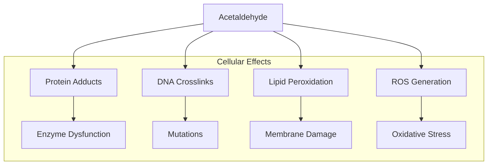
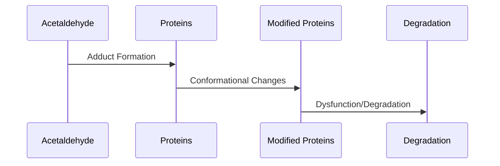
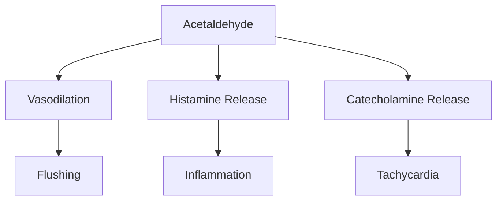
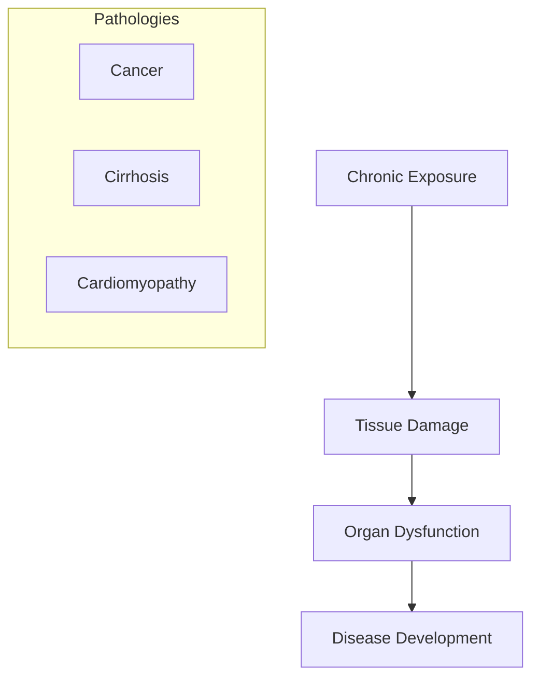
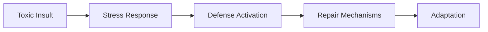
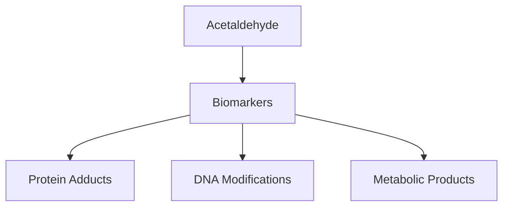

# Acetaldehyde Toxicity

## Description
Acetaldehyde toxicity occurs when this reactive metabolite of ethanol accumulates in tissues, leading to various adverse effects including DNA damage, protein modifications, and cellular dysfunction. It is a key factor in alcohol-related pathologies.

## Relationships
- `caused_by`: [[ethanol_metabolism]] - Primary source
- `depends_on`: [[ALDH2_deficiency]] - Major risk factor
- `affects`: [[cellular_damage]] - Direct effect
- `triggers`: [[alcohol_flush_reaction]] - Immediate response
- `contributes_to`: [[carcinogenesis]] - Long-term risk
- `modulates`: [[inflammatory_response]] - Cellular effect
- `interacts_with`: [[DNA_repair_mechanisms]] - Molecular impact

## Molecular Mechanisms

## Biochemical Effects

### 1. Protein Modifications

### 2. DNA Damage
- Direct adducts
- Cross-linking
- Base modifications
- Strand breaks

## Physiological Effects

### 1. Immediate Responses

### 2. Tissue-Specific Effects
- Liver damage
- Gastrointestinal irritation
- Cardiovascular effects
- Neurological impact

## Clinical Manifestations

### 1. Acute Effects
- Facial flushing
- Nausea
- Headache
- Tachycardia
- Respiratory symptoms

### 2. Chronic Effects

## Protection Mechanisms

### 1. Enzymatic Defense
- [[ALDH2]] activity
- [[glutathione_system]]
- [[antioxidant_enzymes]]

### 2. Cellular Response

## Risk Factors

### 1. Genetic Factors
- ALDH2*2 allele
- ADH1B*2 allele
- DNA repair variants

### 2. Environmental Factors
- Alcohol consumption
- Dietary factors
- Oxidative stress
- Concurrent exposures

## Clinical Management

### 1. Prevention Strategies
- Alcohol limitation
- Protective supplements
- Risk awareness

### 2. Treatment Approaches
- Symptom management
- Antioxidant therapy
- Organ protection

## Research Directions

### 1. Biomarker Development

### 2. Therapeutic Targets
- ALDH2 activation
- Adduct prevention
- Damage repair
- Protection pathways

## References
1. Toxicology and Mechanisms
2. Clinical Effects
3. Genetic Factors
4. Treatment Strategies 