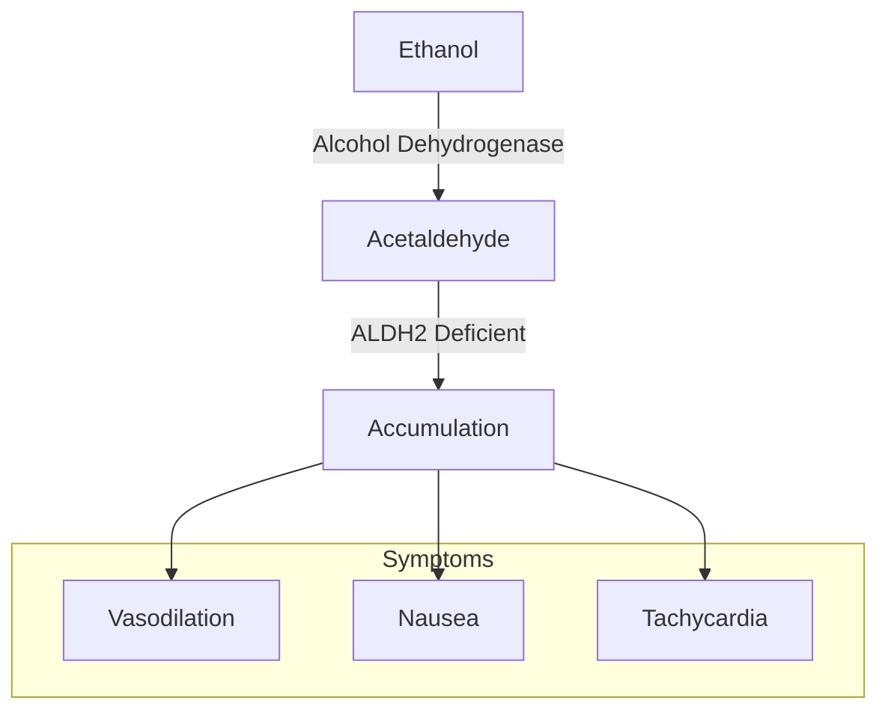
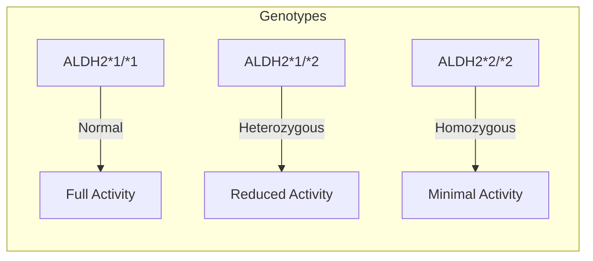
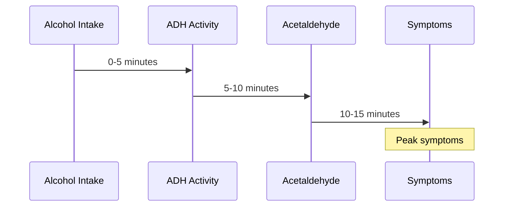
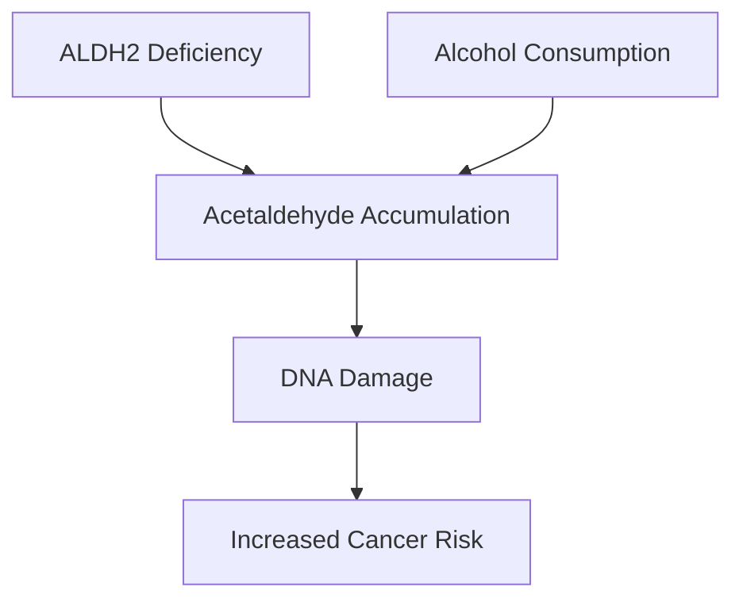

# Alcohol Flush Reaction

## Description
Alcohol flush reaction (also known as Asian flush syndrome) is a condition where individuals experience facial flushing, nausea, and other symptoms after consuming alcohol, due to an accumulation of acetaldehyde caused by aldehyde dehydrogenase 2 (ALDH2) deficiency.

## Relationships
- `caused_by`: [[ALDH2_deficiency]] - Primary genetic cause
- `depends_on`: [[ethanol_metabolism]] - Metabolic pathway involved
- `indicates`: [[acetaldehyde_accumulation]] - Biochemical marker
- `contributes_to`: [[esophageal_cancer_risk]] - Associated health risk
- `type_of`: [[metabolic_disorder]] - Classification
- `modulates`: [[alcohol_tolerance]] - Affects drinking behavior
- `interacts_with`: [[ADH1B_variant]] - Related genetic factor

## Biochemical Mechanism

## Genetic Basis

### 1. ALDH2 Variants

### 2. Population Distribution
- East Asian prevalence: 30-50%
- Geographic distribution:
  - Chinese: ~35%
  - Japanese: ~35%
  - Korean: ~30%
  - Southeast Asian: Variable
  - Inuit: Present

## Clinical Manifestations

### 1. Immediate Symptoms
- Facial flushing
- Neck and shoulder redness
- Nausea
- Headache
- Rapid heartbeat
- Difficulty breathing

### 2. Time Course

## Health Implications

### 1. Cancer Risk

### 2. Protective Effects
- Reduced alcoholism risk
- Natural deterrent to heavy drinking
- Social alcohol avoidance

## Diagnosis

### 1. Clinical Signs
- Visual observation of flushing
- Patient history
- Family history

### 2. Laboratory Tests
- Ethanol patch test
- Genetic testing for ALDH2*2
- Blood acetaldehyde levels

## Management

### 1. Prevention
- Alcohol avoidance
- Reduced consumption
- Awareness of risks

### 2. Risk Mitigation
- H2 blockers (limited effect)
- Hydration
- Pace control

## Research Directions

### 1. Genetic Studies
- Population genetics
- Evolution of ALDH2*2
- ADH1B interactions

### 2. Clinical Research
- Cancer prevention
- Biomarker development
- Treatment strategies

## References
1. Brooks PJ, et al. (2009). PLoS Medicine
2. Peng Y, et al. (2010). BMC Evolutionary Biology
3. Lee CH, et al. (2008). International Journal of Cancer
4. Eng MY, et al. (2007). Alcohol Research & Health 