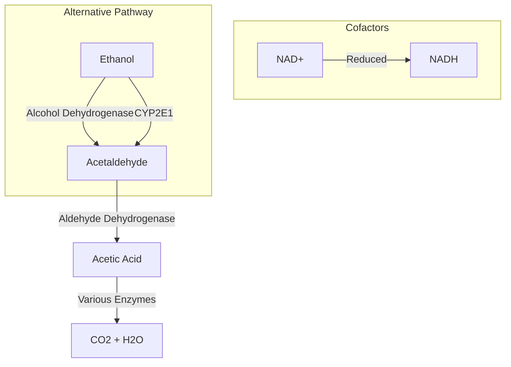
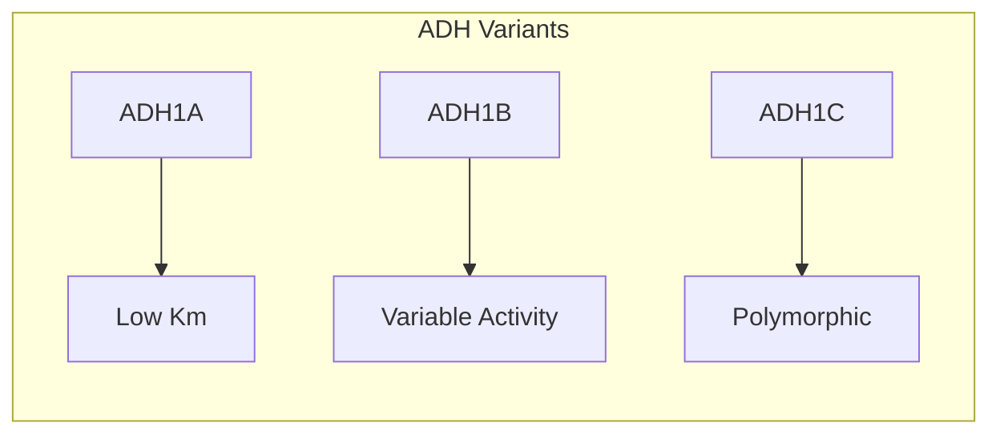
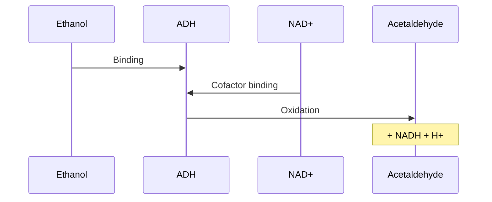
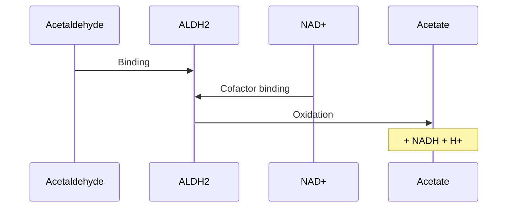
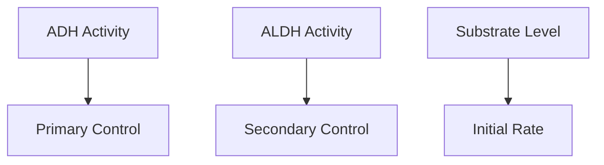
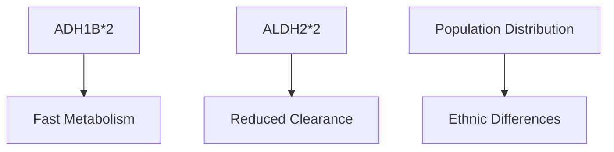

# Ethanol Metabolism

## Description
Ethanol metabolism is the biological process by which alcohol (ethanol) is broken down in the body, primarily in the liver, through a series of enzymatic reactions that convert it to acetaldehyde and then to acetic acid.

## Relationships
- `depends_on`: [[liver_function]] - Primary site of metabolism
- `involves`: [[ADH1B]], [[ALDH2]] - Key enzymes
- `produces`: [[acetaldehyde]] - Intermediate metabolite
- `affects`: [[NAD_NADH_ratio]] - Redox balance
- `modulates`: [[gluconeogenesis]] - Metabolic impact
- `interacts_with`: [[CYP2E1_pathway]] - Alternative pathway
- `regulates`: [[alcohol_intoxication]] - Physiological effects

## Metabolic Pathway

## Key Enzymes

### 1. Alcohol Dehydrogenase (ADH)

### 2. Aldehyde Dehydrogenase (ALDH)
- [[ALDH2]] - Primary enzyme
- [[ALDH1A1]] - Cytosolic form
- Activity variations
- Genetic polymorphisms

## Reaction Steps

### 1. Ethanol to Acetaldehyde

### 2. Acetaldehyde to Acetate

## Regulation

### 1. Metabolic Control
- Substrate availability
- NAD+/NADH ratio
- Enzyme expression
- Hormonal factors

### 2. Rate-Limiting Steps

## Clinical Implications

### 1. Metabolic Effects
- Altered redox state
- Gluconeogenesis inhibition
- Fatty acid metabolism
- Lactate accumulation

### 2. Pathological Conditions
- [[alcoholic_liver_disease]]
- [[alcohol_flush_reaction]]
- [[metabolic_acidosis]]
- [[hypoglycemia]]

## Population Variations

### 1. Genetic Polymorphisms

### 2. Environmental Factors
- Dietary influences
- Medication interactions
- Liver function
- Age effects

## Research Applications

### 1. Drug Development
- Alcohol deterrents
- Liver protection
- Addiction treatment

### 2. Biomarker Studies
- Metabolic profiling
- Genetic screening
- Risk assessment

## References
1. Biochemistry of Alcohol Metabolism
2. Genetic Variations in ADH and ALDH
3. Clinical Implications
4. Population Studies 