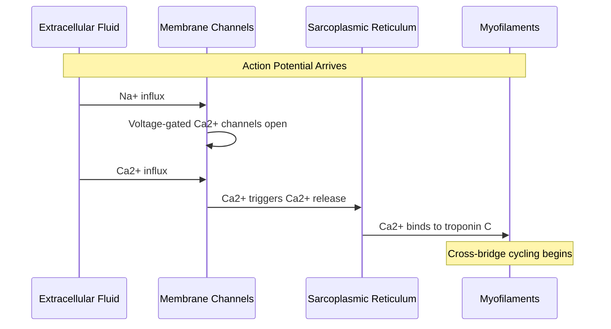
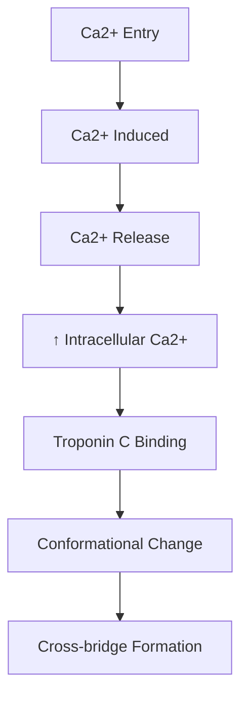
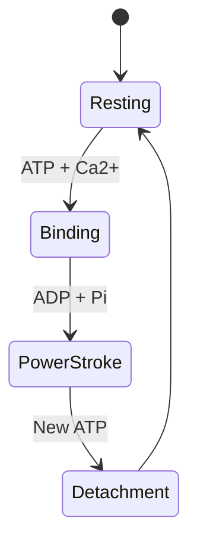
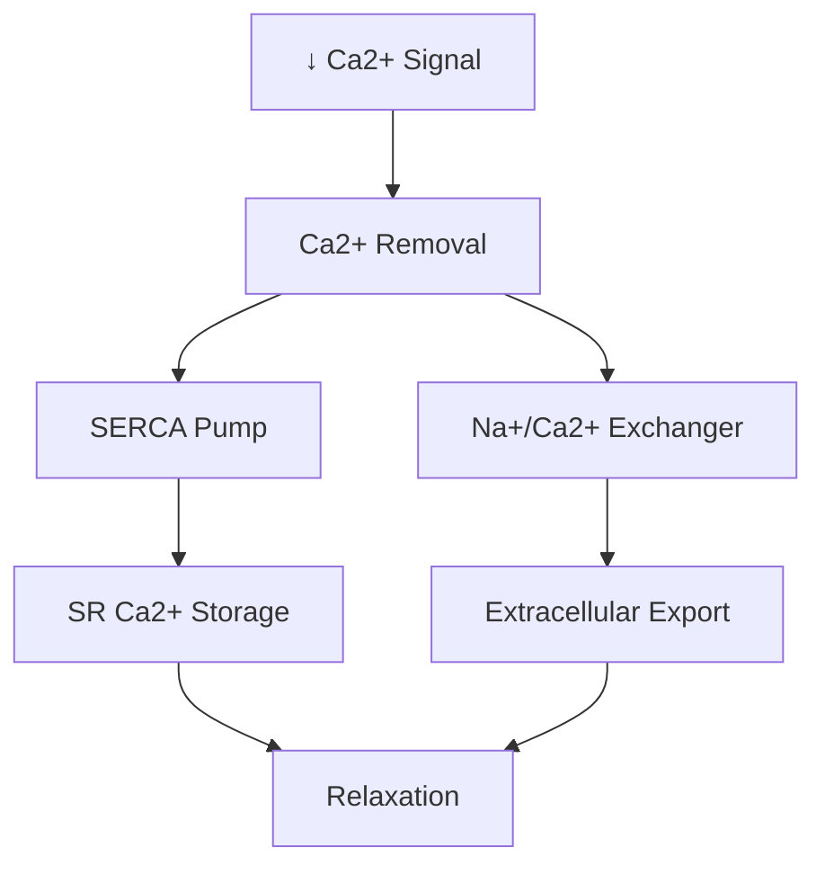

# Cardiac Muscle Contraction

## Description
Cardiac muscle contraction is a highly regulated process that converts electrical signals into mechanical force through excitation-contraction coupling. This process is unique to cardiac muscle cells (cardiomyocytes).

## Molecular Mechanism

## Step-by-Step Process

### 1. Electrical Activation
- Action potential arrives
- Na+ channels open → rapid depolarization
- Voltage-gated L-type Ca2+ channels activate

### 2. Calcium Signaling

#### Key Components:
1. **Calcium Sources**
   - Extracellular (20%)
   - Sarcoplasmic reticulum (80%)
   - Concentration change: 10⁻⁷ to 10⁻⁵ M

2. **Regulatory Proteins**
   - [[troponin_complex]]
   - [[tropomyosin]]
   - [[ryanodine_receptors]]

### 3. Cross-Bridge Cycle

#### Molecular Events:
1. **Myosin Head Activation**
   - ATP binding
   - ATPase activity
   - Power stroke generation

2. **Actin-Myosin Interaction**
   - Strong binding
   - Force generation
   - Sliding filament motion

### 4. Relaxation Process

## Energy Metabolism

### ATP Sources
1. **Immediate**
   - Phosphocreatine
   - Stored ATP

2. **Short-term**
   - Glycolysis
   - β-oxidation

3. **Long-term**
   - Oxidative phosphorylation
   - Fatty acid metabolism

## Regulation

### 1. Beat-to-Beat
- Ca2+ sensitivity
- [[frank_starling_mechanism]]
- Length-tension relationship

### 2. Chronic Adaptation
- Protein expression
- Metabolic changes
- Structural remodeling

## Clinical Implications

### 1. Pathological Conditions
- Heart failure
- Cardiomyopathies
- Ischemia-reperfusion injury

### 2. Therapeutic Targets
- Calcium channel blockers
- Inotropic agents
- Metabolic modulators

## References
1. Molecular Biology of the Cell
2. Cardiac Electrophysiology
3. Journal of Molecular and Cellular Cardiology
4. Physiological Reviews - Cardiac Contraction 