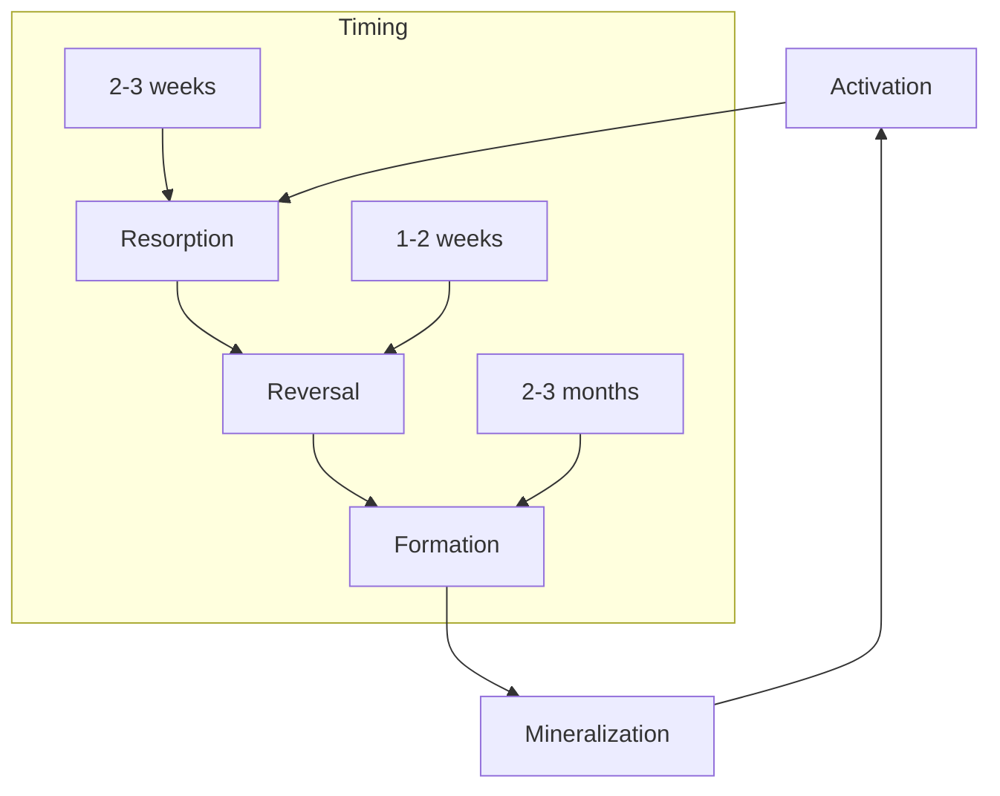
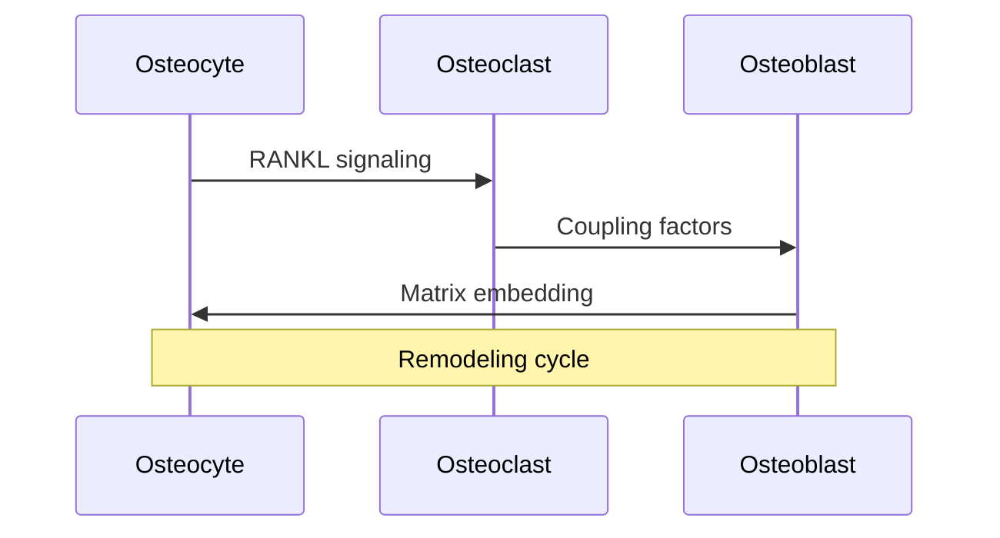
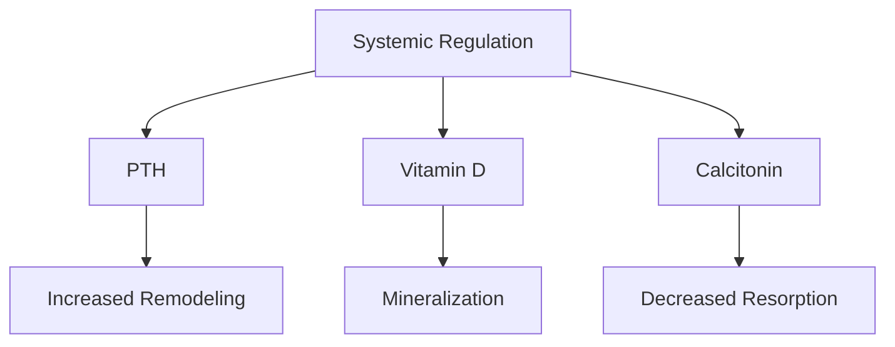
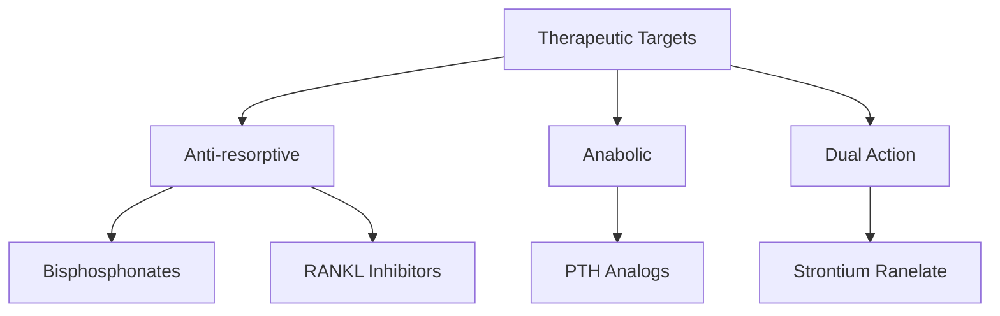

# Bone Remodeling

## Description
Bone remodeling is a continuous process where old bone tissue is removed (resorption) and new bone tissue is formed (formation). This process maintains skeletal integrity, repairs microdamage, and regulates calcium homeostasis.

## Relationships
- `involves`: [[osteoblasts]], [[osteoclasts]], [[osteocytes]] - Key cells
- `modifies`: [[bone_matrix]] - Target structure
- `regulated_by`: [[hormones]], [[mechanical_forces]] - Control factors
- `affects`: [[calcium_homeostasis]] - Metabolic function
- `responds_to`: [[microdamage]] - Trigger factor
- `coordinates_with`: [[immune_system]] - Regulatory interaction
- `maintains`: [[skeletal_integrity]] - Primary function

## Process Phases

### 1. Remodeling Cycle


### 2. Computational Model
```typescript
interface RemodelingUnit {
    state: 'quiescent' | 'active' | 'resorbing' | 'reversal' | 'forming';
    osteoclasts: Osteoclast[];
    osteoblasts: Osteoblast[];
    matrix: BoneMatrix;
    signals: SignalingMolecules[];
    
    async function activate(trigger: Signal): Promise<void>;
    async function resorb(duration: TimeSpan): Promise<void>;
    async function reverse(): Promise<void>;
    async function form(volume: number): Promise<void>;
    async function mineralize(): Promise<void>;
}
```

## Cellular Components

### 1. Cell Interactions


### 2. Molecular Signaling
```typescript
class SignalingNetwork {
    signals: {
        RANKL: Protein;
        OPG: Protein;
        M_CSF: Protein;
        BMPs: Protein[];
        WNTs: Protein[];
    };

    async function regulateRemodeling(site: RemodelingUnit) {
        const strain = await site.measureStrain();
        const damage = await site.assessDamage();
        
        if (strain < THRESHOLD || damage > TOLERANCE) {
            await this.initiateRemodeling(site);
        }
    }
}
```

## Regulation

### 1. Systemic Factors


### 2. Local Factors
```typescript
interface LocalRegulation {
    mechanical: {
        strain: number;
        microdamage: number;
        fluidFlow: number;
    };
    biochemical: {
        pH: number;
        oxygen: number;
        growth_factors: Protein[];
    };
    
    function assessNeed(): RemodelingSignal;
    function adjustResponse(feedback: Feedback): void;
}
```

## Clinical Applications

### 1. Pathological Conditions
- [[osteoporosis]]
- [[paget_disease]]
- [[bone_metastases]]
- [[fracture_healing]]

### 2. Therapeutic Interventions


## Monitoring and Assessment

### 1. Biomarkers
```typescript
interface RemodelingMarkers {
    formation: {
        PINP: number;    // Procollagen type I N propeptide
        bALP: number;    // Bone-specific alkaline phosphatase
        osteocalcin: number;
    };
    resorption: {
        CTX: number;     // C-terminal telopeptide
        NTX: number;     // N-terminal telopeptide
        TRAP5b: number;  // Tartrate-resistant acid phosphatase 5b
    };
    
    function assessBalance(): RemodelingStatus;
    function predictOutcome(): Prediction;
}
```

### 2. Imaging Methods
- Bone densitometry
- Micro-CT analysis
- Histomorphometry
- Dynamic imaging

## Research Applications

### 1. Computational Models
```typescript
class RemodelingSimulation {
    bone: Bone;
    units: RemodelingUnit[];
    time: TimeSpan;
    
    async function simulate(conditions: Conditions) {
        const sites = await this.identifyRemodelingNeed();
        
        for (const site of sites) {
            const unit = new RemodelingUnit(site);
            await unit.activate();
            await this.trackProgress(unit);
            await this.assessOutcome(unit);
        }
    }
}
```

### 2. Experimental Studies
- In vitro models
- Animal studies
- Clinical trials
- Biomarker validation

## References
1. Bone Remodeling Biology
2. Clinical Applications
3. Computational Modeling
4. Therapeutic Developments 