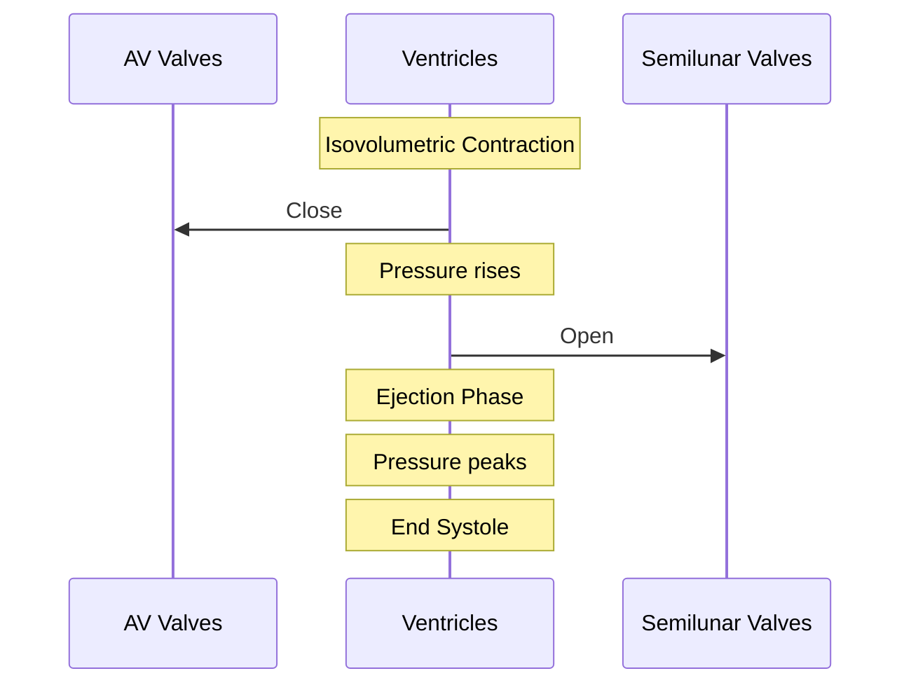
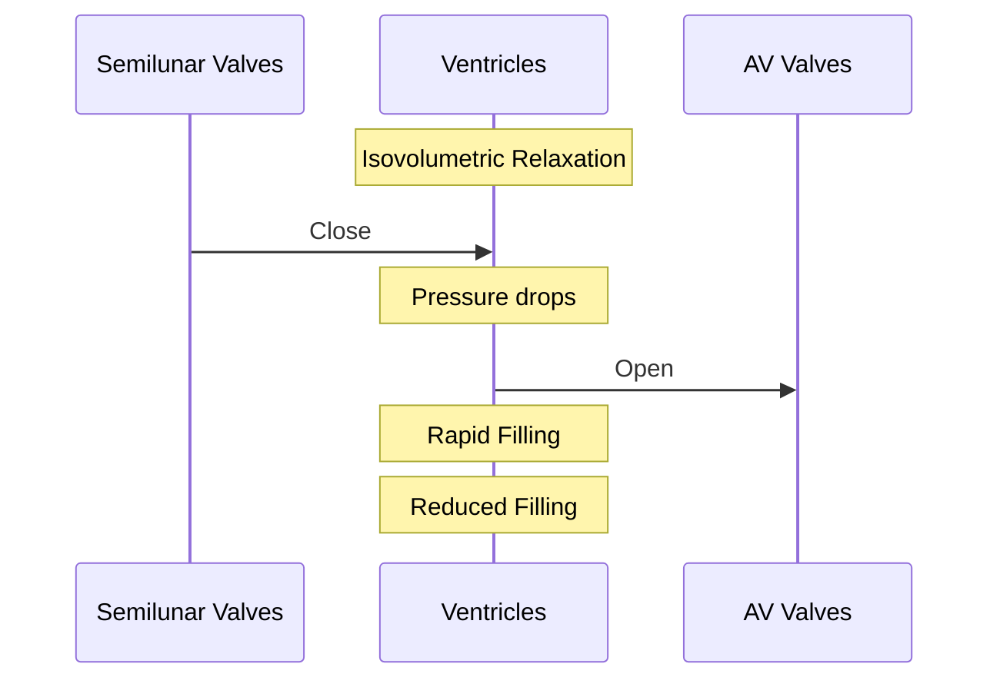
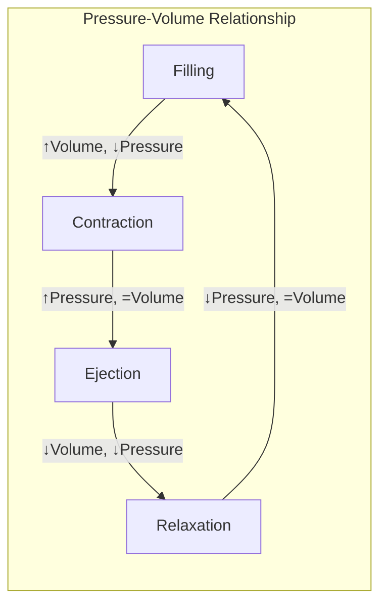

# Cardiac Cycle

## Description
The cardiac cycle represents one complete heartbeat, consisting of two major phases: systole (contraction) and diastole (relaxation). This cycle occurs approximately 70-80 times per minute at rest in a healthy adult.

## Temporal Sequence

```mermaid
gantt
    title Cardiac Cycle Timeline (0.8 seconds)
    dateFormat X
    axisFormat %L
    
    section Atria
    Diastole      :0, 100
    Systole       :100, 200
    Diastole      :200, 800
    
    section Ventricles
    Diastole      :0, 300
    Systole       :300, 500
    Diastole      :500, 800
```

## Phases in Detail

### 1. Atrial Systole (0.1s)
- Atrial contraction ("atrial kick")
- Pressure: 
  - Right atrium: ~6 mmHg
  - Left atrium: ~10 mmHg
- Blood flows through AV valves
- Contributes ~20% of ventricular filling

### 2. Ventricular Systole (0.3s)

#### Phases:
1. **Isovolumetric Contraction**
   - AV valves close (S1 heart sound)
   - Pressure rises rapidly
   - No volume change

2. **Ejection**
   - [[aortic]] and [[pulmonary]] valves open
   - Blood ejection begins
   - Pressure peaks:
     - Left ventricle: ~120 mmHg
     - Right ventricle: ~25 mmHg

### 3. Ventricular Diastole (0.4s)

#### Phases:
1. **Isovolumetric Relaxation**
   - Semilunar valves close (S2 heart sound)
   - Pressure drops rapidly
   - No volume change

2. **Rapid Filling**
   - AV valves open
   - 70% of ventricular filling occurs
   - Passive process

3. **Reduced Filling**
   - Slow filling phase
   - 10% of ventricular filling
   - Leads to next atrial systole

## Pressure-Volume Loop

## Control Mechanisms

### 1. Intrinsic
- [[frank_starling_mechanism]]
- Autorhythmicity of SA node
- [[processes/cellular/cardiac_muscle_contraction]]

### 2. Extrinsic
- [[systems/nervous/autonomic]]
  - Sympathetic: ↑ rate and force
  - Parasympathetic: ↓ rate
- [[systems/endocrine]]
  - Epinephrine
  - Norepinephrine

## Clinical Relevance

### Diagnostic Tools
1. **ECG Correlation**
   - P wave → Atrial systole
   - QRS complex → Ventricular systole
   - T wave → Ventricular repolarization

### Common Pathologies
1. **Valve Disorders**
   - Stenosis
   - Regurgitation
   - Impact on cycle timing

2. **Arrhythmias**
   - Impact on filling time
   - Effect on cardiac output

## References
1. Guyton and Hall Textbook of Medical Physiology
2. Cardiovascular Physiology Concepts
3. Clinical Cardiac Pacing
4. Journal of Physiology - Cardiac Mechanics 