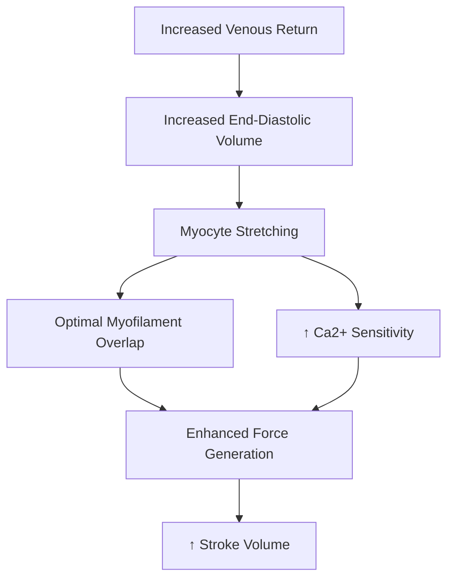
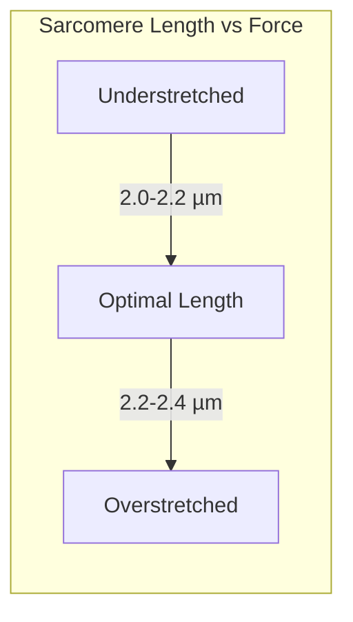
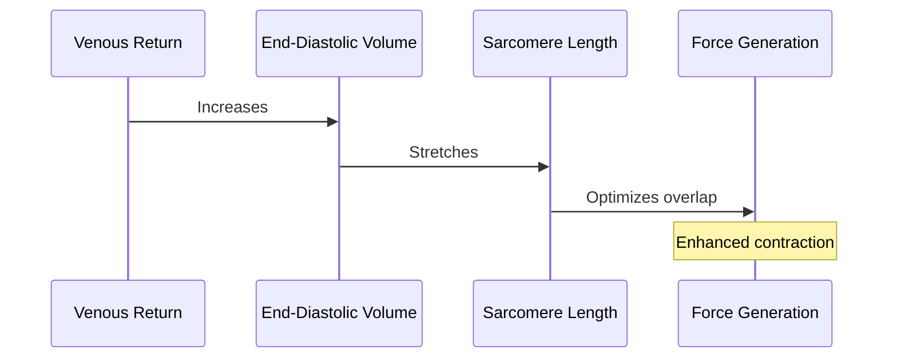
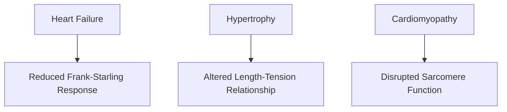

# Frank-Starling Mechanism

## Description
The Frank-Starling mechanism (also known as Starling's law of the heart) describes how the heart automatically adjusts its force of contraction in response to changes in venous return, ensuring that the volume of blood pumped out (stroke volume) matches the volume received (venous return).

## Relationships
- `is_part_of`: [[cardiac_regulation]] - Fundamental cardiac control mechanism
- `regulates`: [[cardiac_output]] - Controls stroke volume
- `depends_on`: [[sarcomere_length]] - Requires optimal filament overlap
- `modulates`: [[contractile_force]] - Adjusts force generation
- `interacts_with`: [[calcium_sensitivity]] - Affects calcium response
- `precedes`: [[ejection_phase]] - Occurs before blood ejection
- `follows`: [[venous_return]] - Responds to blood return
- `contributes_to`: [[cardiac_adaptation]] - Part of cardiac response
- `type_of`: [[autoregulation]] - Self-regulation mechanism
- `indicates`: [[cardiac_function]] - Measure of heart health

## Molecular Basis

### Sarcomere Length-Tension Relationship

## Molecular Components

### 1. Structural Proteins
- [[titin]]
  - Acts as molecular spring
  - Senses stretch
  - Modulates passive tension

### 2. Contractile Proteins
- [[myosin]]
  - Heavy chains
  - Light chains
  - ATPase activity
- [[actin]]
  - Thin filaments
  - Binding sites

### 3. Regulatory Proteins
- [[troponin_complex]]
  - Troponin C (Ca2+ binding)
  - Troponin I (Inhibitory)
  - Troponin T (Tropomyosin binding)
- [[tropomyosin]]
  - Blocks myosin binding sites
  - Regulatory function

## Physiological Mechanism

### 1. Preload Effects

### 2. Calcium Sensitivity
- Stretch-induced conformational changes
- Enhanced Ca2+ binding to troponin C
- Increased cross-bridge formation

## Clinical Applications

### 1. Diagnostic Value
- Pressure-volume loops
- Echocardiography
- Strain imaging

### 2. Pathological States

## Regulation

### 1. Acute Modulation
- [[beta_adrenergic_stimulation]]
- [[calcium_handling]]
- [[phosphorylation_states]]

### 2. Chronic Adaptation
- Protein expression changes
- Sarcomere remodeling
- ECM modifications

## Research Applications

### 1. Therapeutic Targets
- Titin modulation
- Calcium sensitizers
- Myosin activators

### 2. Emerging Technologies
- Gene therapy approaches
- Tissue engineering
- Mechanical assist devices

## References
1. Cardiovascular Physiology
2. Journal of Physiology - Frank-Starling Mechanism
3. Circulation Research
4. Nature Reviews Cardiology 