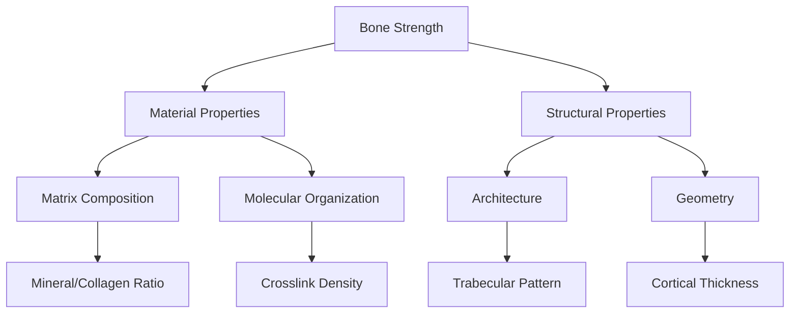
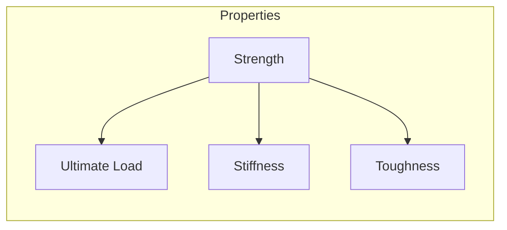
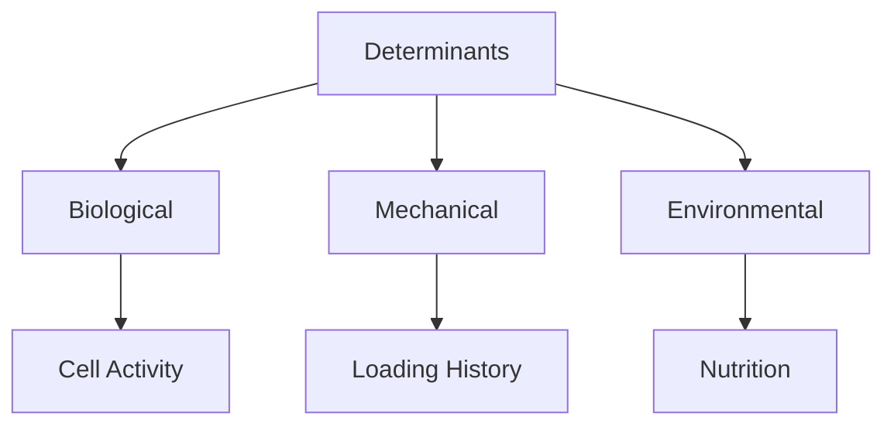
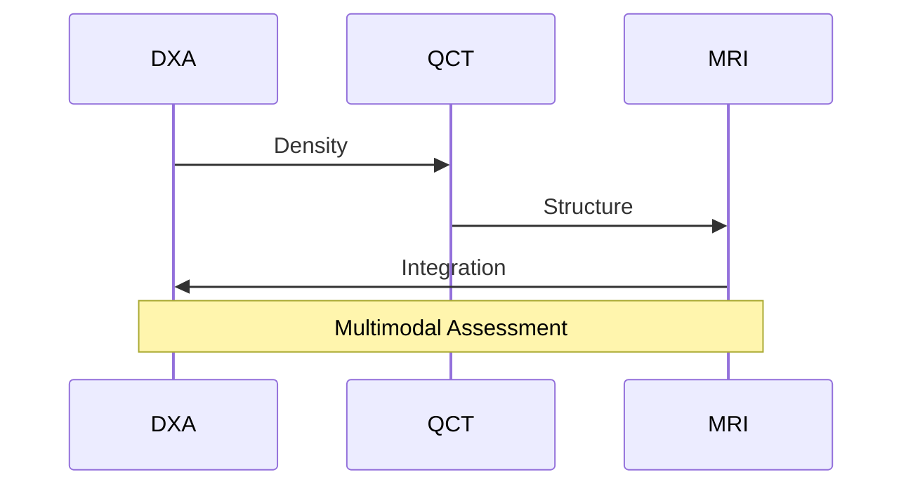
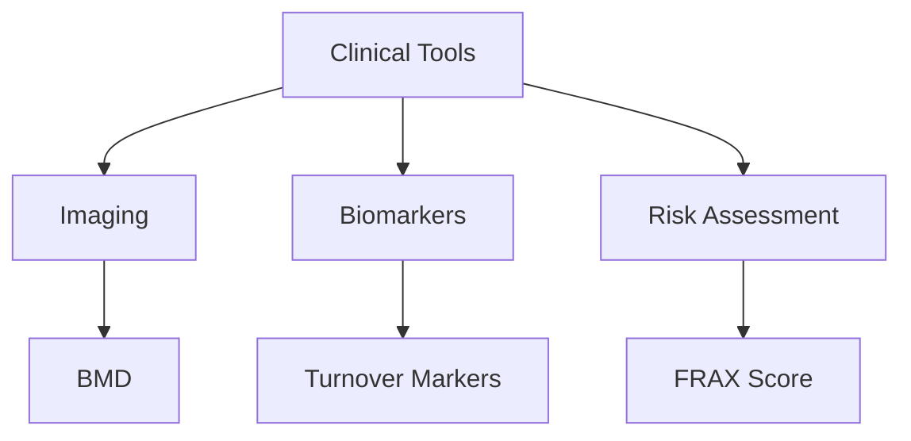

# Bone Strength

## Description
Bone strength is a complex mechanical property that represents the bone's ability to resist fracture and maintain skeletal integrity.

## Implementation

### Core Structures
```rust
#[derive(Debug, Clone, PartialEq)]
pub struct BoneStrength {
    // Material properties
    elastic_modulus: f64,      // GPa
    ultimate_strength: f64,    // MPa
    toughness: f64,           // MJ/m³
    
    // Structural properties
    porosity: f64,            // %
    mineral_content: f64,     // %
    collagen_quality: f64,    // 0-1 scale
    
    // Architecture
    trabecular_density: f64,  // mg/cm³
    cortical_thickness: f64,  // mm
    cross_section: f64        // mm²
}

impl BoneStrength {
    pub fn new() -> Self {
        BoneStrength {
            elastic_modulus: 20.0,
            ultimate_strength: 150.0,
            toughness: 3.0,
            porosity: 10.0,
            mineral_content: 65.0,
            collagen_quality: 0.9,
            trabecular_density: 150.0,
            cortical_thickness: 5.0,
            cross_section: 100.0
        }
    }

    pub fn calculate_strength(&self) -> f64 {
        // Complex calculation incorporating multiple factors
        let material_factor = self.elastic_modulus * self.ultimate_strength / 1000.0;
        let structural_factor = (1.0 - self.porosity / 100.0) * self.mineral_content / 100.0;
        let architecture_factor = self.trabecular_density * self.cortical_thickness / 100.0;
        
        material_factor * structural_factor * architecture_factor * self.collagen_quality
    }
}

#[derive(Debug, Clone)]
pub struct MechanicalProperties {
    stiffness: f64,           // N/m
    yield_strength: f64,      // MPa
    fatigue_resistance: f64,  // cycles
    creep_rate: f64,         // %/hour
    strain_rate: f64         // s⁻¹
}

pub trait StrengthRegulation {
    fn adapt_to_load(&mut self, load: f64);
    fn respond_to_hormones(&mut self, hormone_levels: HashMap<String, f64>);
    fn update_mineral_content(&mut self, calcium: f64, phosphate: f64);
    fn modify_architecture(&mut self, strain_pattern: Vec<f64>);
}

pub trait StrengthAssessment {
    fn measure_density(&self) -> f64;
    fn evaluate_structure(&self) -> StructuralScore;
    fn predict_fracture_risk(&self) -> f64;
    fn monitor_changes(&self, timespan: Duration) -> Vec<StrengthMetric>;
}

#[derive(Debug)]
pub struct StrengthResearch {
    experimental_data: Vec<DataPoint>,
    simulation_results: Vec<SimulationResult>,
    validation_metrics: ValidationScore
}

#[derive(Debug)]
pub struct StrengthModel {
    material_properties: MaterialModel,
    structural_analysis: StructuralAnalysis,
    failure_criteria: FailureCriteria
}

impl StrengthModel {
    pub async fn optimize_design(&self, constraints: Constraints) -> Result<Design, ModelError> {
        // Implementation for optimizing bone design based on constraints
        todo!()
    }
}
```

## Relationships
- `depends_on`: [[bone_matrix]] - Material composition
- `influenced_by`: [[mechanical_loading]] - Adaptation stimulus
- `regulated_by`: [[bone_remodeling]] - Dynamic process
- `measured_by`: [[bone_density]] - Clinical assessment
- `affects`: [[fracture_risk]] - Clinical outcome
- `modulated_by`: [[hormones]] - Systemic regulation

## Components

### 1. Hierarchical Structure


### 2. Computational Model
```typescript
interface BoneStrength {
    material: {
        composition: {
            mineral: MineralContent;
            collagen: CollagenContent;
            water: WaterContent;
        };
        organization: {
            crystallinity: number;
            fibrilAlignment: number;
            crosslinking: CrosslinkDensity;
        };
    };
    
    structure: {
        architecture: {
            porosity: number;
            connectivity: number;
            anisotropy: number;
        };
        geometry: {
            thickness: number;
            curvature: number;
            moment: number;
        };
    };
}
```

## Mechanical Properties

### 1. Load Response


### 2. Material Behavior
```typescript
interface MechanicalProperties {
    elastic: {
        youngsModulus: number;
        poissonsRatio: number;
        anisotropy: number;
    };
    
    failure: {
        ultimateStrength: number;
        yieldPoint: number;
        toughness: number;
    };
    
    function calculateStress(strain: number): Stress;
    function predictFailure(load: Force): FailureProbability;
}
```

## Determinants

### 1. Contributing Factors


### 2. Regulation Model
```typescript
interface StrengthRegulation {
    biological: {
        remodeling: RemodelingRate;
        cellActivity: CellularResponse;
        metabolism: MetabolicState;
    };
    
    mechanical: {
        strain: StrainDistribution;
        adaptation: AdaptiveResponse;
        damage: MicroDamage;
    };
    
    function adaptToLoad(loading: LoadHistory): Adaptation;
    function maintainStrength(conditions: Environment): Maintenance;
}
```

## Assessment Methods

### 1. Clinical Evaluation


### 2. Analysis Tools
```typescript
interface StrengthAssessment {
    imaging: {
        modality: ImagingTechnique;
        parameters: ImagingParameters;
        analysis: ImageAnalysis;
    };
    
    biomechanics: {
        testing: MechanicalTest;
        simulation: FiniteElement;
        validation: Validation;
    };
    
    async function assessStrength(bone: Bone): Promise<StrengthMetrics>;
    async function predictRisk(patient: Patient): Promise<FractureRisk>;
}
```

## Clinical Applications

### 1. Diagnostic Tools


### 2. Therapeutic Targets
- Bone formation
- Matrix quality
- Architecture preservation
- Load optimization

## Research Methods

### 1. Experimental Approaches
```typescript
interface StrengthResearch {
    experimental: {
        mechanical: MechanicalTesting;
        material: MaterialAnalysis;
        biological: BiologicalAssays;
    };
    
    computational: {
        modeling: FiniteElementAnalysis;
        simulation: MechanicalSimulation;
        prediction: PredictiveModeling;
    };
    
    async function investigateProperty(parameter: Parameter): Promise<Result>;
    async function validateModel(data: ExperimentalData): Promise<Validation>;
}
```

### 2. Future Directions
- Novel assessment methods
- Personalized prediction
- Targeted interventions
- Preventive strategies

## Computational Analysis

### 1. Modeling Framework
```typescript
interface StrengthModel {
    multiscale: {
        molecular: MolecularDynamics;
        tissue: ContinuumMechanics;
        organ: StructuralAnalysis;
    };
    
    integration: {
        coupling: ScaleCoupling;
        homogenization: Homogenization;
        validation: ModelValidation;
    };
    
    async function simulateResponse(loading: Loading): Promise<Response>;
    async function optimizeDesign(constraints: Constraints): Promise<Design>;
}
```

### 2. Predictive Tools
- Fracture prediction
- Adaptation modeling
- Intervention planning
- Risk assessment

## References
1. Bone Biomechanics
2. Clinical Assessment
3. Computational Modeling
4. Therapeutic Strategies 