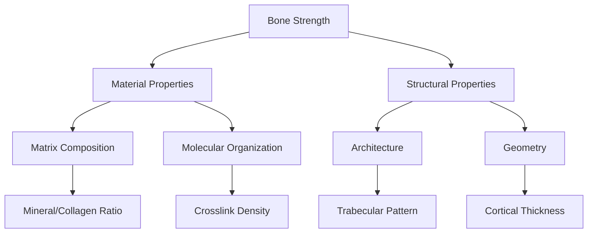
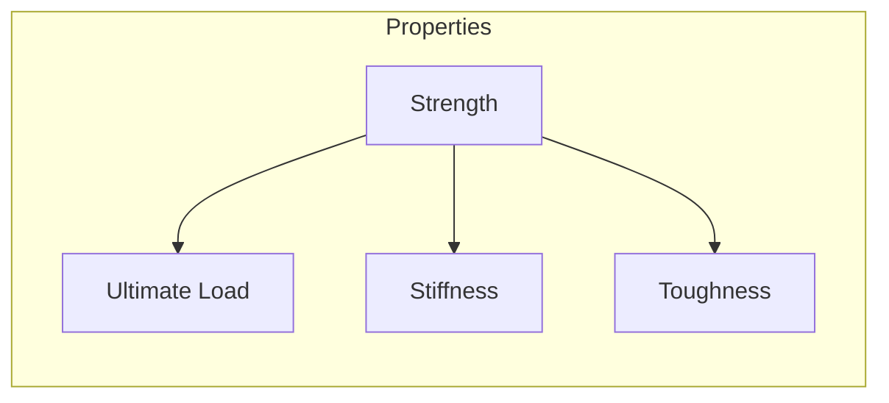
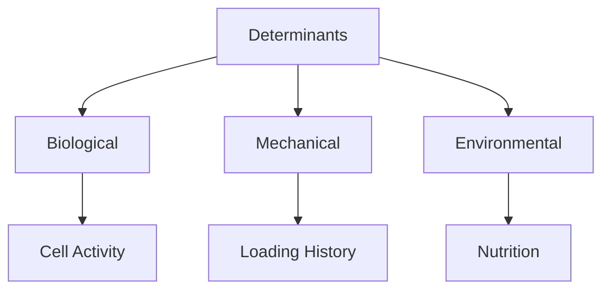
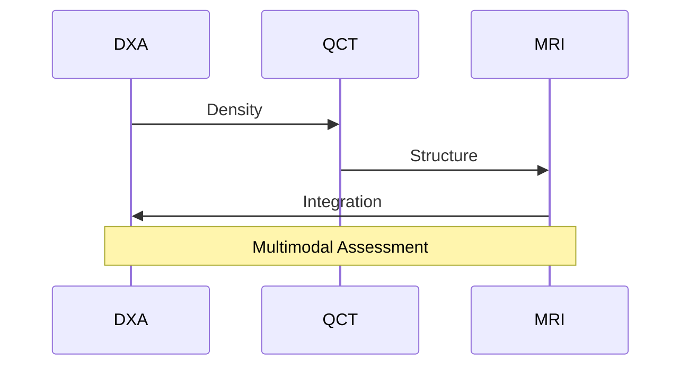
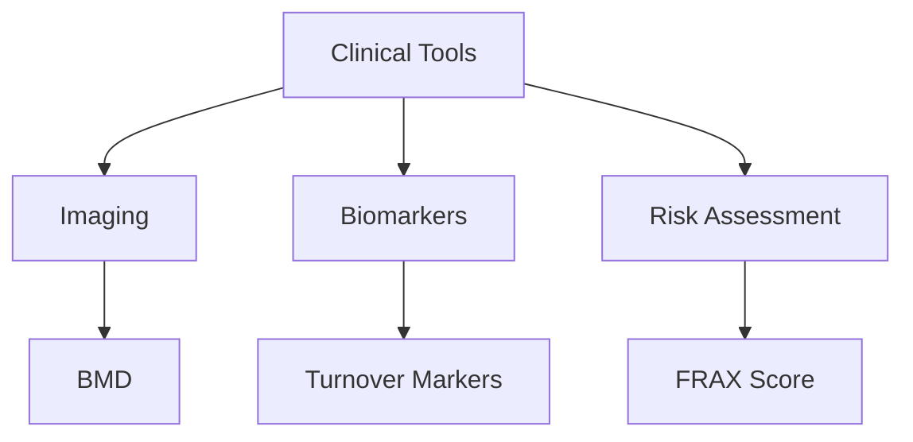

# Bone Strength

## Description
Bone strength is a complex property that emerges from the interaction of multiple hierarchical levels of bone structure, from molecular composition to macroscopic architecture. It determines the bone's ability to resist fracture and maintain skeletal integrity.

## Relationships
- `depends_on`: [[bone_matrix]], [[collagen]], [[hydroxyapatite]] - Structural components
- `regulated_by`: [[bone_remodeling]] - Dynamic control
- `affected_by`: [[mechanical_loading]] - Environmental factor
- `influenced_by`: [[aging]], [[disease]] - Modifying factors
- `measured_by`: [[bone_density]], [[bone_quality]] - Clinical metrics
- `determines`: [[fracture_resistance]] - Functional outcome
- `involves`: [[material_properties]], [[structural_properties]] - Physical characteristics

## Components

### 1. Hierarchical Structure


### 2. Computational Model
```typescript
interface BoneStrength {
    material: {
        composition: {
            mineral: MineralContent;
            collagen: CollagenContent;
            water: WaterContent;
        };
        organization: {
            crystallinity: number;
            fibrilAlignment: number;
            crosslinking: CrosslinkDensity;
        };
    };
    
    structure: {
        architecture: {
            porosity: number;
            connectivity: number;
            anisotropy: number;
        };
        geometry: {
            thickness: number;
            curvature: number;
            moment: number;
        };
    };
}
```

## Mechanical Properties

### 1. Load Response


### 2. Material Behavior
```typescript
interface MechanicalProperties {
    elastic: {
        youngsModulus: number;
        poissonsRatio: number;
        anisotropy: number;
    };
    
    failure: {
        ultimateStrength: number;
        yieldPoint: number;
        toughness: number;
    };
    
    function calculateStress(strain: number): Stress;
    function predictFailure(load: Force): FailureProbability;
}
```

## Determinants

### 1. Contributing Factors


### 2. Regulation Model
```typescript
interface StrengthRegulation {
    biological: {
        remodeling: RemodelingRate;
        cellActivity: CellularResponse;
        metabolism: MetabolicState;
    };
    
    mechanical: {
        strain: StrainDistribution;
        adaptation: AdaptiveResponse;
        damage: MicroDamage;
    };
    
    function adaptToLoad(loading: LoadHistory): Adaptation;
    function maintainStrength(conditions: Environment): Maintenance;
}
```

## Assessment Methods

### 1. Clinical Evaluation


### 2. Analysis Tools
```typescript
interface StrengthAssessment {
    imaging: {
        modality: ImagingTechnique;
        parameters: ImagingParameters;
        analysis: ImageAnalysis;
    };
    
    biomechanics: {
        testing: MechanicalTest;
        simulation: FiniteElement;
        validation: Validation;
    };
    
    async function assessStrength(bone: Bone): Promise<StrengthMetrics>;
    async function predictRisk(patient: Patient): Promise<FractureRisk>;
}
```

## Clinical Applications

### 1. Diagnostic Tools


### 2. Therapeutic Targets
- Bone formation
- Matrix quality
- Architecture preservation
- Load optimization

## Research Methods

### 1. Experimental Approaches
```typescript
interface StrengthResearch {
    experimental: {
        mechanical: MechanicalTesting;
        material: MaterialAnalysis;
        biological: BiologicalAssays;
    };
    
    computational: {
        modeling: FiniteElementAnalysis;
        simulation: MechanicalSimulation;
        prediction: PredictiveModeling;
    };
    
    async function investigateProperty(parameter: Parameter): Promise<Result>;
    async function validateModel(data: ExperimentalData): Promise<Validation>;
}
```

### 2. Future Directions
- Novel assessment methods
- Personalized prediction
- Targeted interventions
- Preventive strategies

## Computational Analysis

### 1. Modeling Framework
```typescript
interface StrengthModel {
    multiscale: {
        molecular: MolecularDynamics;
        tissue: ContinuumMechanics;
        organ: StructuralAnalysis;
    };
    
    integration: {
        coupling: ScaleCoupling;
        homogenization: Homogenization;
        validation: ModelValidation;
    };
    
    async function simulateResponse(loading: Loading): Promise<Response>;
    async function optimizeDesign(constraints: Constraints): Promise<Design>;
}
```

### 2. Predictive Tools
- Fracture prediction
- Adaptation modeling
- Intervention planning
- Risk assessment

## References
1. Bone Biomechanics
2. Clinical Assessment
3. Computational Modeling
4. Therapeutic Strategies 