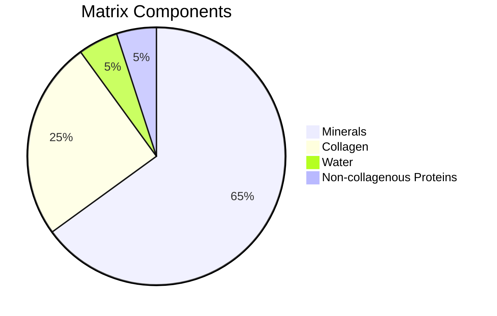
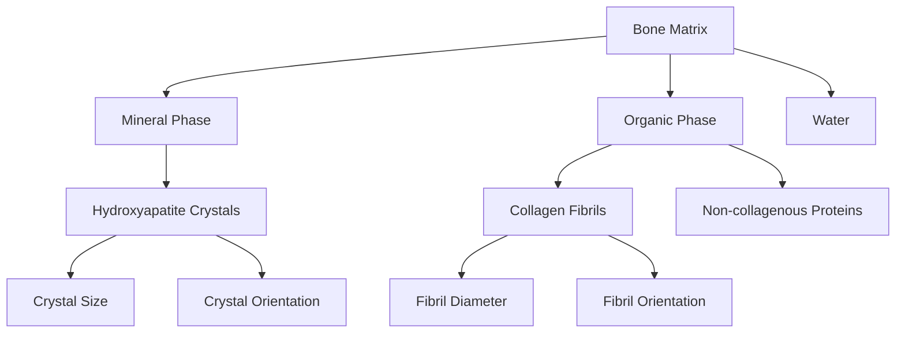
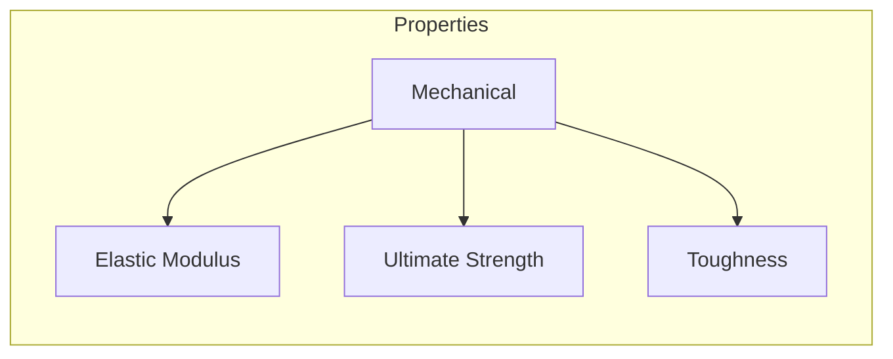
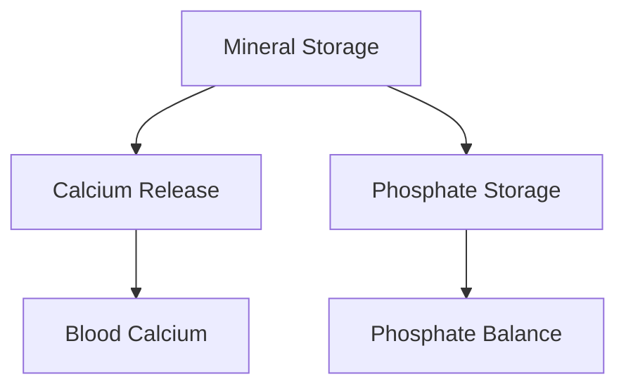
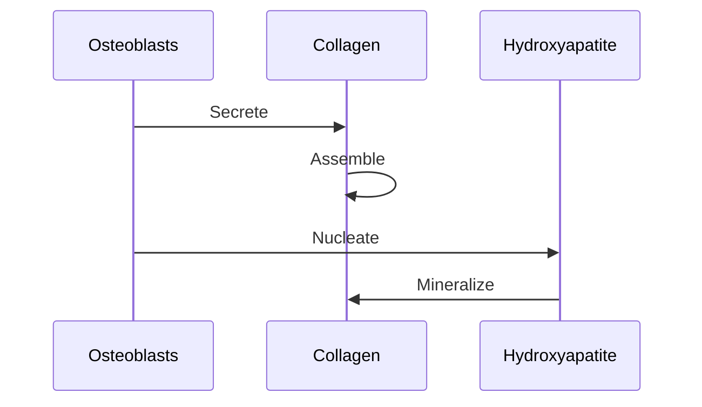
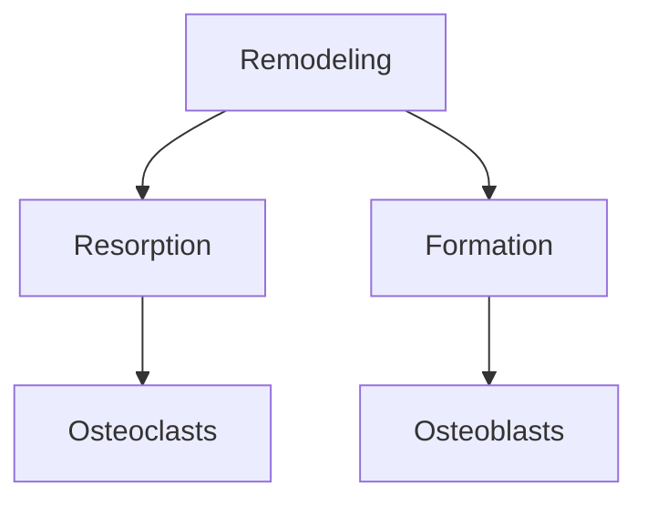
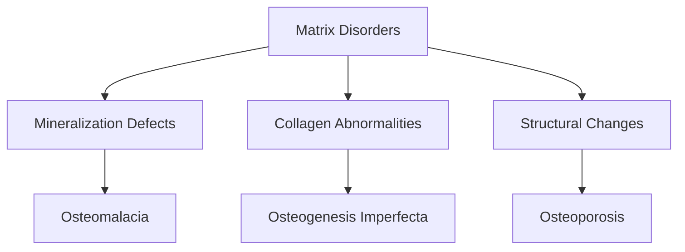

# Bone Matrix

## Description
The bone matrix is a complex composite material that forms the structural foundation of bone tissue. It consists of both organic and inorganic components, providing mechanical strength while serving as a mineral reservoir.

## Components

### 1. Material Composition


### 2. Structural Organization


## Properties

### 1. Physical Properties
- **Density**: 2.0 g/cm³
- **Porosity**: 5-10%
- **Water Content**: 5-10%

### 2. Mechanical Properties


## Biological Functions

### 1. Structural Support
- Provides mechanical strength to bone
- Maintains skeletal integrity
- Resists mechanical loads

### 2. Mineral Homeostasis


### 3. Protein Functions
- Collagen: Provides tensile strength
- Non-collagenous proteins: Regulate mineralization
- Growth factors: Stored and released during remodeling

## Dynamic Processes

### 1. Matrix Formation


### 2. Matrix Remodeling


## Implementation Details

### 1. Data Structures
The Rust implementation uses the following main structures:
- `BoneMatrix`: Main structure representing the bone matrix
- `MatrixComposition`: Tracks component percentages
- `MatrixOrganization`: Handles structural arrangement
- `MatrixProperties`: Stores physical properties

### 2. Key Methods
```rust
// Create new bone matrix
let matrix = BoneMatrix::new();

// Calculate quality score
let quality = matrix.calculate_quality();

// Update based on conditions
matrix.update_chemistry(ChemicalProperty::pH(7.4));
matrix.apply_force(Vector3D::new(0.0, 0.0, 1000.0));
```

### 3. State Management
The matrix can be in various states:
- Developing: Initial formation
- Active: Normal function
- Mature: Fully developed
- Degrading: Under resorption

## Clinical Relevance

### 1. Pathological Changes


### 2. Therapeutic Targets
- Mineralization processes
- Collagen crosslinking
- Matrix organization
- Remodeling balance

## Research Applications

### 1. Experimental Methods
- Histomorphometry
- Micro-CT analysis
- Mechanical testing
- Chemical analysis

### 2. Computational Modeling
The Rust implementation enables:
- Quality assessment
- Mechanical response prediction
- Chemical interaction simulation
- Temporal evolution tracking

## References
1. Bone Matrix Biology
2. Biomechanics Literature
3. Clinical Studies
4. Computational Methods 