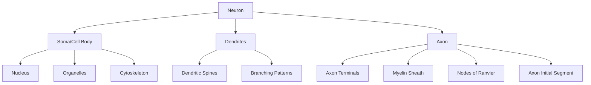
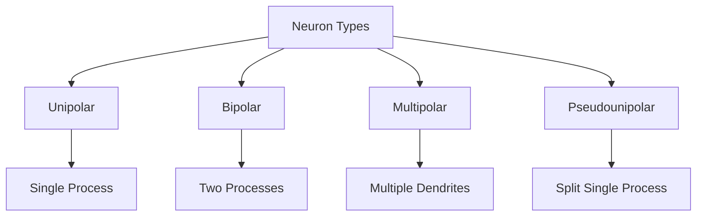
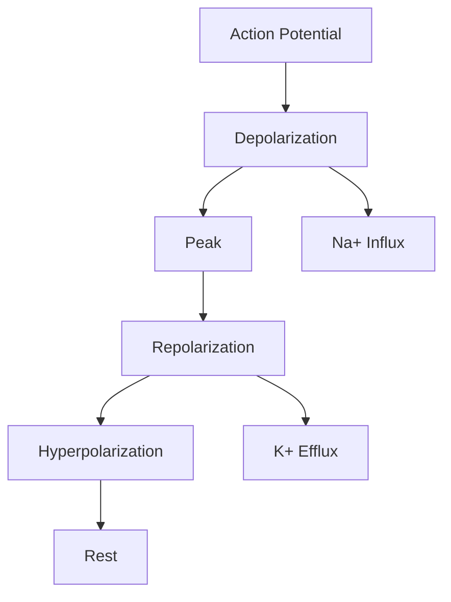
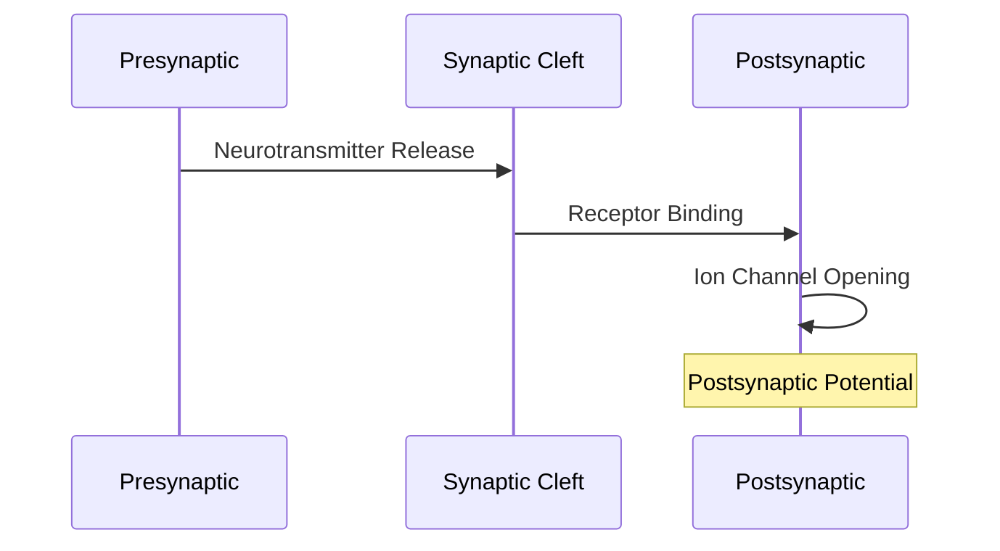
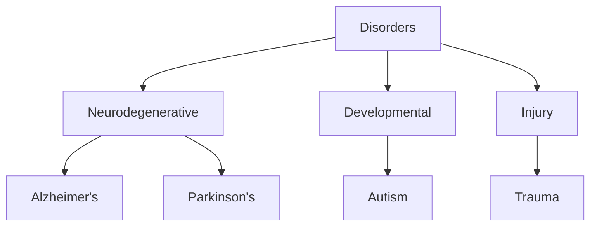

# Neuron

## Description
Neurons are specialized cells of the nervous system that process and transmit information through electrical and chemical signals. They are the fundamental units of brain function and neural computation.

## Structure

### 1. Major Components

### 2. Subcellular Components
1. **Soma**
   - Nucleus
   - Endoplasmic reticulum
   - Golgi apparatus
   - Mitochondria
   - Cytoskeleton

2. **Dendrites**
   - Dendritic spines
   - Postsynaptic densities
   - Local protein synthesis
   - Calcium compartments

3. **Axon**
   - Myelin sheath
   - Nodes of Ranvier
   - Transport systems
   - Presynaptic terminals

## Types of Neurons

### 1. Morphological Classification

### 2. Functional Classification
1. **Sensory Neurons**
   - Mechanoreceptors
   - Thermoreceptors
   - Chemoreceptors
   - Nociceptors

2. **Motor Neurons**
   - Alpha motor neurons
   - Beta motor neurons
   - Gamma motor neurons

3. **Interneurons**
   - Local circuit neurons
   - Relay neurons
   - Modulatory neurons

## Membrane Properties

### 1. Resting Potential
- Na+/K+ ATPase pump
- Ion channels
- Membrane permeability
- Equilibrium potentials

### 2. Action Potential

### 3. Ion Channels
1. **Voltage-gated**
   - Sodium channels
   - Potassium channels
   - Calcium channels

2. **Ligand-gated**
   - Neurotransmitter receptors
   - Ion-specific channels
   - Mechanosensitive channels

## Synaptic Transmission

### 1. Chemical Synapses

### 2. Neurotransmitters
1. **Small Molecules**
   - Glutamate
   - GABA
   - Acetylcholine
   - Dopamine
   - Serotonin

2. **Neuropeptides**
   - Substance P
   - Endorphins
   - Enkephalins

### 3. Synaptic Plasticity
- Long-term potentiation (LTP)
- Long-term depression (LTD)
- Spike timing-dependent plasticity
- Homeostatic plasticity

## Cellular Functions

### 1. Protein Transport
1. **Anterograde Transport**
   - Synaptic vesicles
   - Membrane proteins
   - Mitochondria

2. **Retrograde Transport**
   - Endosomes
   - Autophagosomes
   - Signaling molecules

### 2. Energy Metabolism
- Glucose utilization
- Mitochondrial function
- ATP production
- Lactate shuttle

### 3. Gene Expression
- Activity-dependent transcription
- Local translation
- RNA trafficking
- Protein turnover

## Clinical Relevance

### 1. Neurological Disorders

### 2. Therapeutic Targets
- Ion channels
- Neurotransmitter systems
- Synaptic proteins
- Cellular stress pathways

## Research Methods

### 1. Imaging Techniques
- Electron microscopy
- Fluorescence microscopy
- Calcium imaging
- Voltage imaging

### 2. Electrophysiology
- Patch clamp
- Field recordings
- Multi-electrode arrays
- Optogenetics

### 3. Molecular Tools
- Genetic markers
- Viral tracers
- Optogenetic probes
- Chemogenetic tools

## References
1. Principles of Neural Science
2. Molecular Biology of the Cell
3. Ion Channels of Excitable Membranes
4. Synaptic Organization of the Brain 