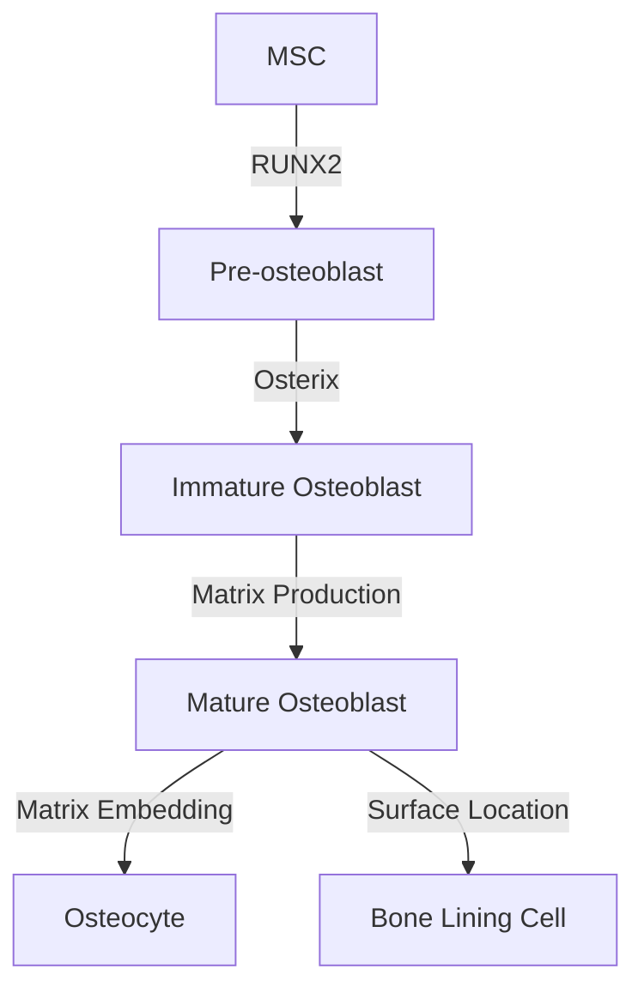
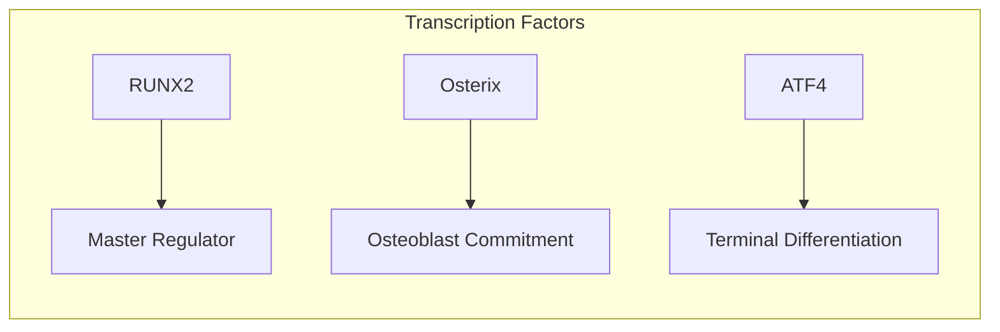
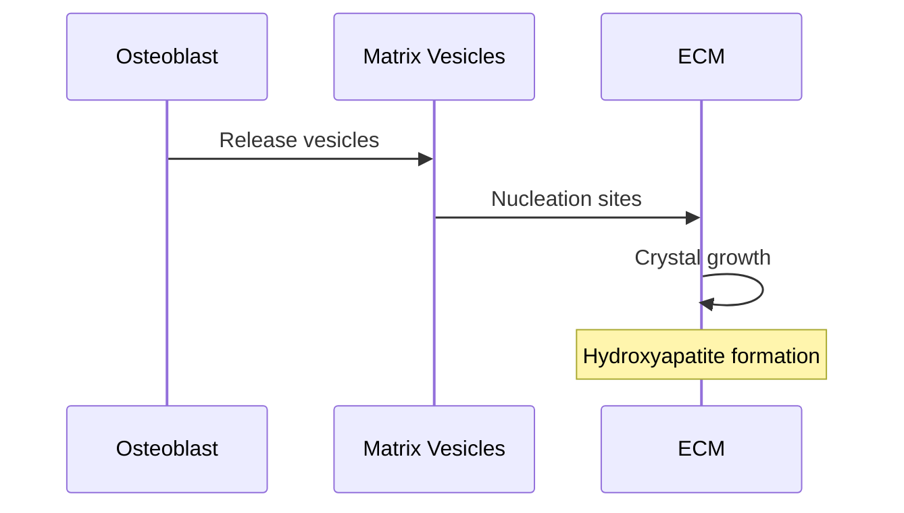
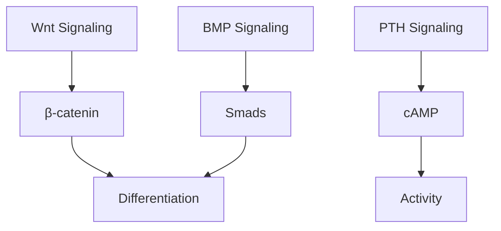
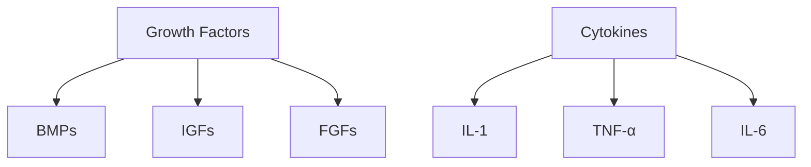
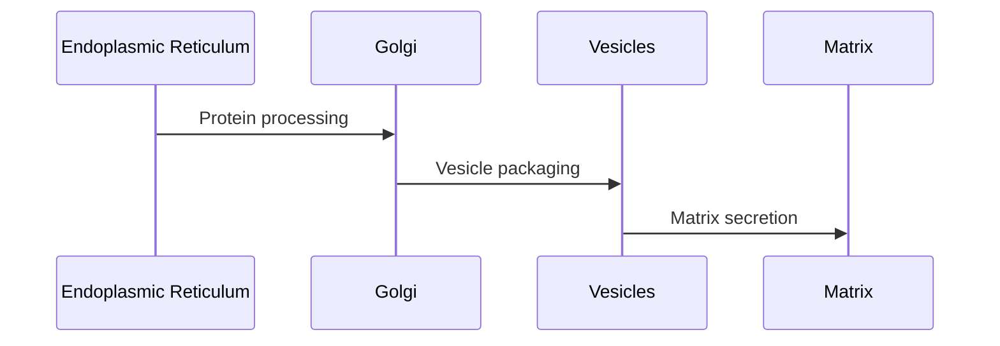
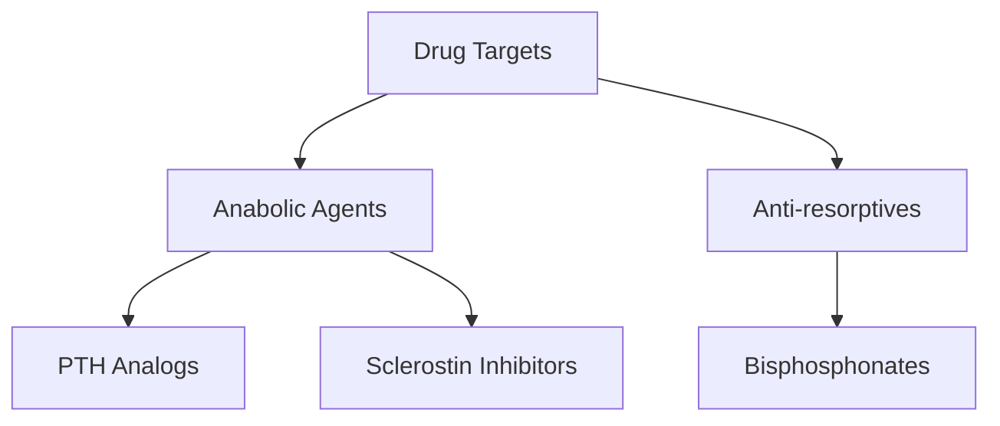

# Osteoblasts

## Description
Osteoblasts are specialized bone-forming cells derived from mesenchymal stem cells that synthesize and mineralize the bone matrix. They play crucial roles in bone development, remodeling, and repair.

## Relationships
- `derived_from`: [[mesenchymal_stem_cells]] - Cell origin
- `produces`: [[bone_matrix]] - Primary function
- `differentiates_into`: [[osteocytes]] - Terminal differentiation
- `interacts_with`: [[osteoclasts]] - Bone remodeling
- `regulated_by`: [[bone_morphogenetic_proteins]] - Development
- `responds_to`: [[mechanical_forces]] - Mechanotransduction
- `secretes`: [[osteoid]] - Unmineralized matrix

## Development

### 1. Differentiation Pathway

### 2. Key Regulators

## Cellular Functions

### 1. Matrix Synthesis
- Type I Collagen
- Non-collagenous proteins:
  - [[osteocalcin]]
  - [[osteopontin]]
  - [[bone_sialoprotein]]

### 2. Mineralization Process

## Molecular Characteristics

### 1. Surface Markers
- Alkaline phosphatase
- Type I collagen
- Osteocalcin
- PTH receptor
- BMP receptors

### 2. Signaling Pathways

## Regulation

### 1. Hormonal Control
- [[parathyroid_hormone]]
- [[vitamin_D]]
- [[growth_hormone]]
- [[estrogen]]

### 2. Local Factors

## Metabolic Activities

### 1. Energy Metabolism
- Glucose utilization
- Oxidative phosphorylation
- ATP production
- Protein synthesis

### 2. Secretory Function

## Clinical Significance

### 1. Pathological Conditions
- [[osteoporosis]]
- [[osteogenesis_imperfecta]]
- [[paget_disease]]
- [[bone_tumors]]

### 2. Therapeutic Targets

## Research Applications

### 1. In Vitro Studies
- Cell culture models
- Differentiation studies
- Drug screening
- Mechanotransduction

### 2. Tissue Engineering
- Scaffold seeding
- Bone regeneration
- Biomaterial testing
- Gene therapy

## References
1. Bone Cell Biology
2. Osteoblast Differentiation
3. Clinical Applications
4. Tissue Engineering 