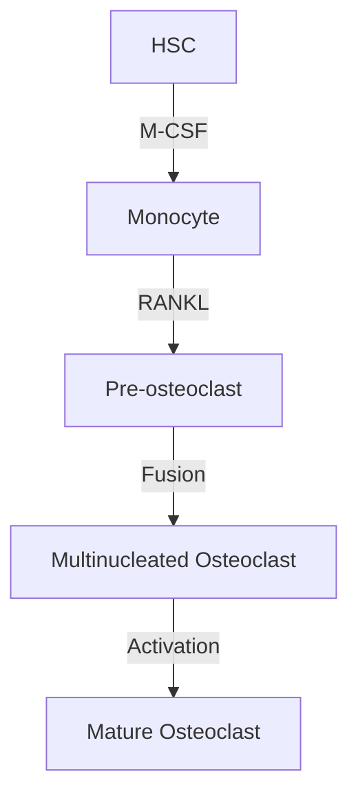
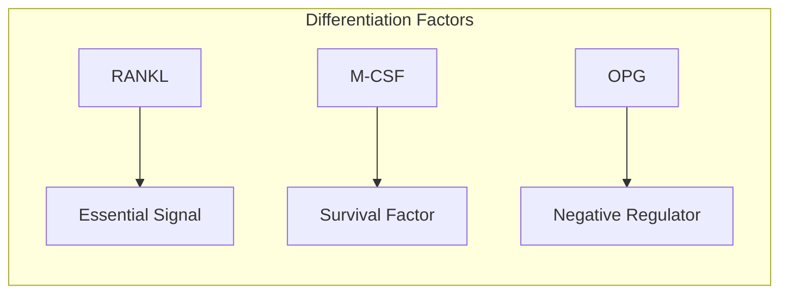
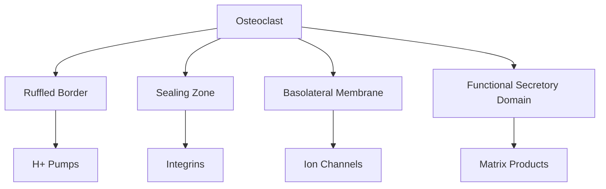
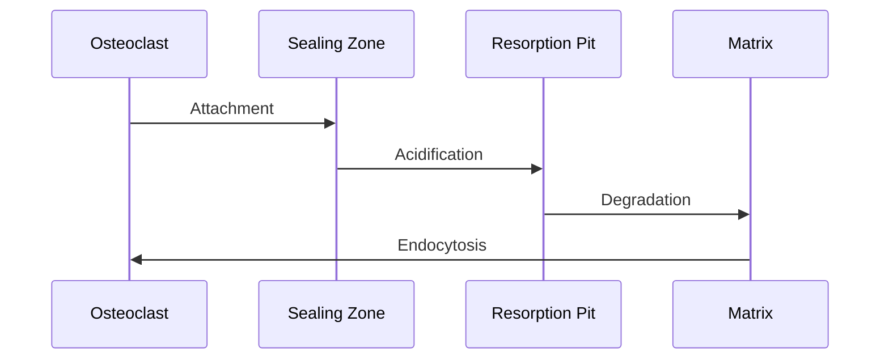
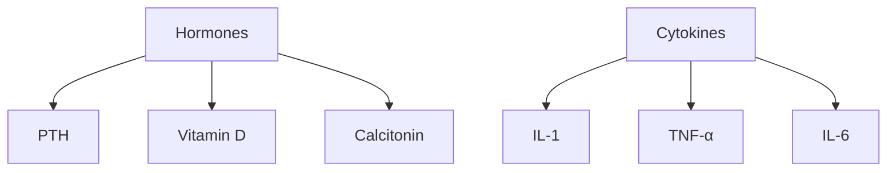
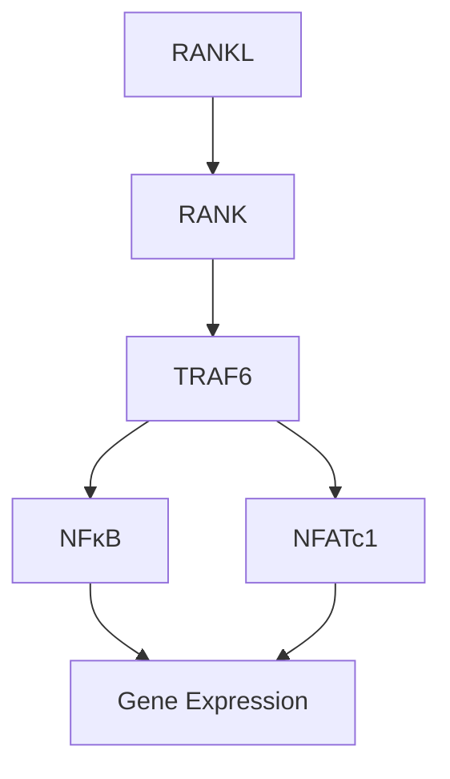
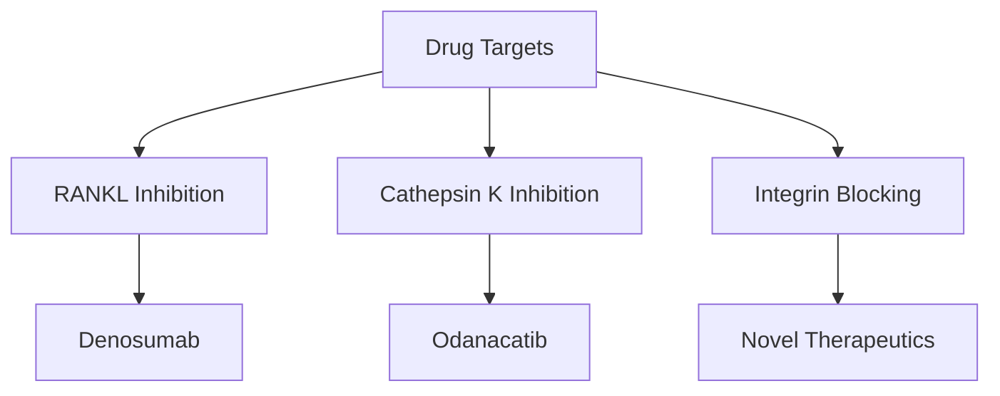

# Osteoclasts

## Description
Osteoclasts are large, multinucleated cells derived from hematopoietic stem cells that specialize in bone resorption. They are essential for bone remodeling, calcium homeostasis, and skeletal repair.

## Relationships
- `derived_from`: [[hematopoietic_stem_cells]] - Cell origin
- `interacts_with`: [[osteoblasts]] - Coupling mechanism
- `regulated_by`: [[RANK_RANKL_system]] - Primary regulation
- `responds_to`: [[parathyroid_hormone]] - Hormonal control
- `modifies`: [[bone_matrix]] - Resorption target
- `influenced_by`: [[cytokines]] - Immune regulation
- `affects`: [[calcium_homeostasis]] - Metabolic function

## Development

### 1. Differentiation Pathway

### 2. Key Regulators

## Cellular Structure

### 1. Specialized Features
- Multinucleated (3-100 nuclei)
- Ruffled border
- Sealing zone
- Abundant mitochondria
- Lysosomes

### 2. Membrane Domains

## Bone Resorption

### 1. Resorption Process

### 2. Molecular Mechanisms
- Proton pump activity
- Chloride channel function
- Matrix metalloproteinases
- Cathepsin K secretion

## Regulation

### 1. Systemic Factors

### 2. Local Factors
- RANKL/OPG system
- M-CSF
- Inflammatory mediators
- Matrix-derived factors

## Signaling Pathways

### 1. RANK Signaling

### 2. Integrin Signaling
- αvβ3 integrin
- Src kinase
- PI3K pathway
- Cytoskeletal organization

## Clinical Significance

### 1. Pathological Conditions
- [[osteopetrosis]]
- [[paget_disease]]
- [[bone_metastases]]
- [[inflammatory_bone_loss]]

### 2. Therapeutic Targets

## Research Applications

### 1. In Vitro Studies
- Cell culture models
- Resorption assays
- Drug screening
- Signaling studies

### 2. Clinical Research
- Biomarker development
- Drug development
- Therapeutic monitoring
- Disease mechanisms

## References
1. Osteoclast Biology
2. Bone Remodeling
3. Clinical Applications
4. Drug Development 