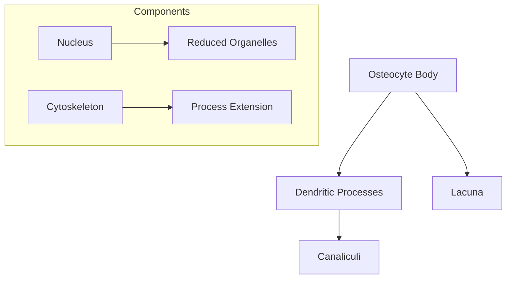
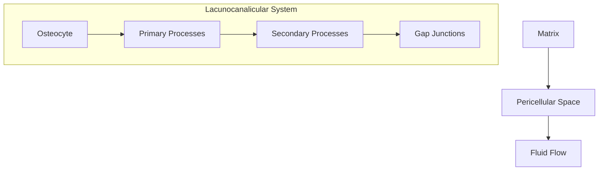
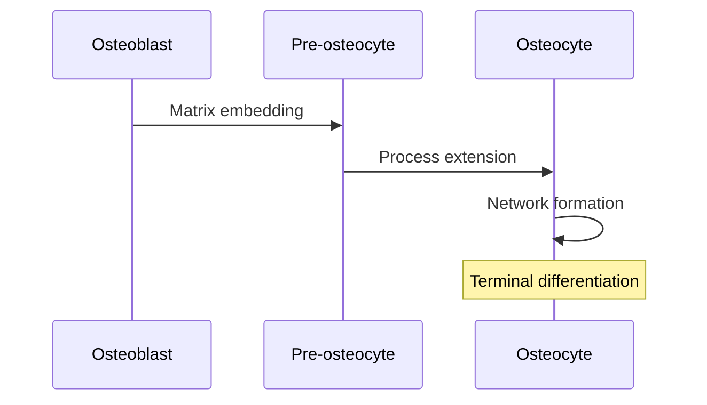
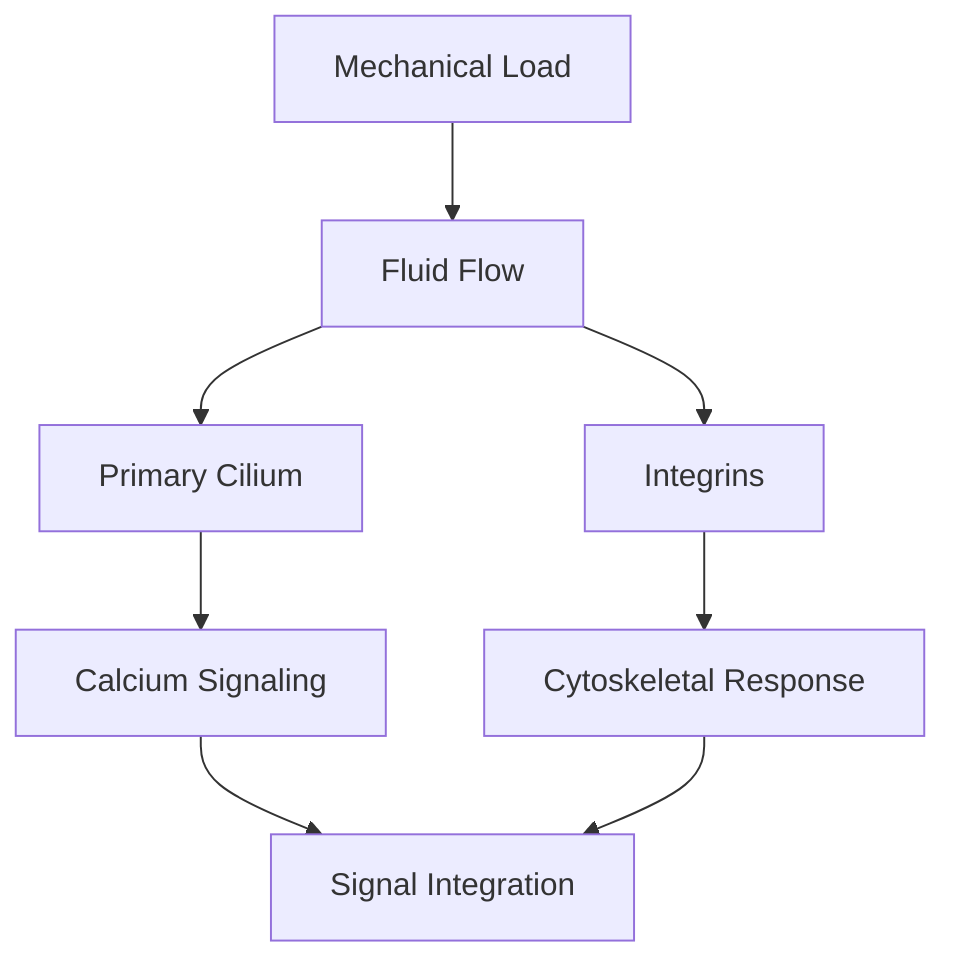
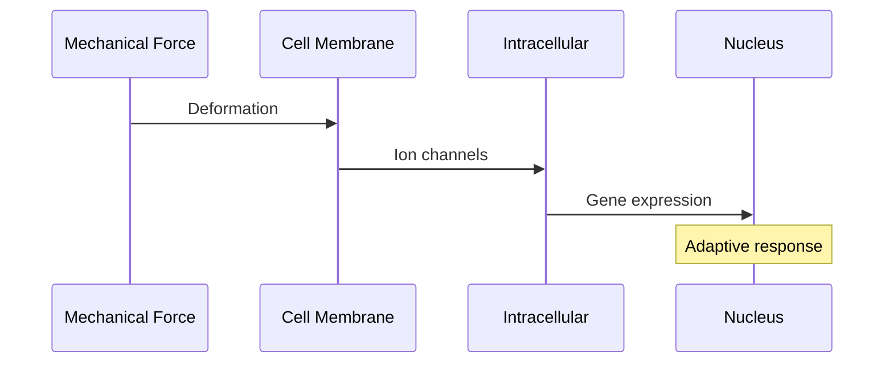
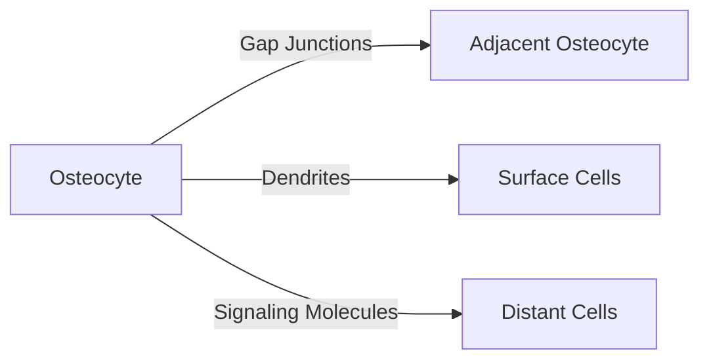
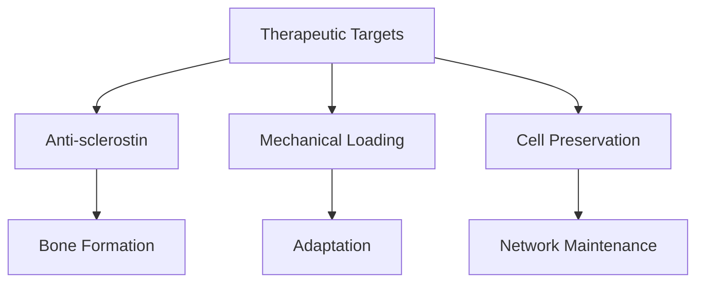

# Osteocytes

## Description
Osteocytes are terminally differentiated bone cells derived from osteoblasts that become embedded within the mineralized bone matrix. They form an extensive network that functions as the primary mechanosensor in bone tissue.

## Relationships
- `derived_from`: [[osteoblasts]] - Cell origin
- `located_in`: [[bone_matrix]] - Physical location
- `communicates_with`: [[bone_lining_cells]] - Surface connection
- `regulates`: [[bone_remodeling]] - Homeostatic control
- `responds_to`: [[mechanical_forces]] - Primary function
- `produces`: [[sclerostin]] - Signaling molecule
- `coordinates`: [[mineral_homeostasis]] - Metabolic function

## Structure

### 1. Cellular Features

### 2. Network Organization

## Development

### 1. Differentiation Process

### 2. Molecular Changes
- Reduced protein synthesis
- Enhanced mechanosensing apparatus
- Development of processes
- Matrix protein expression

## Functions

### 1. Mechanosensing

### 2. Signaling Functions
- Sclerostin production
- RANKL/OPG regulation
- FGF23 secretion
- Prostaglandin release

## Molecular Mechanisms

### 1. Mechanotransduction

### 2. Signaling Pathways
- Wnt/β-catenin pathway
- Calcium signaling
- cAMP/PKA pathway
- MAP kinases

## Network Communication

### 1. Cell-Cell Interaction

### 2. Matrix Interaction
- Pericellular matrix
- Tethering elements
- Matrix proteins
- Fluid dynamics

## Clinical Significance

### 1. Pathological Conditions
- [[osteocyte_apoptosis]]
- [[osteoporosis]]
- [[bone_aging]]
- [[mechanical_loading_disorders]]

### 2. Therapeutic Implications

## Research Applications

### 1. Experimental Models
- 3D culture systems
- Loading studies
- Network analysis
- Molecular imaging

### 2. Clinical Applications
- Biomarker development
- Drug targeting
- Exercise protocols
- Disease monitoring

## References
1. Osteocyte Biology
2. Mechanotransduction
3. Bone Adaptation
4. Clinical Applications 