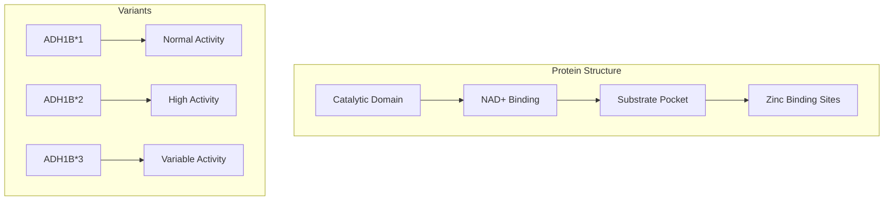
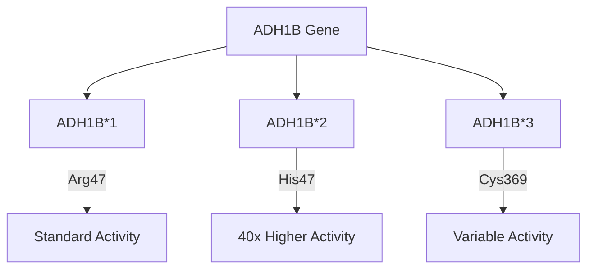
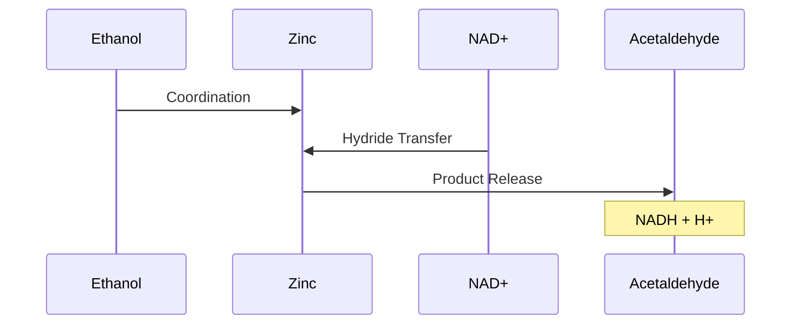
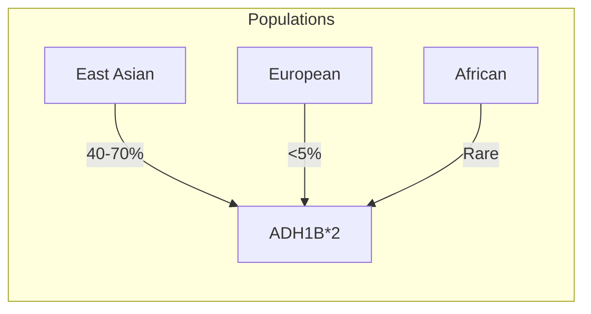
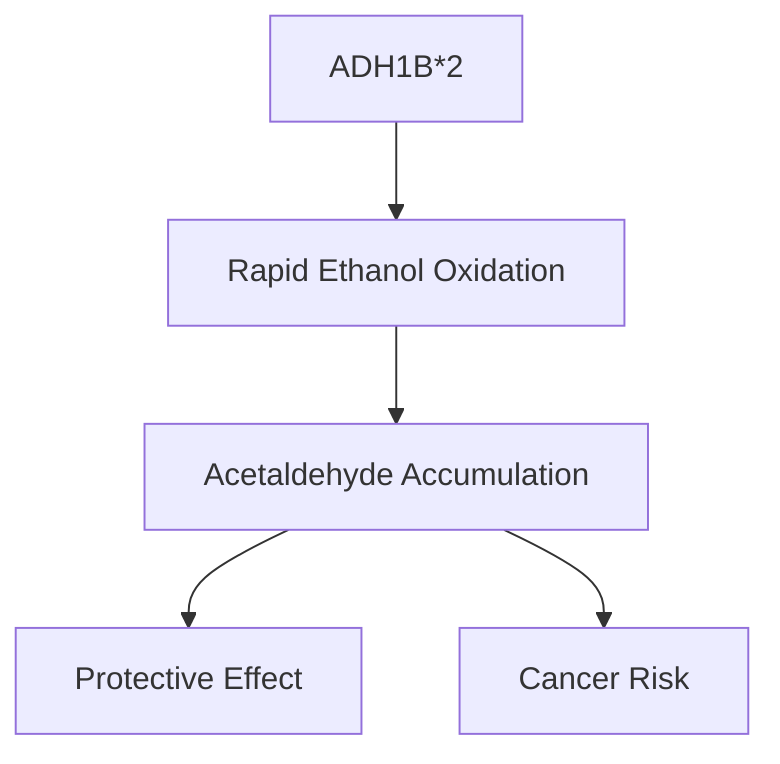

# Alcohol Dehydrogenase 1B (ADH1B)

## Description
ADH1B is a key enzyme in alcohol metabolism that catalyzes the oxidation of ethanol to acetaldehyde. The ADH1B*2 variant, common in East Asian populations, shows significantly higher activity than the wild-type enzyme.

## Relationships
- `is_part_of`: [[ethanol_metabolism]] - Primary metabolic pathway
- `produces`: [[acetaldehyde]] - Direct product
- `interacts_with`: [[NAD_plus]] - Essential cofactor
- `modulates`: [[alcohol_flush_reaction]] - Affects symptom intensity
- `synergizes_with`: [[ALDH2]] - Combined genetic effect
- `located_in`: [[liver_cytosol]] - Primary location
- `type_of`: [[oxidoreductase]] - Enzyme classification

## Structure

## Molecular Details

### 1. Protein Properties
- Length: 375 amino acids
- Molecular weight: 40 kDa
- Quaternary structure: Homodimer
- Cofactor: NAD+
- Metal ions: 2 Zinc atoms per subunit

### 2. Genetic Variants

## Catalytic Mechanism

### 1. Kinetic Parameters
- Km (ethanol):
  - ADH1B*1: ~1 mM
  - ADH1B*2: ~0.2 mM
- Vmax (relative):
  - ADH1B*1: 1x
  - ADH1B*2: ~40x

### 2. Substrate Specificity
- Primary: Ethanol
- Secondary:
  - Methanol
  - Longer chain alcohols
  - Retinol

## Population Genetics

### 1. Allele Distribution

### 2. Evolutionary Aspects
- Selection pressure
- Rice cultivation correlation
- Geographic distribution

## Clinical Significance

### 1. Alcohol Metabolism
- Rapid acetaldehyde production
- Enhanced alcohol sensitivity
- Reduced alcoholism risk

### 2. Health Implications

## Research Applications

### 1. Pharmacogenetics
- Drug metabolism
- Personalized medicine
- Treatment strategies

### 2. Population Studies
- Alcohol use disorders
- Cancer risk assessment
- Genetic screening

## Interactions

### 1. Enzyme Networks
- [[ALDH2]] pathway
- [[CYP2E1]] system
- [[catalase]] pathway

### 2. Regulatory Factors
- Hormonal regulation
- Transcriptional control
- Post-translational modifications

## References
1. Molecular Genetics and Evolution
2. Enzyme Structure and Function
3. Population Studies
4. Clinical Applications 