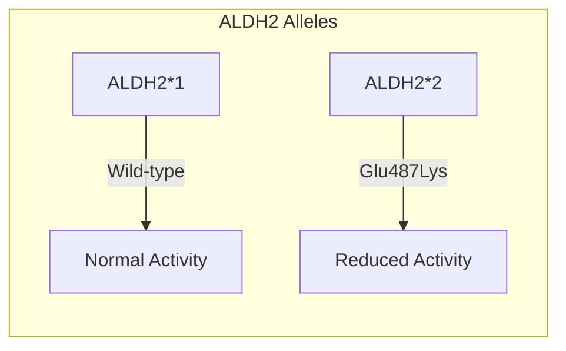
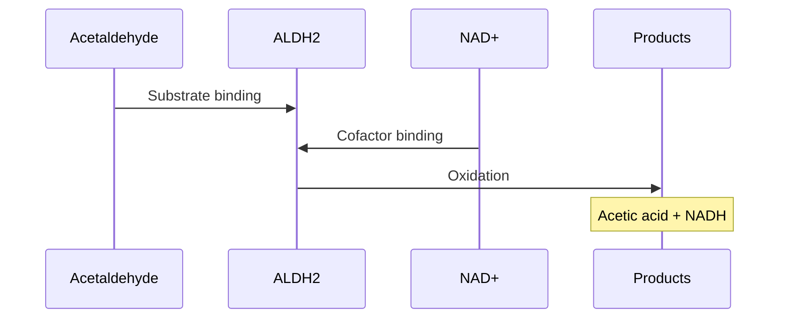
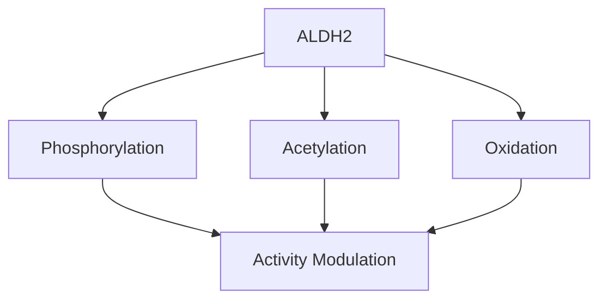
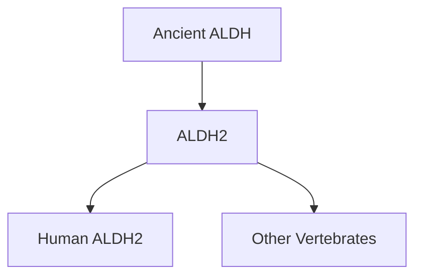

# Aldehyde Dehydrogenase 2 (ALDH2)

## Description
ALDH2 is a mitochondrial enzyme that plays a crucial role in alcohol metabolism by catalyzing the oxidation of acetaldehyde to acetic acid. It is particularly important in detoxifying alcohol-derived acetaldehyde.

## Relationships
- `is_part_of`: [[mitochondrial_proteins]] - Cellular location
- `regulates`: [[acetaldehyde_metabolism]] - Primary function
- `interacts_with`: [[NAD_plus]] - Essential cofactor
- `modulates`: [[alcohol_metabolism]] - Key metabolic role
- `causes`: [[alcohol_flush_reaction]] - When deficient
- `located_in`: [[mitochondrial_matrix]] - Subcellular location
- `type_of`: [[oxidoreductase]] - Enzyme classification

## Structure

## Molecular Details

### 1. Protein Properties
- Length: 517 amino acids
- Molecular weight: 56 kDa
- Oligomeric state: Homotetramer
- Cofactor: NAD+

### 2. Genetic Variants

## Catalytic Mechanism

### 1. Reaction Steps
- Substrate binding
- NAD+ binding
- Hydride transfer
- Product release

### 2. Kinetic Parameters
- Km (acetaldehyde): ~1 µM
- kcat: ~1.2 s⁻¹
- pH optimum: 7.5
- Temperature optimum: 37°C

## Regulation

### 1. Transcriptional Control
- Nuclear respiratory factors
- Oxidative stress response
- Tissue-specific expression

### 2. Post-translational Modifications

## Clinical Significance

### 1. ALDH2*2 Variant
- Glu487Lys mutation
- Dominant negative effect
- Reduced enzyme stability
- ~40% prevalence in East Asians

### 2. Associated Conditions
- [[alcohol_flush_reaction]]
- [[acetaldehyde_toxicity]]
- [[esophageal_cancer_risk]]
- [[cardiovascular_effects]]

## Research Applications

### 1. Drug Development
- ALDH2 activators
- Protective compounds
- Cancer prevention

### 2. Biomedical Research
- Alcohol metabolism
- Oxidative stress
- Cardiovascular protection

## Evolution and Conservation

### 1. Evolutionary History

### 2. Conservation Analysis
- Highly conserved active site
- Variable regulatory regions
- Species-specific variants

## References
1. Molecular Structure and Function
2. Biochemistry and Regulation
3. Clinical Implications
4. Evolutionary Studies 