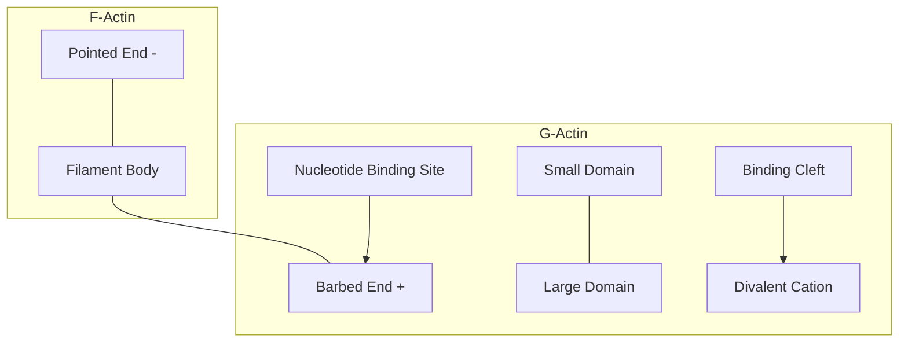
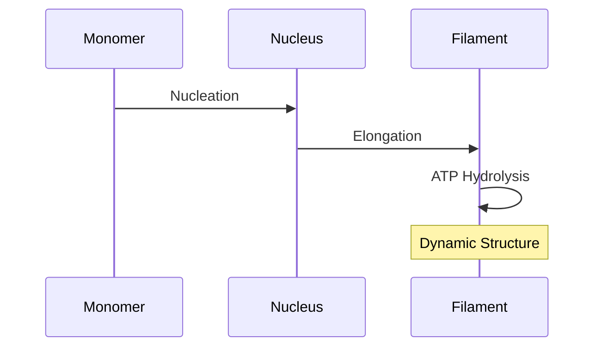
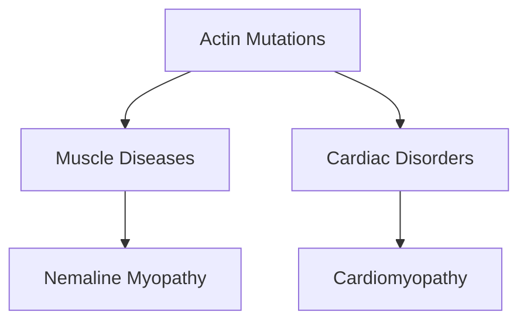

# Actin

## Description
Actin is a highly conserved protein that forms microfilaments in muscle and non-muscle cells, playing crucial roles in cell movement, structure, and muscle contraction. In muscle, it forms the thin filaments of the sarcomere.

## Relationships
- `is_part_of`: [[thin_filament]] - Major component of thin filaments
- `interacts_with`: [[myosin]] - Forms actomyosin complex
- `interacts_with`: [[tropomyosin]] - Regulatory protein binding
- `interacts_with`: [[troponin_complex]] - Forms regulatory complex
- `contains`: [[ATP_binding_site]] - Nucleotide binding pocket
- `regulates`: [[muscle_contraction]] - Essential for force generation
- `type_of`: [[cytoskeletal_protein]] - Structural classification
- `instance_of`: [[contractile_protein]] - Functional classification

## Structure

## Molecular Details

### 1. G-Actin (Monomer)
- Molecular weight: 42 kDa
- Structure:
  - 4 subdomains
  - ATP/ADP binding pocket
  - Mg2+ binding site
- States:
  - ATP-bound
  - ADP-bound
  - Nucleotide-free

### 2. F-Actin (Filament)

## Polymerization Process

### 1. Nucleation Phase
- Formation of actin trimers
- Rate-limiting step
- Requires ATP-bound monomers

### 2. Elongation Phase
- Rapid addition at barbed end
- Slower addition at pointed end
- ATP hydrolysis follows

### 3. Steady State

## Regulation

### 1. Actin Binding Proteins
- [[actin_binding_proteins]]
  - Nucleation factors
  - Capping proteins
  - Severing proteins
  - Cross-linking proteins

### 2. Post-translational Modifications
- Phosphorylation
- Methylation
- Acetylation
- Oxidation

## Functions

### 1. Muscle Contraction
- Myosin binding sites
- Force transmission
- Sarcomere structure

### 2. Non-muscle Roles
- Cytoskeleton organization
- Cell motility
- Vesicle transport
- Cell division

## Clinical Significance

### 1. Pathologies

### 2. Therapeutic Targets
- Cytoskeletal drugs
- Anti-cancer agents
- Cardiac medications

## Research Applications
- Drug development
- Cytoskeleton studies
- Muscle research
- Cell biology

## References
1. Nature Reviews Molecular Cell Biology
2. Annual Review of Biophysics
3. Journal of Muscle Research
4. Cytoskeleton 