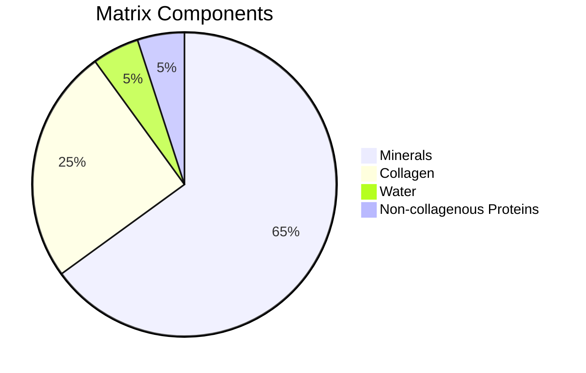
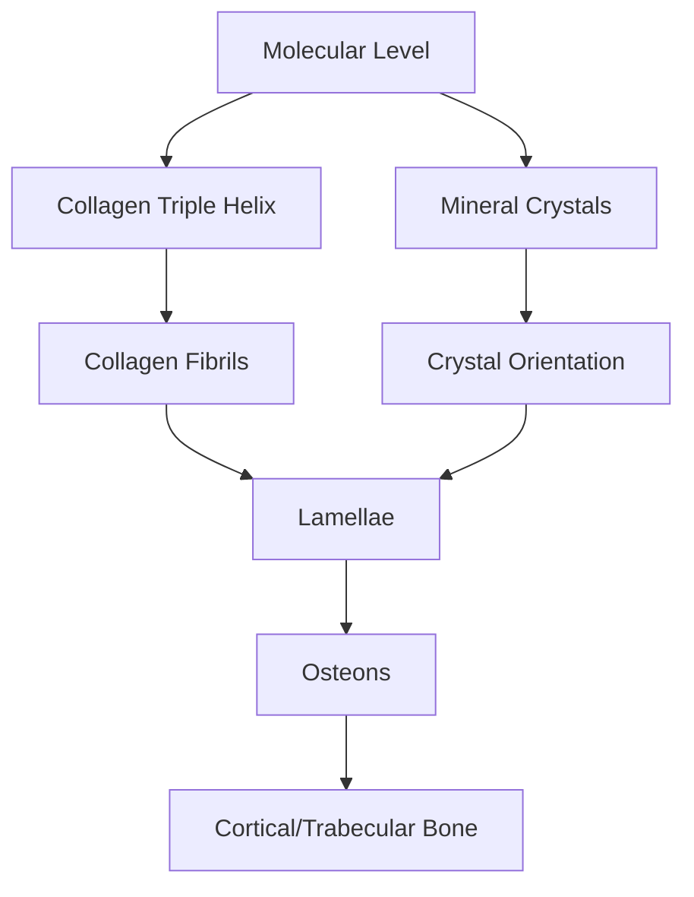
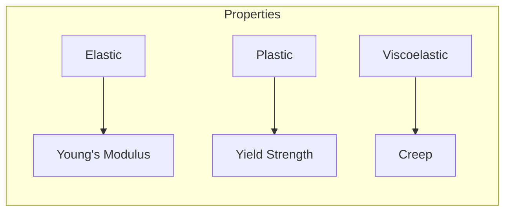
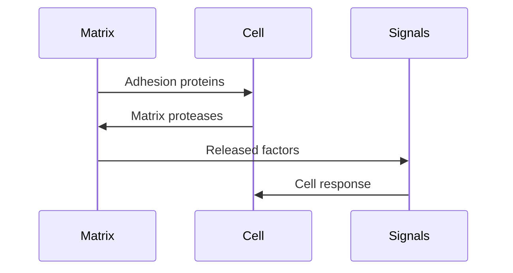
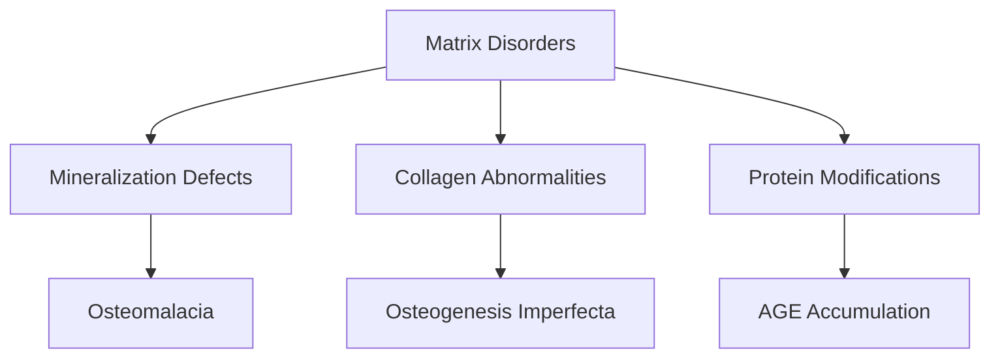

# Bone Matrix

## Description
The bone matrix is a complex composite material consisting of both organic and inorganic components. It provides mechanical strength, serves as a mineral reservoir, and contains various growth factors and signaling molecules.

## Relationships
- `is_part_of`: [[bone_tissue]] - Structural component
- `contains`: [[collagen]], [[hydroxyapatite]] - Major components
- `interacts_with`: [[bone_cells]] - Cellular interface
- `stores`: [[growth_factors]], [[minerals]] - Reservoir function
- `regulated_by`: [[matrix_proteins]] - Organization control
- `provides`: [[mechanical_strength]] - Physical function
- `supports`: [[cell_adhesion]] - Biological function

## Composition

### 1. Components Distribution


### 2. Computational Model
```typescript
interface BoneMatrix {
    composition: {
        mineral: {
            hydroxyapatite: number;
            carbonates: number;
            other_ions: Ion[];
        };
        organic: {
            collagen: CollagenFibril[];
            ncps: NonCollagenousProtein[];
            proteoglycans: Proteoglycan[];
        };
        water: {
            bound: number;
            free: number;
        };
    };
    
    properties: {
        density: number;
        stiffness: number;
        strength: number;
        porosity: number;
    };
}
```

## Structural Organization

### 1. Hierarchical Structure


### 2. Molecular Assembly
```typescript
class MatrixAssembly {
    collagen: {
        molecules: CollagenMolecule[];
        crosslinks: CrossLink[];
        organization: FibrilStructure;
    };
    
    mineral: {
        crystals: HydroxyapatiteCrystal[];
        orientation: Orientation3D;
        distribution: SpatialDistribution;
    };
    
    async function assembleMatrix(): MatrixStructure {
        const fibrils = await this.organizeCollagen();
        const minerals = await this.nucleateCrystals();
        return this.integrateComponents(fibrils, minerals);
    }
}
```

## Mechanical Properties

### 1. Material Behavior


### 2. Computational Analysis
```typescript
interface MechanicalProperties {
    elastic: {
        youngsModulus: number;
        poissonsRatio: number;
        shearModulus: number;
    };
    
    strength: {
        tensile: number;
        compressive: number;
        shear: number;
    };
    
    function calculateStress(strain: number): Stress;
    function predictFailure(load: Force): FailureProbability;
}
```

## Remodeling Interface

### 1. Matrix-Cell Interactions


### 2. Dynamic Processes
```typescript
class MatrixDynamics {
    degradation: {
        enzymes: MatrixMetalloprotease[];
        pH: number;
        rate: number;
    };
    
    formation: {
        collagenSynthesis: Rate;
        mineralization: Rate;
        maturation: TimeSpan;
    };
    
    async function modelTurnover(site: RemodelingUnit) {
        const oldMatrix = await site.getCurrentMatrix();
        const degradation = await this.calculateDegradation(oldMatrix);
        const newMatrix = await this.synthesizeMatrix(site);
        return this.integrateChanges(degradation, newMatrix);
    }
}
```

## Biological Functions

### 1. Growth Factor Storage
- BMPs
- TGF-β
- IGFs
- PDGF

### 2. Signal Processing
```typescript
interface MatrixSignaling {
    stored_factors: GrowthFactor[];
    binding_sites: BindingSite[];
    release_triggers: Trigger[];
    
    async function processSignal(signal: Signal) {
        const boundFactors = this.binding_sites
            .filter(site => site.canBind(signal))
            .map(site => site.release());
            
        return this.integrateResponses(boundFactors);
    }
}
```

## Clinical Relevance

### 1. Pathological Changes


### 2. Therapeutic Targets
- Mineralization modulators
- Collagen stabilizers
- Crosslink inhibitors
- Matrix protectors

## References
1. Matrix Biology
2. Biomechanics
3. Clinical Disorders
4. Computational Modeling 