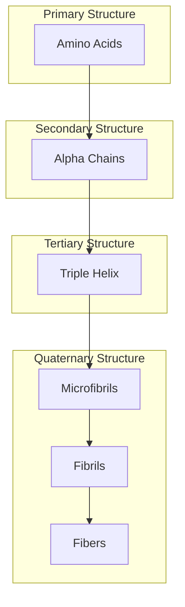
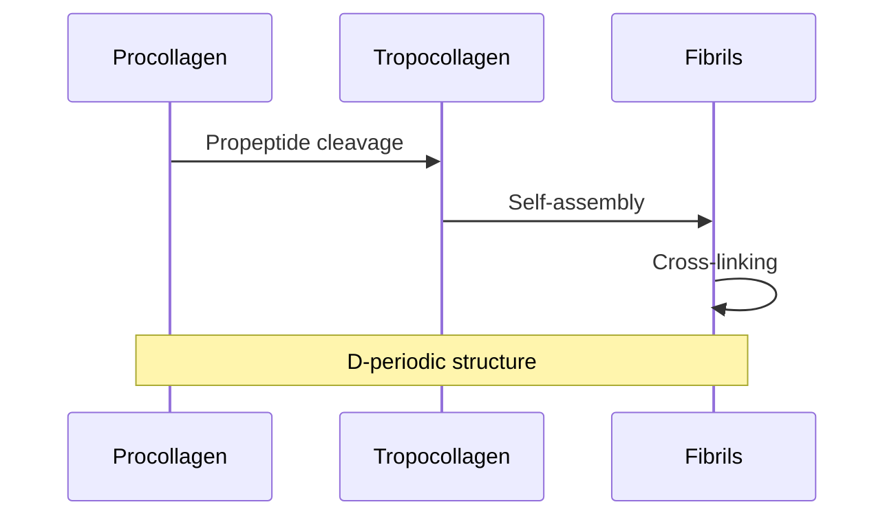
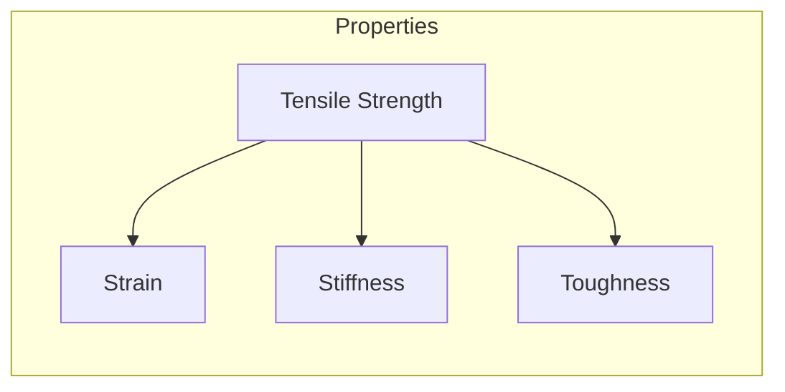
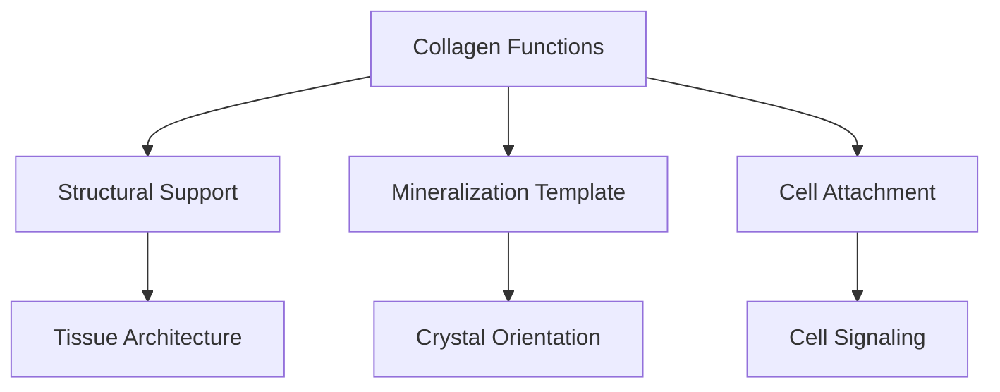
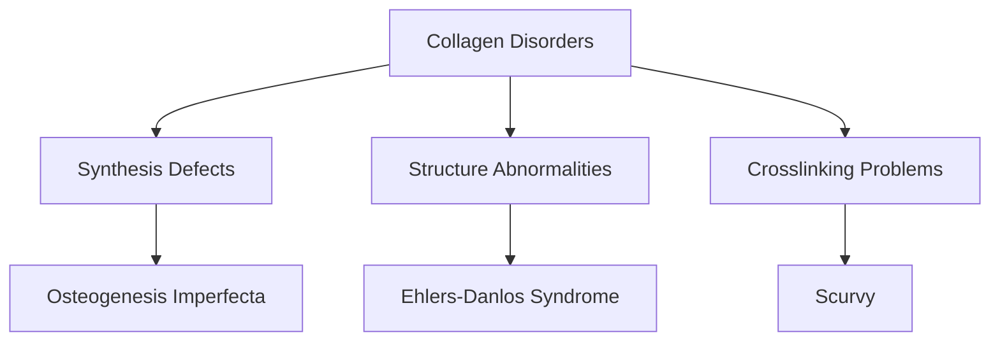

# Collagen

## Description
Collagen is the most abundant protein in the human body and the primary organic component of bone matrix. Type I collagen, the predominant form in bone, provides tensile strength and serves as a scaffold for mineralization.

## Relationships
- `is_part_of`: [[bone_matrix]] - Major organic component
- `interacts_with`: [[hydroxyapatite]] - Mineralization template
- `produced_by`: [[osteoblasts]] - Cellular source
- `modified_by`: [[post_translational_modifications]] - Regulation
- `stabilized_by`: [[crosslinks]] - Structural stability
- `guides`: [[mineralization]] - Crystal organization
- `affects`: [[bone_strength]] - Mechanical property

## Structure

### 1. Hierarchical Organization


### 2. Molecular Model
```typescript
interface CollagenMolecule {
    primary: {
        chains: AlphaChain[];
        sequence: AminoAcid[];
        length: number;
    };
    
    structure: {
        tripleHelix: HelicalDomain;
        telopeptides: NonHelicalDomain[];
        modifications: PTM[];
    };
    
    properties: {
        stability: number;
        flexibility: number;
        bindingSites: BindingSite[];
    };
}
```

## Assembly Process

### 1. Fibril Formation


### 2. Assembly Dynamics
```typescript
class CollagenAssembly {
    synthesis: {
        transcription: GeneExpression;
        translation: ProteinSynthesis;
        modification: PostTranslational;
    };
    
    assembly: {
        nucleation: AssemblyNucleus[];
        growth: FibrilGrowth;
        organization: SpatialArrangement;
    };
    
    async function modelAssembly(conditions: Environment): Promise<Fibril> {
        const molecules = await this.synthesizeCollagen();
        const nucleus = await this.initiateAssembly();
        return this.growFibril(molecules, nucleus);
    }
}
```

## Properties

### 1. Mechanical Characteristics


### 2. Material Behavior
```typescript
interface CollagenProperties {
    mechanical: {
        tensileStrength: number;
        elasticModulus: number;
        viscoelasticity: number;
    };
    
    structural: {
        diameter: number;
        periodicity: number;
        orientation: Orientation3D;
    };
    
    function calculateStress(strain: number): Stress;
    function predictDeformation(load: Force): Deformation;
}
```

## Biological Functions

### 1. Matrix Organization


### 2. Molecular Interactions
```typescript
interface CollagenInteractions {
    cellular: {
        bindingSites: IntegrinBinding[];
        signaling: CellSignal[];
        adhesion: AdhesionStrength;
    };
    
    matrix: {
        mineralBinding: BindingSite[];
        proteinInteractions: ProteinBinding[];
        crosslinks: CrossLink[];
    };
    
    function regulateBinding(molecule: Ligand): BindingResponse;
    function mediateSignaling(signal: CellSignal): Response;
}
```

## Clinical Relevance

### 1. Pathological Changes


### 2. Therapeutic Approaches
- Genetic therapy
- Collagen stabilization
- Crosslink modification
- Matrix targeting

## Research Applications

### 1. Biomaterial Development
```typescript
interface CollagenBiomaterials {
    scaffolds: {
        architecture: ScaffoldStructure;
        porosity: number;
        degradation: Rate;
    };
    
    modifications: {
        crosslinking: CrosslinkMethod;
        functionalization: ChemicalGroup[];
        incorporation: Biomolecule[];
    };
    
    async function designScaffold(application: TissueType): Promise<Scaffold>;
    async function optimizeProperties(requirements: Properties): Promise<Process>;
}
```

### 2. Future Directions
- Smart materials
- Drug delivery systems
- Tissue engineering
- Regenerative medicine

## Computational Analysis

### 1. Molecular Dynamics
```typescript
interface CollagenSimulation {
    model: {
        atomistic: AtomisticModel;
        coarseGrained: CGModel;
        continuum: ContinuumModel;
    };
    
    analysis: {
        stability: StabilityAnalysis;
        dynamics: DynamicsSimulation;
        interactions: InteractionAnalysis;
    };
    
    async function simulateDynamics(timespan: Time): Promise<Trajectory>;
    async function predictBehavior(conditions: Environment): Promise<Behavior>;
}
```

### 2. Structure Prediction
- Sequence analysis
- Folding simulation
- Assembly modeling
- Property prediction

## References
1. Protein Chemistry
2. Biomechanics
3. Clinical Disorders
4. Tissue Engineering 