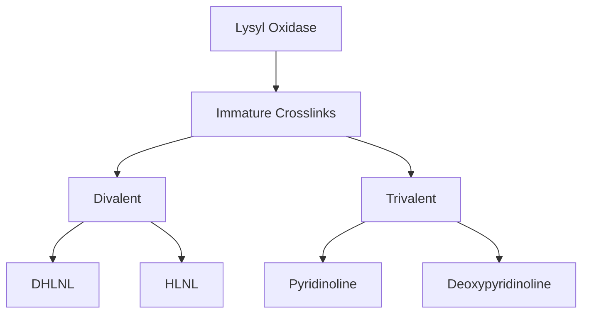
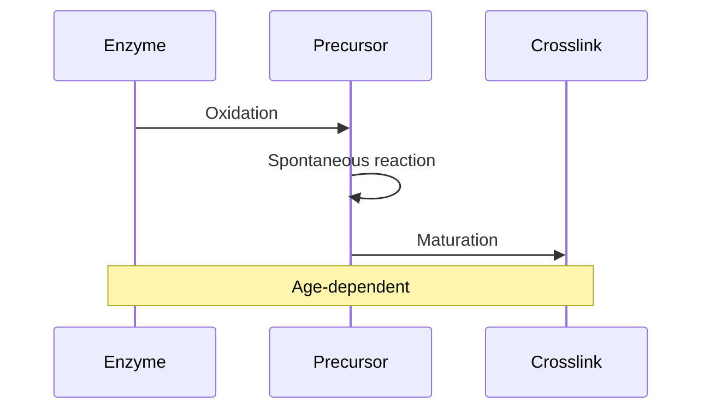
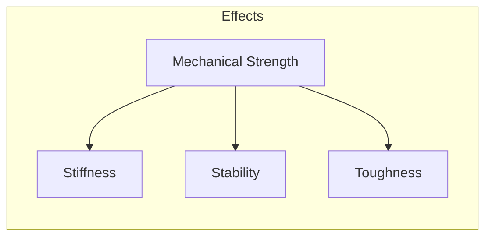
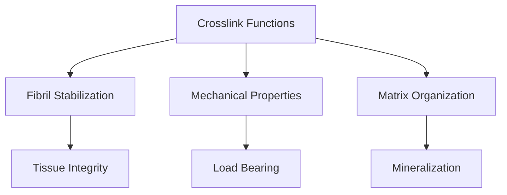
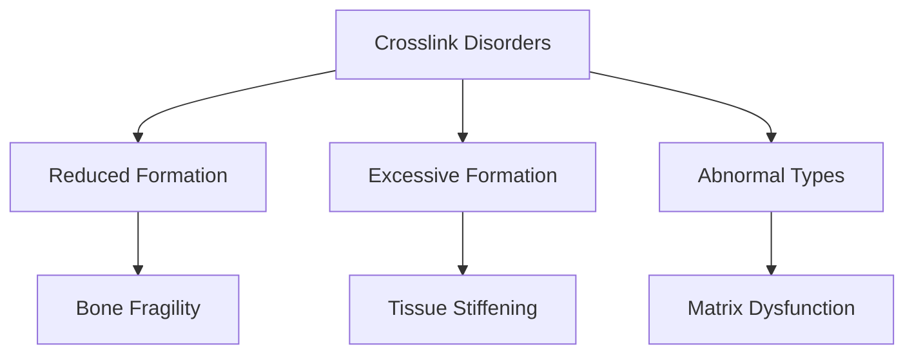

# Crosslinks

## Description
Crosslinks are covalent bonds that connect collagen molecules and fibrils, providing structural stability and mechanical strength to bone tissue. They are essential for the proper function of the extracellular matrix and bone mineralization.

## Relationships
- `stabilizes`: [[collagen]] - Primary function
- `affects`: [[bone_strength]] - Mechanical property
- `regulated_by`: [[enzymes]] - Formation control
- `influenced_by`: [[aging]] - Time-dependent changes
- `modifies`: [[bone_matrix]] - Structural impact
- `correlates_with`: [[bone_quality]] - Clinical measure
- `involved_in`: [[tissue_maturation]] - Development process

## Types

### 1. Enzymatic Crosslinks


### 2. Molecular Model
```typescript
interface EnzymaticCrosslink {
    type: CrosslinkType;
    chemistry: {
        precursors: AminoAcid[];
        enzyme: LysylOxidase;
        mechanism: ReactionMechanism;
    };
    
    properties: {
        stability: number;
        maturity: CrosslinkMaturity;
        orientation: Orientation3D;
    };
    
    function formBond(residues: AminoAcid[]): Bond;
}
```

## Formation Process

### 1. Development Stages


### 2. Formation Dynamics
```typescript
class CrosslinkFormation {
    initiation: {
        enzyme: LysylOxidase;
        substrate: CollagenLysine;
        cofactors: Cofactor[];
    };
    
    maturation: {
        intermediate: AldimineBond;
        final: MatureCrosslink;
        timing: MaturationTime;
    };
    
    async function modelFormation(conditions: Environment): Promise<Crosslink> {
        const precursor = await this.initializeOxidation();
        const intermediate = await this.formIntermediate();
        return this.matureCrosslink(intermediate);
    }
}
```

## Properties

### 1. Structural Impact


### 2. Physical Properties
```typescript
interface CrosslinkProperties {
    mechanical: {
        bondStrength: number;
        elasticity: number;
        resistance: number;
    };
    
    chemical: {
        stability: pH_Stability;
        reversibility: boolean;
        energy: BondEnergy;
    };
    
    function assessStrength(): MechanicalStrength;
    function predictStability(conditions: Environment): Stability;
}
```

## Biological Functions

### 1. Matrix Stabilization


### 2. Molecular Interactions
```typescript
interface CrosslinkInteractions {
    structural: {
        fibrilAlignment: Alignment;
        spacing: MolecularDistance;
        density: CrosslinkDensity;
    };
    
    functional: {
        loadTransfer: LoadDistribution;
        deformation: DeformationResponse;
        recovery: RecoveryRate;
    };
    
    function distributeForce(load: Force): ForceDistribution;
    function maintainStructure(stress: Stress): StructuralResponse;
}
```

## Clinical Relevance

### 1. Pathological Changes


### 2. Therapeutic Targets
- Crosslink modulators
- Enzyme inhibitors
- Matrix stabilizers
- Age-related interventions

## Research Applications

### 1. Analysis Methods
```typescript
interface CrosslinkAnalysis {
    quantification: {
        method: AnalyticalMethod;
        markers: BiochemicalMarker[];
        standards: Standard[];
    };
    
    imaging: {
        technique: ImagingModality;
        resolution: SpatialResolution;
        analysis: ImageAnalysis;
    };
    
    async function measureDensity(sample: TissueSample): Promise<Density>;
    async function mapDistribution(tissue: Tissue): Promise<Distribution>;
}
```

### 2. Future Directions
- Novel detection methods
- Therapeutic targeting
- Aging interventions
- Tissue engineering

## Computational Modeling

### 1. Structural Analysis
```typescript
interface CrosslinkModel {
    geometry: {
        position: Position3D;
        orientation: Orientation3D;
        distribution: SpatialDistribution;
    };
    
    mechanics: {
        forceField: ForceField;
        constraints: Constraint[];
        dynamics: MolecularDynamics;
    };
    
    async function simulateResponse(force: Force): Promise<Response>;
    async function optimizeDistribution(requirements: Requirements): Promise<Layout>;
}
```

### 2. Predictive Tools
- Formation kinetics
- Stability analysis
- Mechanical impact
- Aging effects

## References
1. Collagen Chemistry
2. Bone Biomechanics
3. Clinical Studies
4. Analytical Methods 