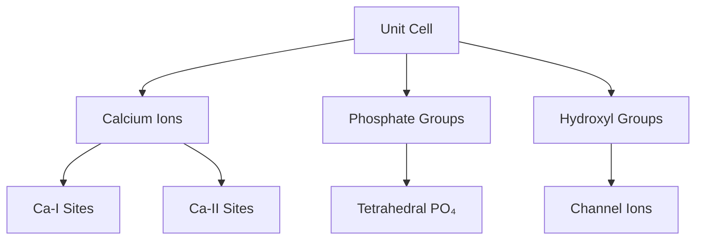
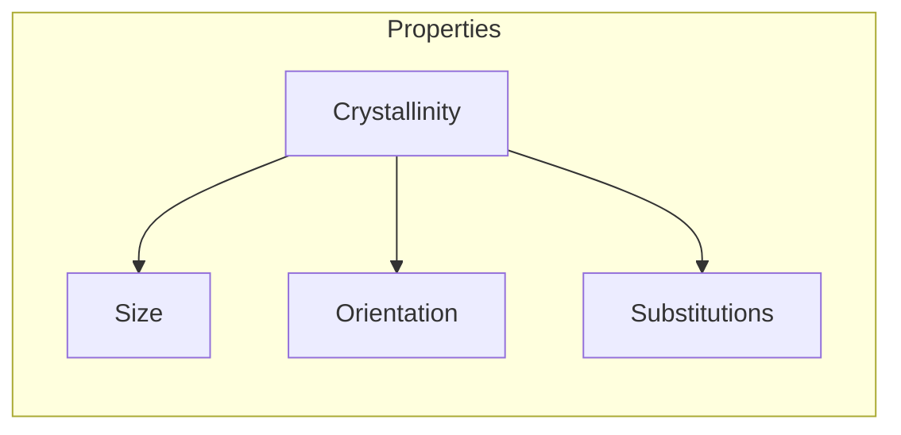
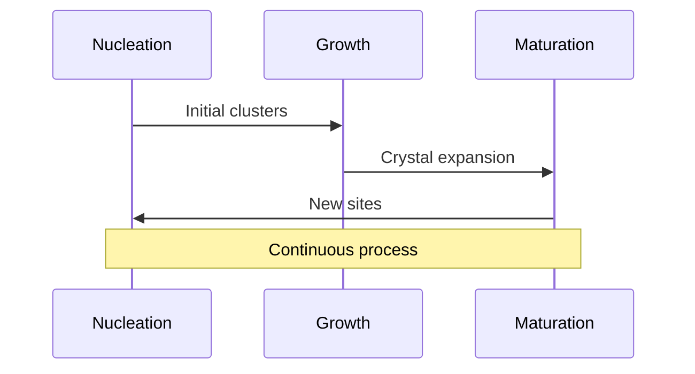
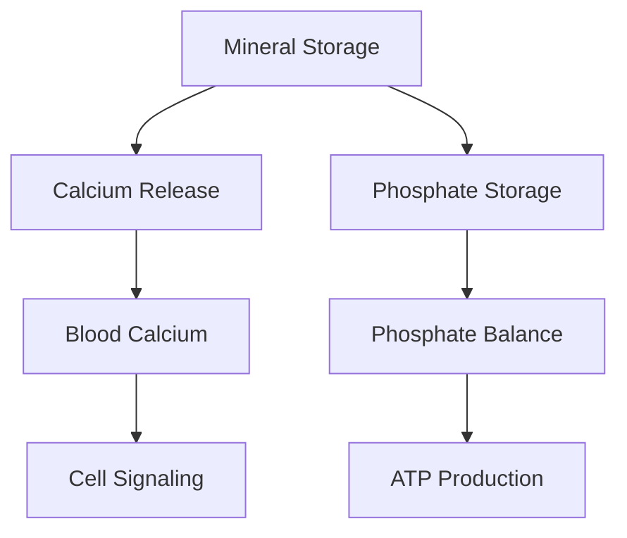
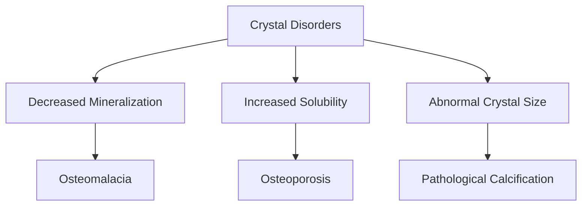

# Hydroxyapatite

## Description
Hydroxyapatite (Ca₁₀(PO₄)₆(OH)₂) is the primary mineral component of bone tissue, comprising about 65% of bone matrix by weight. It provides mechanical strength and serves as the body's primary mineral reservoir.

## Relationships
- `is_part_of`: [[bone_matrix]] - Primary component
- `interacts_with`: [[collagen]] - Structural integration
- `stores`: [[calcium]], [[phosphate]] - Mineral reservoir
- `affected_by`: [[pH_changes]] - Solubility factor
- `regulated_by`: [[bone_remodeling]] - Dynamic control
- `influences`: [[bone_strength]] - Mechanical property
- `participates_in`: [[mineralization]] - Formation process

## Structure

### 1. Crystal Structure


### 2. Computational Model
```typescript
interface HydroxyapatiteCrystal {
    composition: {
        calcium: CationSite[];
        phosphate: PhosphateGroup[];
        hydroxyl: HydroxylGroup[];
        substitutions: IonicSubstitution[];
    };
    
    structure: {
        lattice: HexagonalLattice;
        dimensions: Crystal3D;
        orientation: Orientation3D;
    };
    
    properties: {
        solubility: number;
        surfaceCharge: number;
        crystallinity: number;
    };
}
```

## Properties

### 1. Physical Characteristics


### 2. Material Properties
```typescript
interface CrystalProperties {
    mechanical: {
        elasticModulus: number;
        hardness: number;
        brittleness: number;
    };
    
    chemical: {
        solubilityProduct: number;
        surfaceArea: number;
        reactivity: number;
    };
    
    function calculateStability(pH: number, temperature: number): Stability;
    function predictDissolution(conditions: Environment): DissolutionRate;
}
```

## Formation Process

### 1. Nucleation and Growth


### 2. Growth Dynamics
```typescript
class CrystalGrowth {
    nucleation: {
        sites: NucleationSite[];
        rate: number;
        energy: number;
    };
    
    growth: {
        direction: Vector3D;
        rate: GrowthRate;
        inhibitors: Inhibitor[];
    };
    
    async function modelGrowth(conditions: Environment): Promise<Crystal> {
        const nucleus = await this.initiateNucleation();
        const growthPattern = await this.calculateGrowthPattern();
        return this.simulateGrowth(nucleus, growthPattern);
    }
}
```

## Biological Role

### 1. Mineral Homeostasis


### 2. Regulation System
```typescript
interface MineralRegulation {
    homeostasis: {
        calcium: CalciumPool;
        phosphate: PhosphatePool;
        regulators: HormonalRegulator[];
    };
    
    exchange: {
        dissolution: Rate;
        precipitation: Rate;
        equilibrium: Constant;
    };
    
    function maintainHomeostasis(demand: MineralDemand): void;
    function respondToHormones(signal: HormonalSignal): void;
}
```

## Clinical Applications

### 1. Therapeutic Uses
- Bone grafts
- Dental materials
- Coatings for implants
- Drug delivery systems

### 2. Biomedical Engineering
```typescript
interface BiomaterialApplications {
    implants: {
        coating: CoatingProperties;
        integration: IntegrationRate;
        durability: Lifespan;
    };
    
    drugDelivery: {
        loading: DrugLoadingCapacity;
        release: ReleaseProfile;
        targeting: TargetSpecificity;
    };
    
    function optimizeProperties(application: ClinicalUse): Properties;
    function predictPerformance(environment: PhysiologicalConditions): Performance;
}
```

## Pathological Changes

### 1. Disease States


### 2. Diagnostic Tools
- X-ray diffraction
- Electron microscopy
- Spectroscopic analysis
- Thermal analysis

## Research Applications

### 1. Synthetic Production
```typescript
interface SyntheticHydroxyapatite {
    synthesis: {
        method: SynthesisMethod;
        parameters: ProcessParameters;
        quality: QualityMetrics;
    };
    
    characterization: {
        composition: ChemicalAnalysis;
        structure: CrystalStructure;
        properties: MaterialProperties;
    };
    
    async function optimize(targetProperties: Properties): Promise<Process>;
    async function scaleUp(labProcess: Process): Promise<IndustrialProcess>;
}
```

### 2. Future Directions
- Smart materials
- Nanostructured composites
- Biomimetic synthesis
- Controlled release systems

## References
1. Crystal Chemistry
2. Biomineralization
3. Clinical Applications
4. Materials Science 