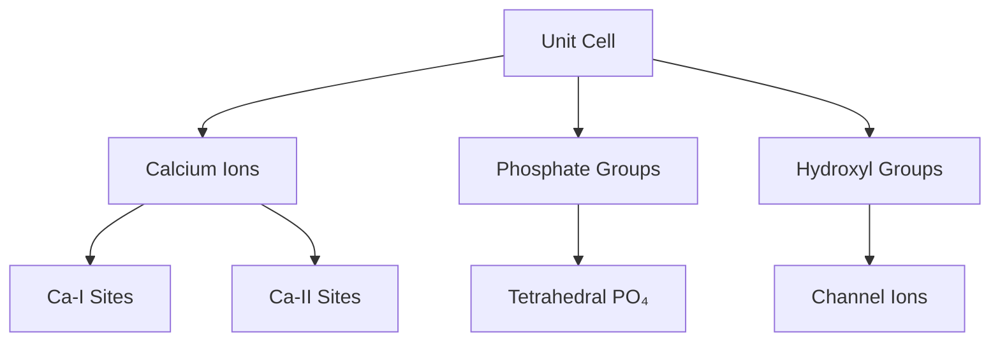
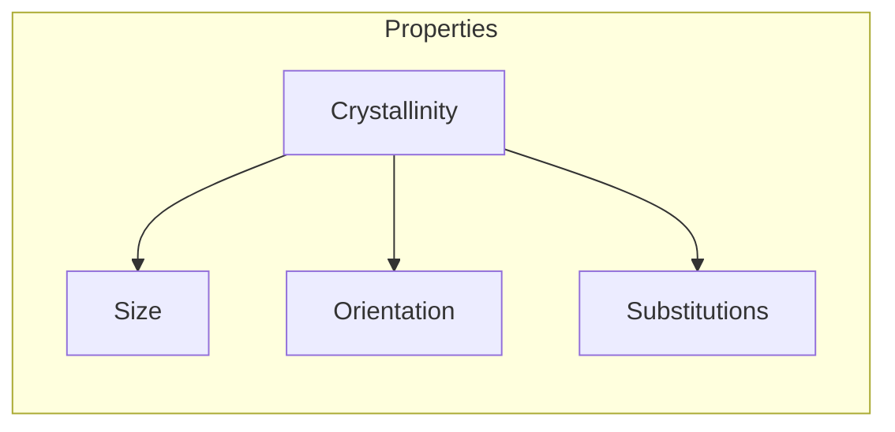
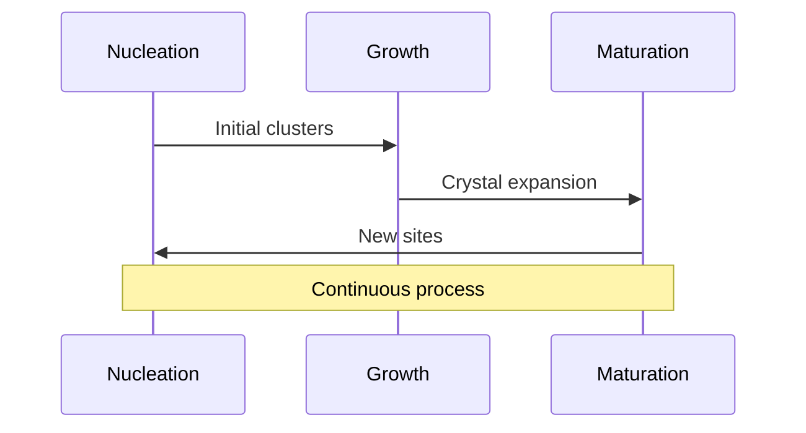
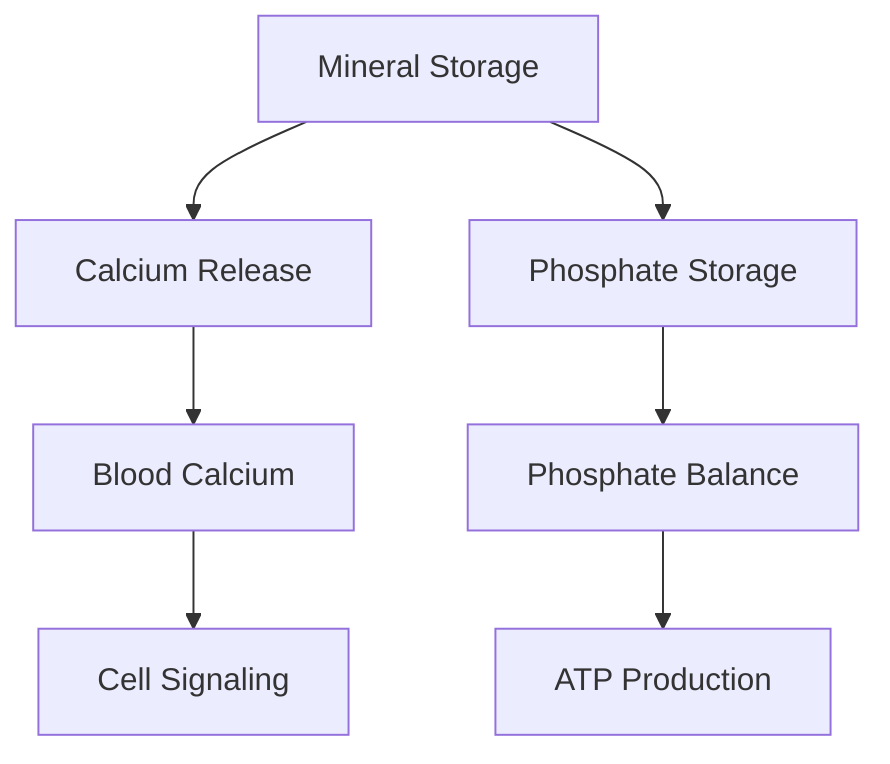
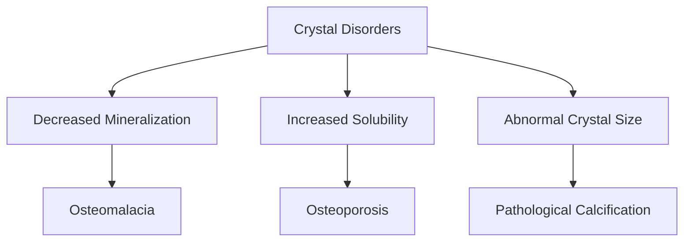

# Hydroxyapatite

## Description
Hydroxyapatite (Ca₁₀(PO₄)₆(OH)₂) is the primary mineral component of bone tissue, comprising about 65% of bone matrix by weight. It provides mechanical strength and serves as the body's primary mineral reservoir.

## Relationships
- `is_part_of`: [[bone_matrix]] - Primary component
- `interacts_with`: [[collagen]] - Structural integration
- `stores`: [[calcium]], [[phosphate]] - Mineral reservoir
- `affected_by`: [[pH_changes]] - Solubility factor
- `regulated_by`: [[bone_remodeling]] - Dynamic control
- `influences`: [[bone_strength]] - Mechanical property
- `participates_in`: [[mineralization]] - Formation process

## Structure

### 1. Crystal Structure


### 2. Computational Model
```typescript
interface HydroxyapatiteCrystal {
    composition: {
        calcium: CationSite[];
        phosphate: PhosphateGroup[];
        hydroxyl: HydroxylGroup[];
        substitutions: IonicSubstitution[];
    };
    
    structure: {
        lattice: HexagonalLattice;
        dimensions: Crystal3D;
        orientation: Orientation3D;
    };
    
    properties: {
        solubility: number;
        surfaceCharge: number;
        crystallinity: number;
    };
}
```

## Properties

### 1. Physical Characteristics


### 2. Material Properties
```typescript
interface CrystalProperties {
    mechanical: {
        elasticModulus: number;
        hardness: number;
        brittleness: number;
    };
    
    chemical: {
        solubilityProduct: number;
        surfaceArea: number;
        reactivity: number;
    };
    
    function calculateStability(pH: number, temperature: number): Stability;
    function predictDissolution(conditions: Environment): DissolutionRate;
}
```

## Formation Process

### 1. Nucleation and Growth


### 2. Growth Dynamics
```typescript
class CrystalGrowth {
    nucleation: {
        sites: NucleationSite[];
        rate: number;
        energy: number;
    };
    
    growth: {
        direction: Vector3D;
        rate: GrowthRate;
        inhibitors: Inhibitor[];
    };
    
    async function modelGrowth(conditions: Environment): Promise<Crystal> {
        const nucleus = await this.initiateNucleation();
        const growthPattern = await this.calculateGrowthPattern();
        return this.simulateGrowth(nucleus, growthPattern);
    }
}
```

## Biological Role

### 1. Mineral Homeostasis


### 2. Regulation System
```typescript
interface MineralRegulation {
    homeostasis: {
        calcium: CalciumPool;
        phosphate: PhosphatePool;
        regulators: HormonalRegulator[];
    };
    
    exchange: {
        dissolution: Rate;
        precipitation: Rate;
        equilibrium: Constant;
    };
    
    function maintainHomeostasis(demand: MineralDemand): void;
    function respondToHormones(signal: HormonalSignal): void;
}
```

## Clinical Applications

### 1. Therapeutic Uses
- Bone grafts
- Dental materials
- Coatings for implants
- Drug delivery systems

### 2. Biomedical Engineering
```typescript
interface BiomaterialApplications {
    implants: {
        coating: CoatingProperties;
        integration: IntegrationRate;
        durability: Lifespan;
    };
    
    drugDelivery: {
        loading: DrugLoadingCapacity;
        release: ReleaseProfile;
        targeting: TargetSpecificity;
    };
    
    function optimizeProperties(application: ClinicalUse): Properties;
    function predictPerformance(environment: PhysiologicalConditions): Performance;
}
```

## Pathological Changes

### 1. Disease States


### 2. Diagnostic Tools
- X-ray diffraction
- Electron microscopy
- Spectroscopic analysis
- Thermal analysis

## Research Applications

### 1. Synthetic Production
```typescript
interface SyntheticHydroxyapatite {
    synthesis: {
        method: SynthesisMethod;
        parameters: ProcessParameters;
        quality: QualityMetrics;
    };
    
    characterization: {
        composition: ChemicalAnalysis;
        structure: CrystalStructure;
        properties: MaterialProperties;
    };
    
    async function optimize(targetProperties: Properties): Promise<Process>;
    async function scaleUp(labProcess: Process): Promise<IndustrialProcess>;
}
```

### 2. Future Directions
- Smart materials
- Nanostructured composites
- Biomimetic synthesis
- Controlled release systems

## References
1. Crystal Chemistry
2. Biomineralization
3. Clinical Applications
4. Materials Science 

## Implementation

```rust
use std::collections::HashMap;
use serde::{Serialize, Deserialize};

#[derive(Debug, Clone, Serialize, Deserialize)]
pub struct HydroxyapatiteCrystal {
    // Chemical composition
    calcium_phosphate_ratio: f64,
    carbonate_content: f64,
    trace_elements: HashMap<String, f64>,
    
    // Physical properties
    crystal_size: Vec3,        // nm
    crystal_orientation: f64,  // radians
    surface_charge: f64,      // mV
    solubility: f64,          // Ksp
    
    // Structural features
    unit_cell: UnitCell,
    defect_sites: Vec<DefectSite>,
    surface_area: f64         // m²/g
}

#[derive(Debug, Clone)]
pub struct CrystalProperties {
    // Mechanical properties
    elastic_modulus: f64,     // GPa
    hardness: f64,           // GPa
    fracture_toughness: f64, // MPa·m½
    
    // Thermodynamic properties
    formation_energy: f64,    // kJ/mol
    surface_energy: f64,     // J/m²
    thermal_stability: f64    // °C
}

pub trait CrystalGrowth {
    fn initiate_nucleation(&self) -> Result<NucleationSite, CrystalError>;
    fn calculate_growth_pattern(&self, conditions: GrowthConditions) -> Result<GrowthPattern, CrystalError>;
    fn incorporate_ions(&mut self, ion_concentrations: &HashMap<String, f64>);
    fn regulate_size(&mut self, proteins: &[Protein]);
}

impl CrystalGrowth for HydroxyapatiteCrystal {
    fn initiate_nucleation(&self) -> Result<NucleationSite, CrystalError> {
        // Implementation for crystal nucleation
        todo!()
    }

    fn calculate_growth_pattern(&self, conditions: GrowthConditions) -> Result<GrowthPattern, CrystalError> {
        // Implementation for growth pattern calculation
        todo!()
    }

    fn incorporate_ions(&mut self, ion_concentrations: &HashMap<String, f64>) {
        // Implementation for ion incorporation
        todo!()
    }

    fn regulate_size(&mut self, proteins: &[Protein]) {
        // Implementation for size regulation
        todo!()
    }
}

pub trait MineralRegulation {
    fn dissolve(&mut self, ph: f64, temperature: f64) -> f64;
    fn precipitate(&mut self, supersaturation: f64) -> Result<(), MineralError>;
    fn exchange_ions(&mut self, solution: &Solution) -> IonFlux;
    fn respond_to_proteins(&mut self, proteins: &[Protein]);
}

#[derive(Debug)]
pub struct BiomaterialApplications {
    coating_properties: CoatingProperties,
    scaffold_design: ScaffoldParameters,
    drug_delivery: DrugDeliverySystem,
    bioactivity: BioactivityMetrics
}

impl BiomaterialApplications {
    pub fn optimize_coating(&mut self, substrate: Substrate) -> Result<CoatingQuality, BiomaterialError>;
    pub fn design_scaffold(&self, requirements: ScaffoldRequirements) -> Result<ScaffoldDesign, BiomaterialError>;
    pub fn load_drug(&mut self, drug: Drug, loading_conditions: LoadingConditions) -> Result<LoadingEfficiency, BiomaterialError>;
    pub fn assess_bioactivity(&self, test_conditions: TestConditions) -> BioactivityScore;
}

#[derive(Debug, Clone)]
pub struct SyntheticHydroxyapatite {
    synthesis_method: SynthesisMethod,
    process_parameters: ProcessParameters,
    product_characteristics: ProductCharacteristics,
    quality_metrics: QualityMetrics
}

impl SyntheticHydroxyapatite {
    pub fn new(method: SynthesisMethod) -> Self {
        // Implementation for creating synthetic hydroxyapatite
        todo!()
    }

    pub fn optimize_synthesis(&mut self, targets: QualityTargets) -> Result<(), SynthesisError> {
        // Implementation for synthesis optimization
        todo!()
    }

    pub fn characterize(&self) -> CharacterizationResults {
        // Implementation for material characterization
        todo!()
    }
}
```