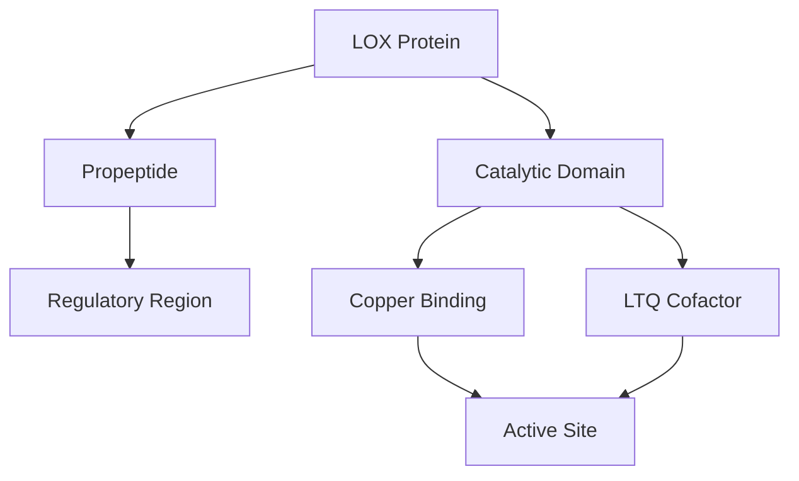
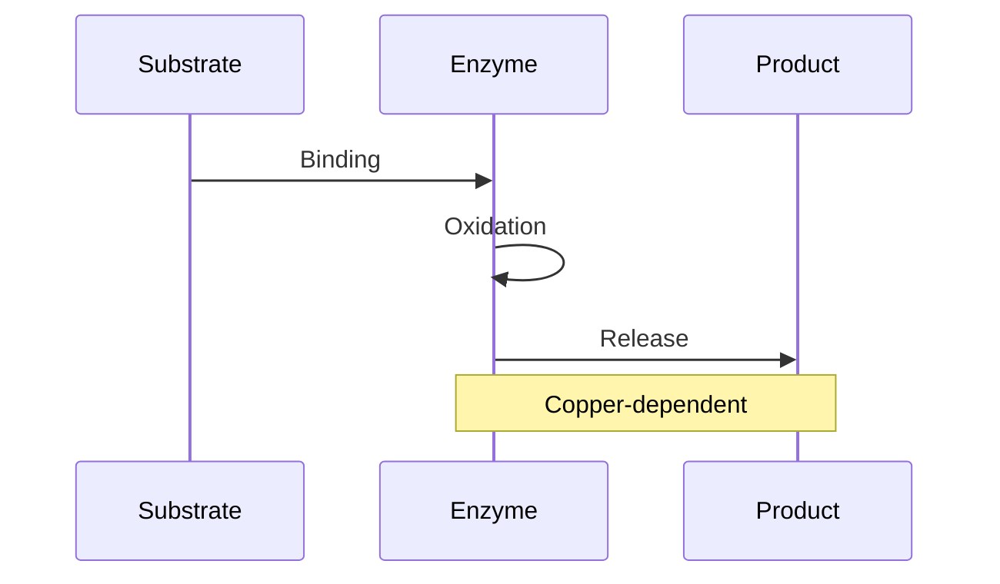
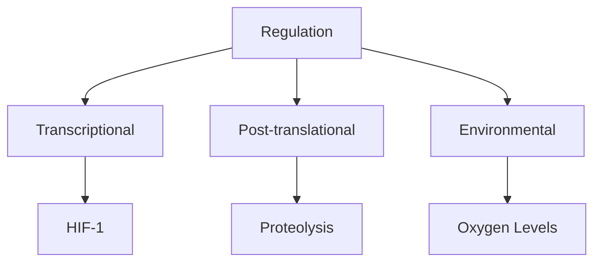
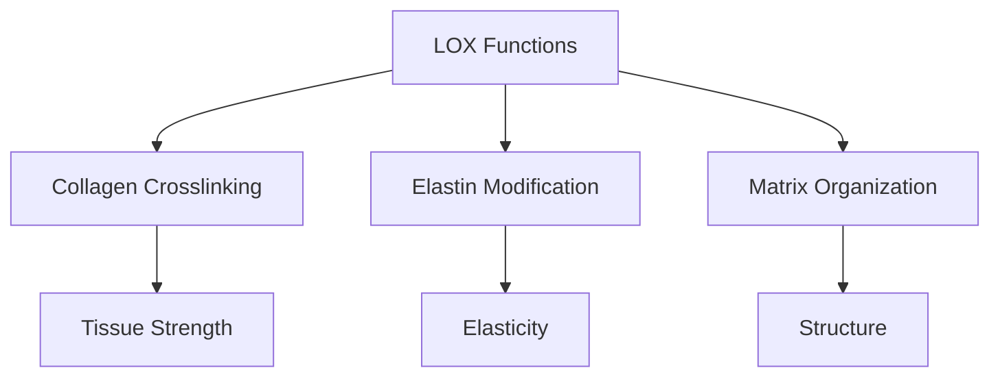
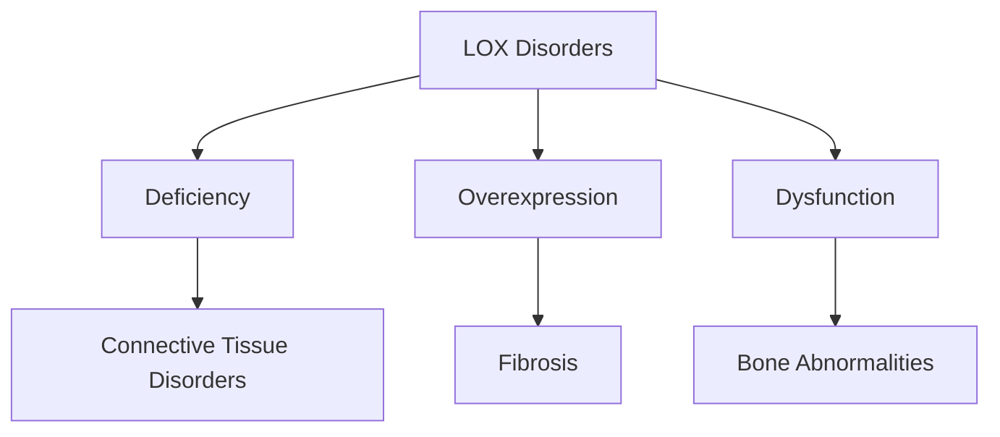

# Lysyl Oxidase

## Description
Lysyl oxidase (LOX) is a copper-dependent amine oxidase that initiates the formation of crosslinks in collagen and elastin. It plays a crucial role in extracellular matrix maturation and bone strength development.

## Relationships
- `catalyzes`: [[crosslinks]] - Primary function
- `modifies`: [[collagen]] - Target substrate
- `requires`: [[copper]] - Essential cofactor
- `regulated_by`: [[hypoxia]] - Expression control
- `affects`: [[bone_strength]] - Mechanical outcome
- `involved_in`: [[tissue_maturation]] - Development process
- `interacts_with`: [[extracellular_matrix]] - Working environment

## Structure

### 1. Protein Domains


### 2. Molecular Model
```typescript
interface LysylOxidase {
    structure: {
        propeptide: PropeptideDomain;
        catalytic: CatalyticDomain;
        cofactors: {
            copper: CopperIon;
            LTQ: LysyltyrosylquinoneCofactor;
        };
    };
    
    properties: {
        activity: number;
        specificity: SubstrateSpecificity;
        regulation: RegulationMechanism;
    };
    
    function bindSubstrate(substrate: CollagenLysine): EnzymeSubstrateComplex;
}
```

## Catalytic Mechanism

### 1. Reaction Steps


### 2. Reaction Model
```typescript
class EnzymaticReaction {
    mechanism: {
        binding: SubstrateBinding;
        oxidation: ElectronTransfer;
        release: ProductRelease;
    };
    
    kinetics: {
        rate: ReactionRate;
        efficiency: CatalyticEfficiency;
        regulation: FeedbackControl;
    };
    
    async function catalyzeReaction(substrate: Lysine): Promise<Aldehyde> {
        const complex = await this.bindSubstrate(substrate);
        const intermediate = await this.oxidize(complex);
        return this.releaseProduct(intermediate);
    }
}
```

## Regulation

### 1. Expression Control


### 2. Control Systems
```typescript
interface LOXRegulation {
    transcriptional: {
        promoter: PromoterRegion;
        factors: TranscriptionFactor[];
        response: GeneExpression;
    };
    
    processing: {
        activation: ProteaseCleavage;
        localization: CellularLocation;
        stability: ProteinStability;
    };
    
    function respondToSignal(signal: RegulatorySignal): Response;
    function adjustActivity(conditions: Environment): ActivityLevel;
}
```

## Biological Functions

### 1. Matrix Modification


### 2. Molecular Activities
```typescript
interface LOXFunctions {
    primary: {
        crosslinking: CrosslinkFormation;
        matrixStabilization: MatrixStability;
        tissueOrganization: TissueArchitecture;
    };
    
    secondary: {
        signaling: SignalTransduction;
        development: TissueDevelopment;
        repair: WoundHealing;
    };
    
    function initiateModification(target: Substrate): Modification;
    function stabilizeMatrix(tissue: ConnectiveTissue): Stability;
}
```

## Clinical Relevance

### 1. Pathological Changes


### 2. Therapeutic Applications
- Enzyme replacement
- Activity modulation
- Tissue engineering
- Disease targeting

## Research Methods

### 1. Analysis Techniques
```typescript
interface LOXAnalysis {
    activity: {
        assay: EnzymeAssay;
        substrates: ArtificialSubstrate[];
        detection: DetectionMethod;
    };
    
    expression: {
        transcripts: RNAAnalysis;
        protein: ProteinQuantification;
        localization: ImagingTechnique;
    };
    
    async function measureActivity(sample: Sample): Promise<ActivityLevel>;
    async function trackExpression(tissue: Tissue): Promise<ExpressionProfile>;
}
```

### 2. Future Directions
- Novel inhibitors
- Targeted therapy
- Biomarker development
- Tissue engineering

## Computational Modeling

### 1. Structure Analysis
```typescript
interface LOXModel {
    structure: {
        domains: ProteinDomain[];
        activesite: ActiveSite;
        dynamics: MolecularDynamics;
    };
    
    function: {
        binding: BindingSimulation;
        catalysis: ReactionSimulation;
        regulation: RegulationModel;
    };
    
    async function predictActivity(conditions: Conditions): Promise<Activity>;
    async function optimizeFunction(parameters: Parameters): Promise<Optimization>;
}
```

### 2. Predictive Tools
- Structure prediction
- Activity modeling
- Drug design
- Systems biology

## References
1. Enzyme Chemistry
2. Matrix Biology
3. Clinical Studies
4. Computational Biology 