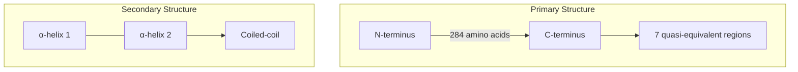
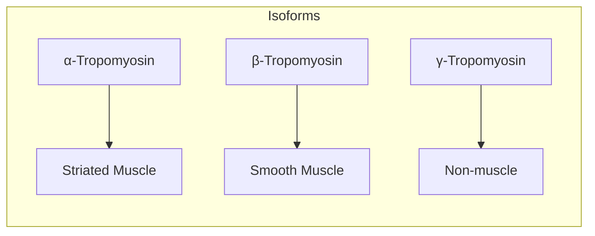
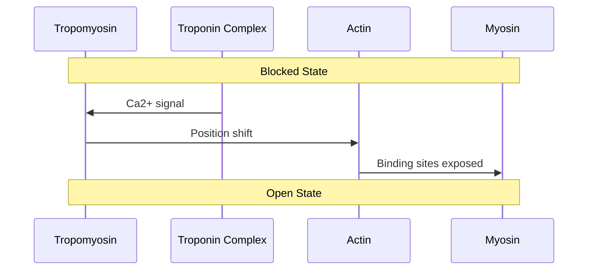
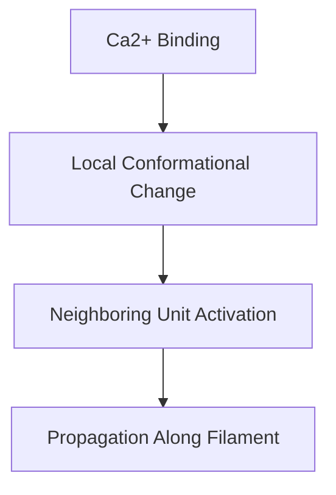
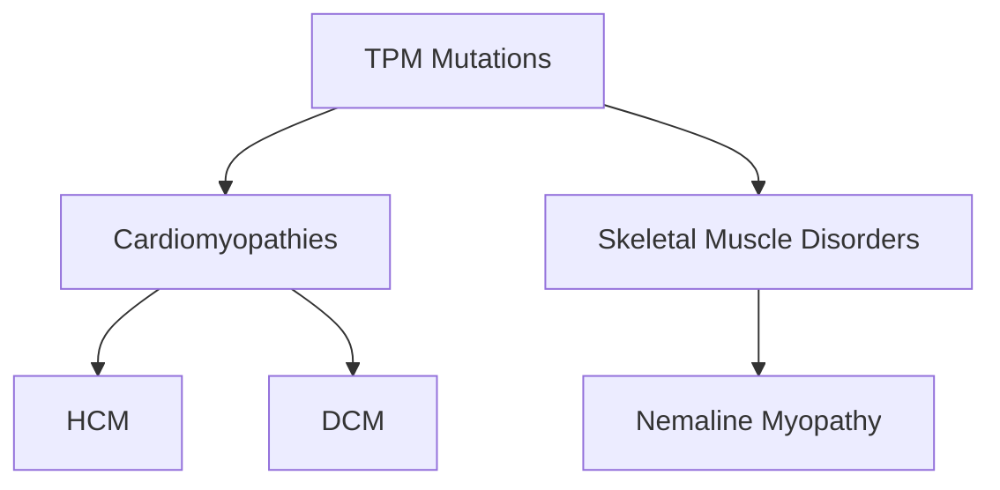

# Tropomyosin

## Description
Tropomyosin is a coiled-coil protein that wraps around the actin filament and works with the troponin complex to regulate muscle contraction in response to calcium signaling.

## Relationships
- `is_part_of`: [[thin_filament]] - Component of muscle thin filaments
- `interacts_with`: [[actin]] - Wraps around actin filaments
- `interacts_with`: [[troponin_complex]] - Forms regulatory partnership
- `regulates`: [[myosin_binding]] - Controls myosin access to actin
- `depends_on`: [[calcium_ions]] - Required for position change
- `modulates`: [[muscle_contraction]] - Regulates contractile process
- `contributes_to`: [[cardiomyopathy]] - Mutations cause disease
- `type_of`: [[regulatory_protein]] - Classification
- `instance_of`: [[coiled_coil_protein]] - Structural classification

## Structure

## Molecular Details

### 1. Physical Properties
- Length: ~40 nm
- Molecular weight: ~65 kDa (dimer)
- Structure:
  - Parallel α-helical coiled-coil
  - 7 actin-binding regions
  - Head-to-tail overlap regions

### 2. Isoforms

## Functional Mechanism

### Position States
1. **Blocked State**
   - Covers myosin binding sites
   - Low Ca2+ concentration
   - No contraction

2. **Closed State**
   - Partially exposed sites
   - Intermediate position
   - Ca2+ bound to TnC

3. **Open State**
   - Fully exposed sites
   - Strong myosin binding
   - Active contraction

## Regulation

### 1. Cooperative Activation

### 2. Post-translational Modifications
- Phosphorylation sites
- Acetylation
- Oxidative modifications

## Interactions

### 1. Direct Partners
- [[actin]]
- [[troponin_complex]]
- [[myosin]]
- [[nebulin]]

### 2. Regulatory Factors
- [[calcium_ions]]
- [[protein_kinases]]
- [[myosin_binding_protein_C]]

## Clinical Significance

### 1. Genetic Disorders

### 2. Disease Mechanisms
- Altered Ca2+ sensitivity
- Disrupted filament stability
- Abnormal contractile function

## Research Applications

### 1. Therapeutic Targets
- Small molecule modulators
- Gene therapy approaches
- Protein engineering

### 2. Diagnostic Tools
- Mutation screening
- Functional assays
- Structure-based drug design

## Evolutionary Conservation
- Highly conserved structure
- Diverse isoform expression
- Tissue-specific regulation

## References
1. Journal of Molecular Biology
2. Annual Review of Biophysics
3. Physiological Reviews
4. Structure 