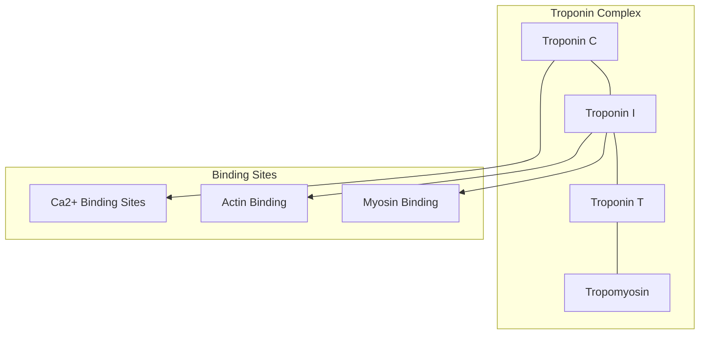
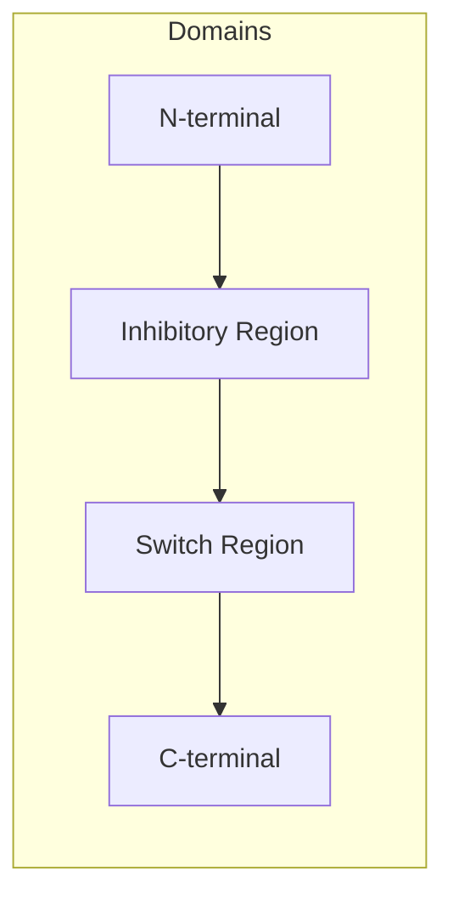
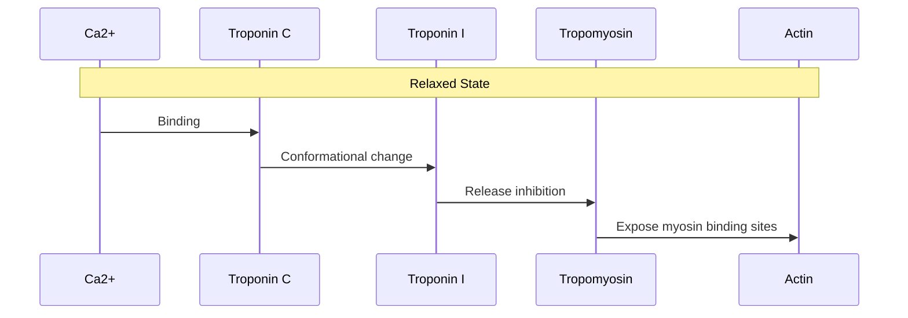
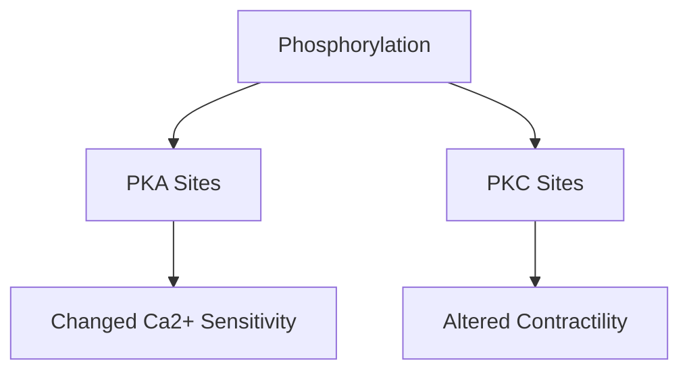

# Troponin Complex

## Description
The troponin complex is a group of three regulatory proteins (troponin C, troponin I, and troponin T) that control muscle contraction through calcium-dependent regulation of the actin-myosin interaction.

## Relationships
- `is_part_of`: [[cardiac_muscle]] - Essential component of cardiac muscle
- `regulates`: [[cardiac_muscle_contraction]] - Controls muscle contraction
- `interacts_with`: [[tropomyosin]] - Forms regulatory complex
- `interacts_with`: [[actin]] - Regulates binding sites
- `depends_on`: [[calcium_ions]] - Required for activation
- `modulates`: [[frank_starling_mechanism]] - Affects contractile response
- `contains`: [[troponin_C]], [[troponin_I]], [[troponin_T]] - Subunit components
- `indicates`: [[myocardial_infarction]] - Used as diagnostic marker
- `type_of`: [[regulatory_protein_complex]] - Classification

## Structure

## Components

### 1. Troponin C (TnC)
- Molecular weight: 18 kDa
- Structure:
  - N-terminal regulatory domain
  - C-terminal structural domain
- Binding sites:
  - 4 EF-hand motifs
  - 2 high-affinity Ca2+/Mg2+ sites
  - 2 low-affinity Ca2+-specific sites

### 2. Troponin I (TnI)

- Molecular weight: 23 kDa
- Function: Inhibits actomyosin ATPase
- Phosphorylation sites:
  - Ser23/24 (PKA targets)
  - Ser43/45 (PKC targets)

### 3. Troponin T (TnT)
- Molecular weight: 35 kDa
- Regions:
  - T1: Tropomyosin binding
  - T2: Core domain interaction
- Isoforms:
  - Cardiac specific (cTnT)
  - Skeletal muscle (sTnT)

## Molecular Mechanism

## Regulation

### 1. Calcium-Dependent
- Resting state: [Ca2+] ~10⁻⁷ M
- Activated state: [Ca2+] ~10⁻⁵ M
- Binding cooperativity

### 2. Post-translational Modifications

## Clinical Significance

### 1. Biomarkers
- Cardiac troponins (cTnI, cTnT)
- Myocardial infarction diagnosis
- Risk stratification

### 2. Genetic Variants
- [[hypertrophic_cardiomyopathy]]
- [[dilated_cardiomyopathy]]
- [[restrictive_cardiomyopathy]]

## Research Applications

### 1. Drug Development
- Calcium sensitizers
- Troponin-targeting drugs
- Novel therapeutic approaches

### 2. Diagnostic Tools
- High-sensitivity assays
- Point-of-care testing
- Prognostic markers

## Interactions

### 1. Protein Partners
- [[actin]]
- [[tropomyosin]]
- [[myosin]]

### 2. Regulatory Molecules
- [[calcium_ions]]
- [[protein_kinases]]
- [[phosphatases]]

## References
1. Nature Structural Biology
2. Journal of Biological Chemistry
3. Circulation Research
4. Clinical Chemistry 