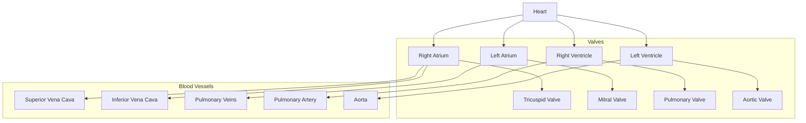
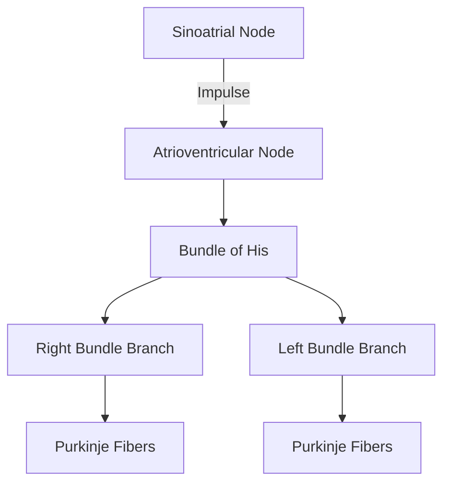

# Heart

## Description
The heart is a muscular organ that serves as the central pump of the [[systems/cardiovascular|cardiovascular system]]. It beats approximately 100,000 times per day, pumping blood throughout the body.

## Anatomical Structure

## Layers
1. **Pericardium** - Outer protective sac
2. **Epicardium** - Outer heart layer
3. **Myocardium** - Heart muscle
4. **Endocardium** - Inner lining

## Electrical Conduction System

## Blood Supply
- Right coronary artery
- Left coronary artery
  - Left anterior descending
  - Circumflex artery

## Related Processes
- [[processes/physiological/cardiac_cycle]]
- [[processes/physiological/blood_pressure]]
- [[processes/cellular/cardiac_muscle_contraction]]

## Clinical Significance
- Common pathologies
- Diagnostic procedures
- Treatment approaches

## References
1. Netter's Atlas of Human Anatomy
2. Clinical Anatomy by Regions
3. Cardiovascular Physiology 