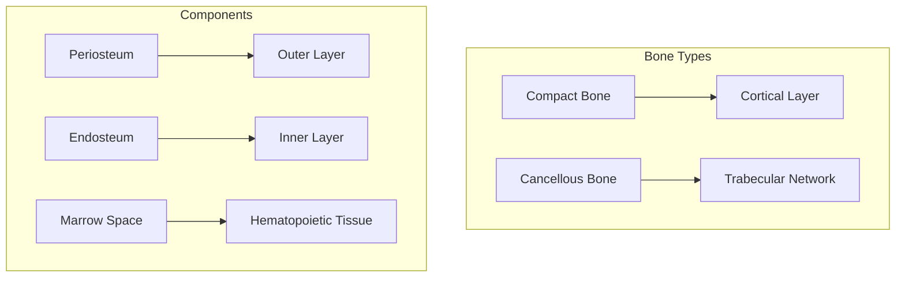
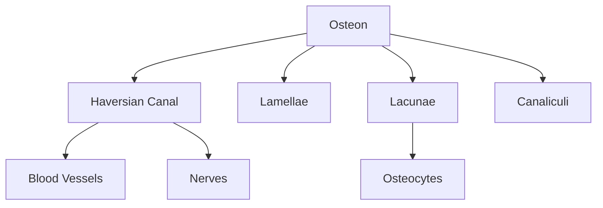
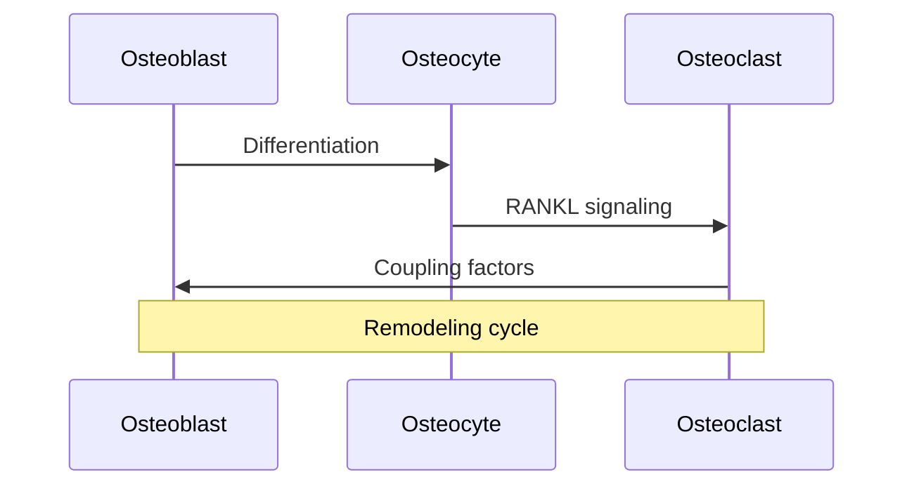
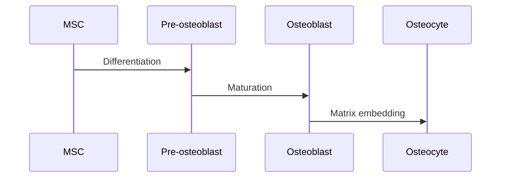
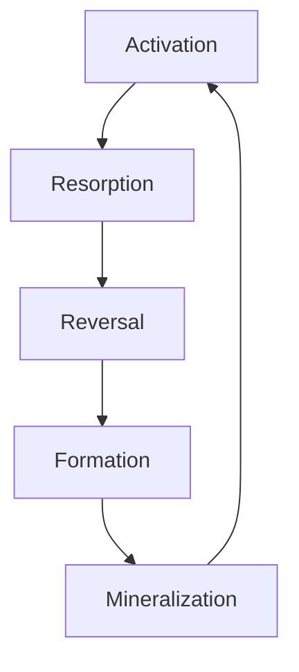
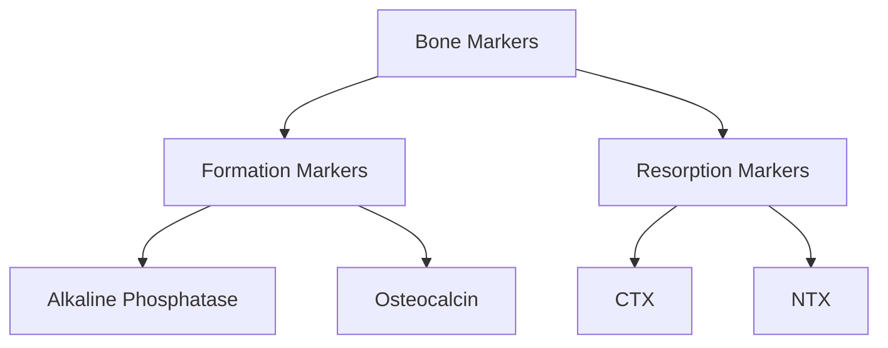

# Bone Tissue

## Description
Bone tissue is a specialized form of connective tissue characterized by a mineralized extracellular matrix that provides both strength and flexibility. It is continuously remodeled throughout life in response to mechanical and metabolic demands.

## Relationships
- `is_part_of`: [[skeletal_system]] - Primary component
- `contains`: [[bone_cells]], [[bone_matrix]] - Basic components
- `interacts_with`: [[blood_vessels]], [[nerves]] - Vascular and neural supply
- `regulated_by`: [[bone_metabolism]] - Homeostatic control
- `produces`: [[bone_marrow]] - Hematopoietic tissue
- `connects_to`: [[cartilage]] - At joints
- `modulates`: [[calcium_homeostasis]] - Mineral storage

## Structure

### 1. Macroscopic Organization


### 2. Microscopic Structure


## Cellular Components

### 1. Bone Cells
- [[osteoblasts]] - Bone formation
- [[osteocytes]] - Mechanosensing
- [[osteoclasts]] - Bone resorption
- [[bone_lining_cells]] - Surface protection

### 2. Cell Communication


## Matrix Composition

### 1. Organic Components
- Type I Collagen (90%)
- Non-collagenous proteins:
  - [[osteocalcin]]
  - [[osteopontin]]
  - [[bone_sialoprotein]]

### 2. Inorganic Components
```mermaid
graph LR
    A[Hydroxyapatite] --> B[Ca10(PO4)6(OH)2]
    C[Other Minerals] --> D[Carbonates]
    C --> E[Magnesium]
    C --> F[Fluoride]
```

## Bone Formation

### 1. Development


### 2. Matrix Mineralization
- Vesicle formation
- Crystal nucleation
- Crystal growth
- Matrix organization

## Remodeling Process

### 1. Cycle Phases


### 2. Regulation
- Mechanical signals
- Hormonal factors
- Local factors
- Metabolic demands

## Clinical Significance

### 1. Pathological Conditions
- [[metabolic_bone_diseases]]
- [[bone_tumors]]
- [[genetic_disorders]]
- [[inflammatory_conditions]]

### 2. Diagnostic Markers


## Research Applications

### 1. Tissue Engineering
- Scaffold development
- Cell-based therapies
- Growth factor delivery
- Biomineralization

### 2. Drug Development
- Anabolic agents
- Anti-resorptive drugs
- Targeted therapies
- Bone substitutes

## References
1. Bone Biology and Structure
2. Matrix Biology
3. Clinical Bone Disorders
4. Tissue Engineering Applications 