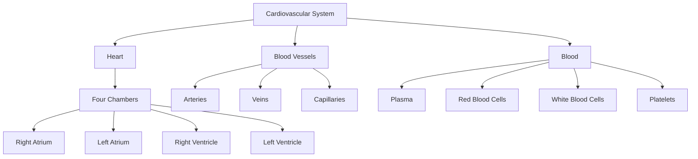
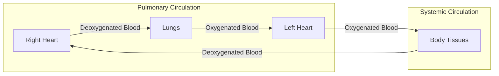
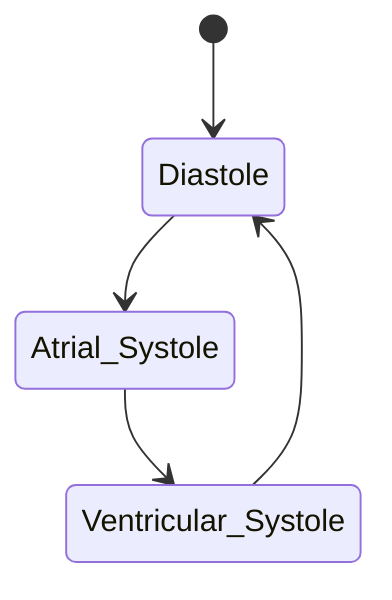

# Cardiovascular System

## Description
The cardiovascular system, also known as the circulatory system, is a vital body system responsible for transporting nutrients, oxygen, hormones, and waste products throughout the body. It consists of the heart, blood vessels, and blood.

## Structure

## Key Components

### Heart [[structures/organs/heart]]
- Central pumping organ
- Four-chambered muscular organ
- Generates electrical impulses for rhythmic contractions
- Pumps approximately 5 liters of blood per minute at rest

### Blood Vessels [[structures/tissues/blood_vessels]]
1. **Arteries**
   - Carry blood away from heart
   - Thick, elastic walls
   - Main arteries: [[aorta]], [[pulmonary_artery]]

2. **Veins**
   - Return blood to heart
   - Contain valves to prevent backflow
   - Major veins: [[vena_cava]], [[pulmonary_veins]]

3. **Capillaries**
   - Site of material exchange
   - Single cell thick walls
   - Connect arterioles to venules

### Blood [[structures/tissues/blood]]
- Composition:
  - 55% Plasma
  - 45% Formed elements (cells and platelets)

## Function

## Processes

### 1. Cardiac Cycle [[processes/physiological/cardiac_cycle]]

### 2. Blood Pressure Regulation [[processes/physiological/blood_pressure]]
- Baroreceptor reflex
- Hormonal control
- Autonomic nervous system regulation

## Interactions

### Connected Systems
- [[systems/respiratory]] - Gas exchange
- [[systems/nervous]] - Heart rate control
- [[systems/endocrine]] - Hormonal regulation
- [[systems/immune]] - Immune cell transport

## Common Pathologies
- Hypertension
- Atherosclerosis
- Myocardial infarction
- Heart failure
- Arrhythmias

## References
1. Gray's Anatomy, 41st Edition
2. Guyton and Hall Textbook of Medical Physiology
3. Cardiovascular Physiology Concepts, 3rd Edition 