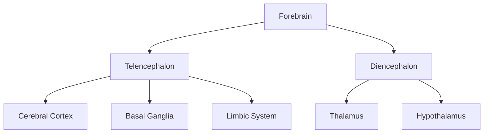
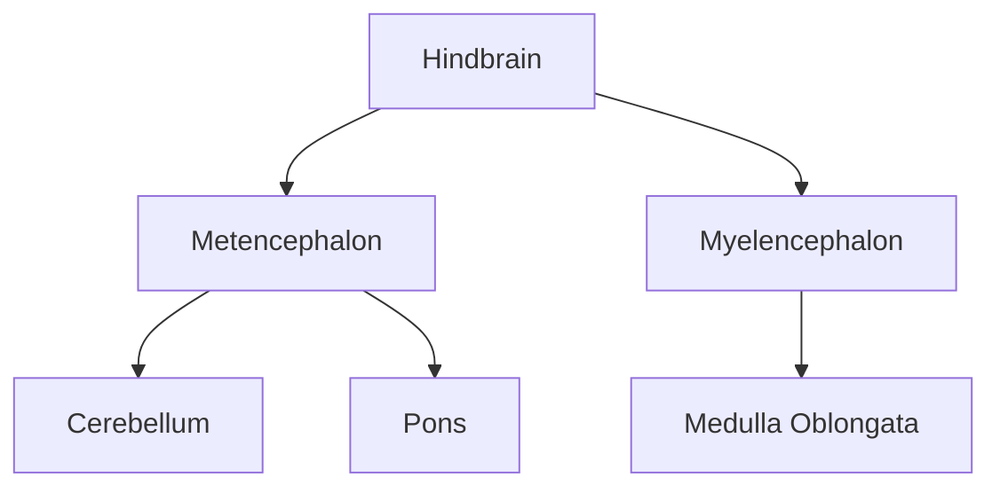
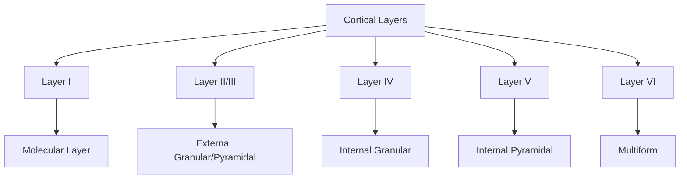
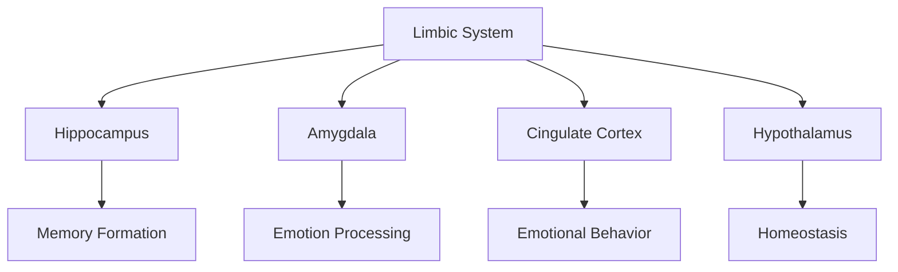
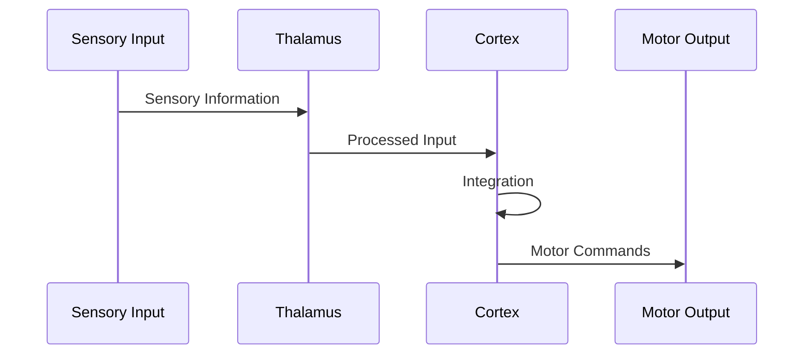
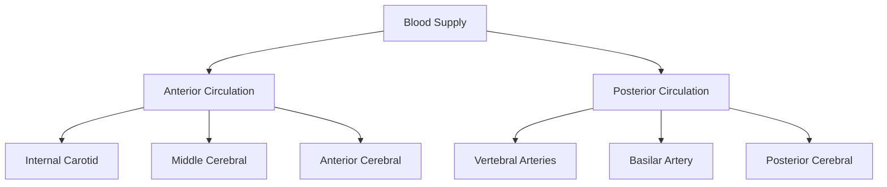
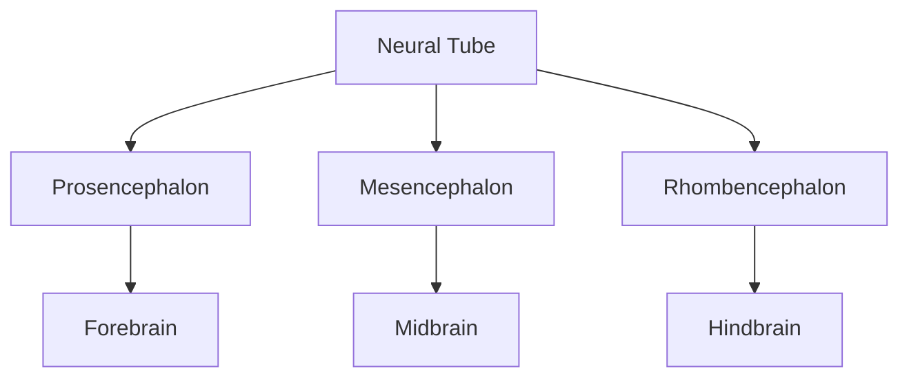
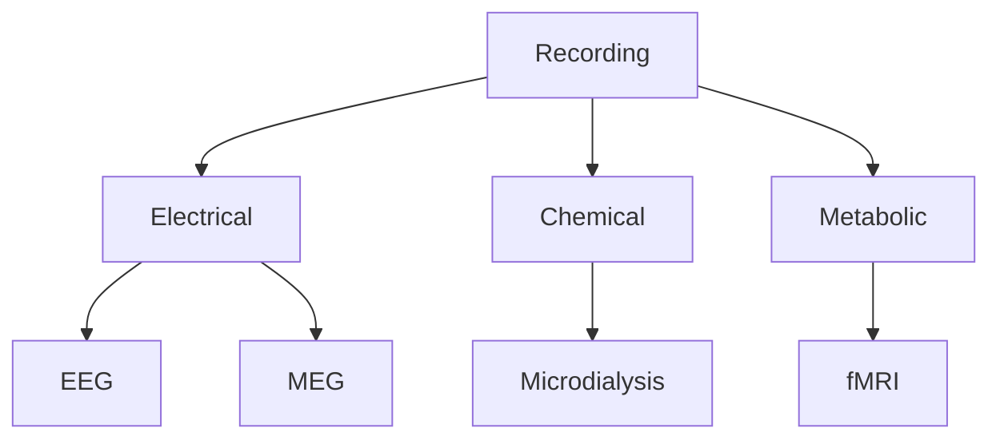

# Brain Structure and Organization

## Overview
The brain is the central organ of the nervous system, responsible for processing sensory information, controlling behavior, and maintaining homeostasis. It consists of billions of neurons organized into specialized regions and networks.

## Major Divisions

### 1. Forebrain (Prosencephalon)

### 2. Midbrain (Mesencephalon)
- Superior colliculus
- Inferior colliculus
- Tegmentum
- Cerebral peduncles
- Periaqueductal gray

### 3. Hindbrain (Rhombencephalon)

## Cerebral Cortex

### 1. Lobes
1. **Frontal Lobe**
   - Motor cortex
   - Prefrontal cortex
   - Broca's area
   - Executive functions

2. **Parietal Lobe**
   - Somatosensory cortex
   - Spatial processing
   - Body awareness
   - Mathematical processing

3. **Temporal Lobe**
   - Auditory cortex
   - Memory formation
   - Language comprehension
   - Face recognition

4. **Occipital Lobe**
   - Visual cortex
   - Visual processing
   - Pattern recognition

### 2. Cortical Organization

## Subcortical Structures

### 1. Basal Ganglia
- Striatum (Caudate and Putamen)
- Globus Pallidus
- Substantia Nigra
- Subthalamic Nucleus

### 2. Limbic System

## Neural Circuits

### 1. Major Pathways
1. **Sensory Systems**
   - Visual pathway
   - Auditory pathway
   - Somatosensory pathway
   - Gustatory pathway
   - Olfactory pathway

2. **Motor Systems**
   - Pyramidal tract
   - Extrapyramidal system
   - Cerebellar circuits
   - Motor planning circuits

### 2. Information Flow

## Neurotransmitter Systems

### 1. Major Systems
1. **Dopaminergic**
   - Reward
   - Movement
   - Motivation
   - Learning

2. **Serotonergic**
   - Mood
   - Sleep
   - Appetite
   - Pain modulation

3. **Cholinergic**
   - Attention
   - Memory
   - Arousal
   - Motor control

4. **GABAergic**
   - Inhibition
   - Anxiety reduction
   - Motor control
   - Sensory processing

## Blood Supply

### 1. Arterial System

### 2. Venous Drainage
- Superior sagittal sinus
- Transverse sinus
- Sigmoid sinus
- Straight sinus
- Dural venous sinuses

## Protection and Support

### 1. Meninges
1. **Dura Mater**
   - Outer layer
   - Protection
   - Blood vessel support

2. **Arachnoid Mater**
   - Middle layer
   - CSF circulation
   - Cushioning

3. **Pia Mater**
   - Inner layer
   - Blood vessel support
   - Direct brain contact

### 2. Cerebrospinal Fluid
- Production
- Circulation
- Absorption
- Protection
- Waste removal

## Development

### 1. Embryonic Development

### 2. Postnatal Development
- Synaptogenesis
- Myelination
- Pruning
- Circuit refinement
- Plasticity

## Clinical Applications

### 1. Common Pathologies
1. **Neurodegenerative**
   - Alzheimer's disease
   - Parkinson's disease
   - Huntington's disease

2. **Vascular**
   - Stroke
   - Aneurysms
   - Vascular malformations

3. **Traumatic**
   - TBI
   - Contusions
   - Diffuse axonal injury

### 2. Diagnostic Methods
- Neuroimaging (MRI, CT, PET)
- Electrophysiology (EEG, EMG)
- Neuropsychological testing
- Biomarker analysis

## Research Methods

### 1. Imaging Techniques
- Structural MRI
- Functional MRI
- Diffusion tensor imaging
- PET scanning
- SPECT imaging

### 2. Recording Methods

## References
1. Principles of Neural Science
2. Clinical Neuroanatomy
3. The Human Brain
4. Neuroscience 