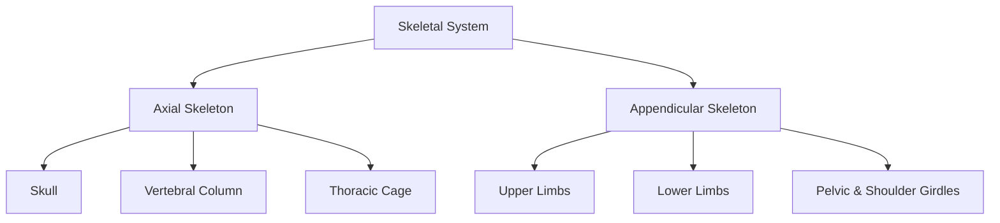
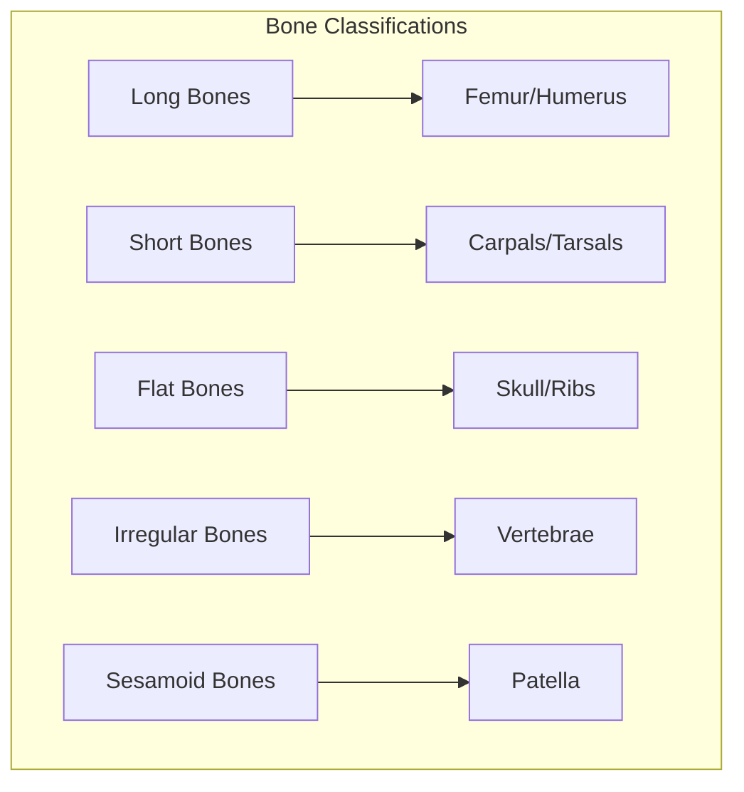
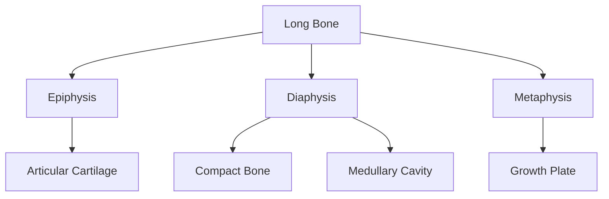
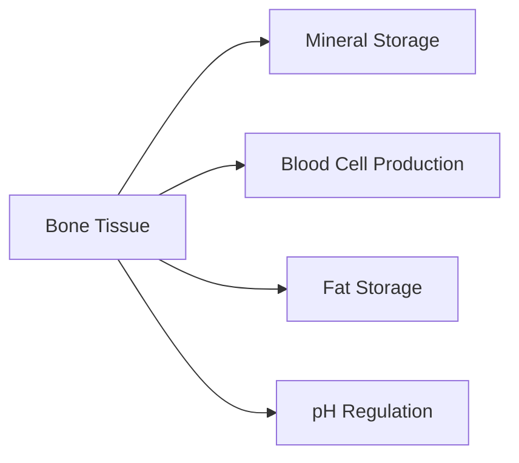
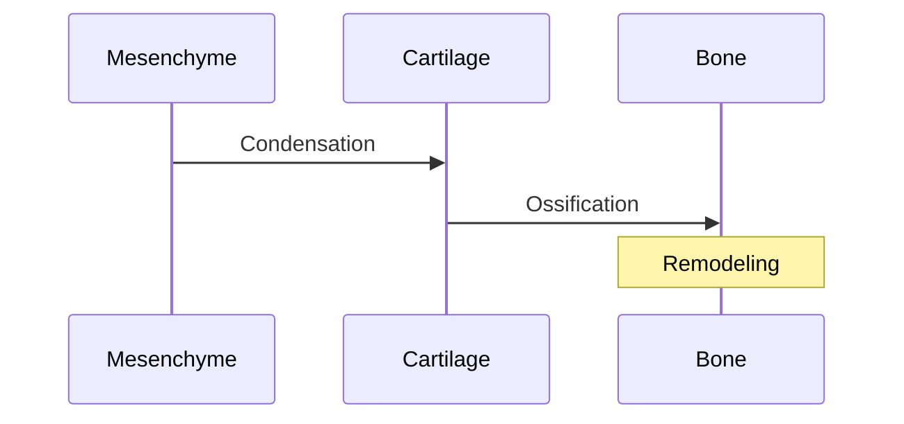
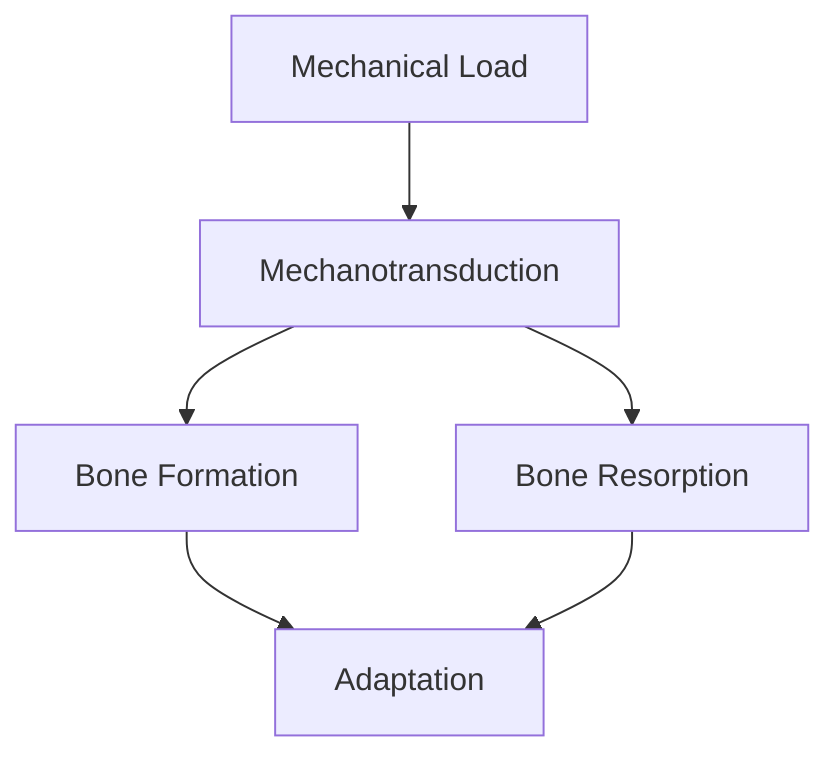
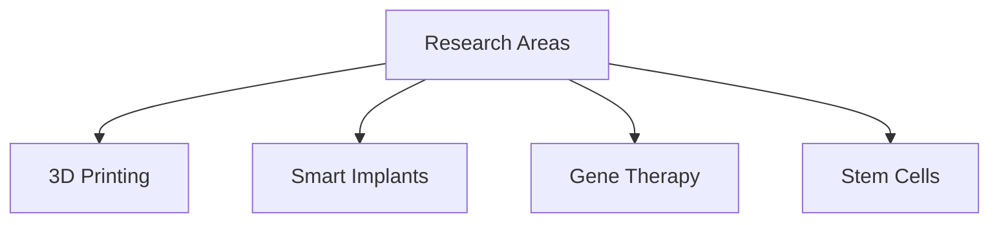

# Skeletal System

## Description
The skeletal system is a complex organ system composed of bones, cartilage, ligaments, and connective tissues that provides structural support, protection, movement capabilities, mineral storage, and blood cell production for the human body.

## Relationships
- `contains`: [[bones]], [[cartilage]], [[ligaments]] - Major components
- `interacts_with`: [[muscular_system]] - Movement generation
- `protects`: [[vital_organs]] - Physical barrier
- `produces`: [[blood_cells]] - Hematopoiesis
- `stores`: [[calcium]], [[phosphorus]] - Mineral homeostasis
- `connects_to`: [[nervous_system]] - Pain and proprioception
- `regulated_by`: [[endocrine_system]] - Bone metabolism

## System Overview

## Components

### 1. Bone Types

### 2. Joints
- [[synovial_joints]]
- [[cartilaginous_joints]]
- [[fibrous_joints]]

## Bone Structure

### 1. Macroscopic Structure

### 2. Microscopic Structure
- [[osteons]] - Basic structural unit
- [[haversian_systems]] - Blood supply
- [[bone_matrix]] - Organic and inorganic components

## Functions

### 1. Mechanical Functions
- Support
- Protection
- Movement
- Sound conduction

### 2. Metabolic Functions

## Development and Growth

### 1. Bone Formation

### 2. Growth Processes
- [[intramembranous_ossification]]
- [[endochondral_ossification]]
- [[bone_remodeling]]

## Regulation

### 1. Hormonal Control
- [[parathyroid_hormone]] - Calcium regulation
- [[calcitonin]] - Calcium homeostasis
- [[vitamin_D]] - Mineral absorption
- [[growth_hormone]] - Growth promotion

### 2. Mechanical Factors

## Clinical Aspects

### 1. Common Pathologies
- [[osteoporosis]]
- [[osteoarthritis]]
- [[fractures]]
- [[bone_cancer]]

### 2. Diagnostic Methods
- X-ray imaging
- DEXA scans
- CT scans
- MRI
- Bone markers

## Research Areas

### 1. Current Focus
- Biomaterial development
- Regenerative medicine
- Bone tissue engineering
- Mechanobiology

### 2. Emerging Technologies

## References
1. Gray's Anatomy
2. Principles of Bone Biology
3. Clinical Orthopedics
4. Developmental Biology 